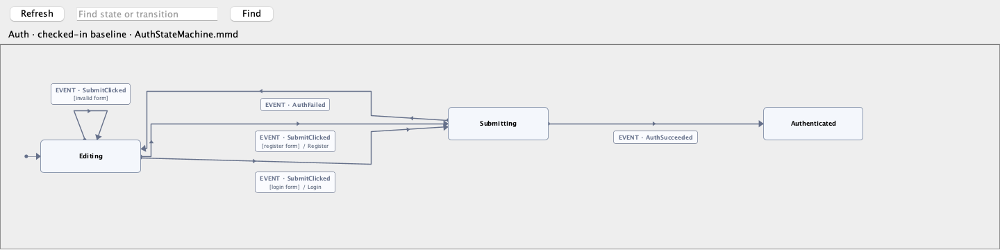
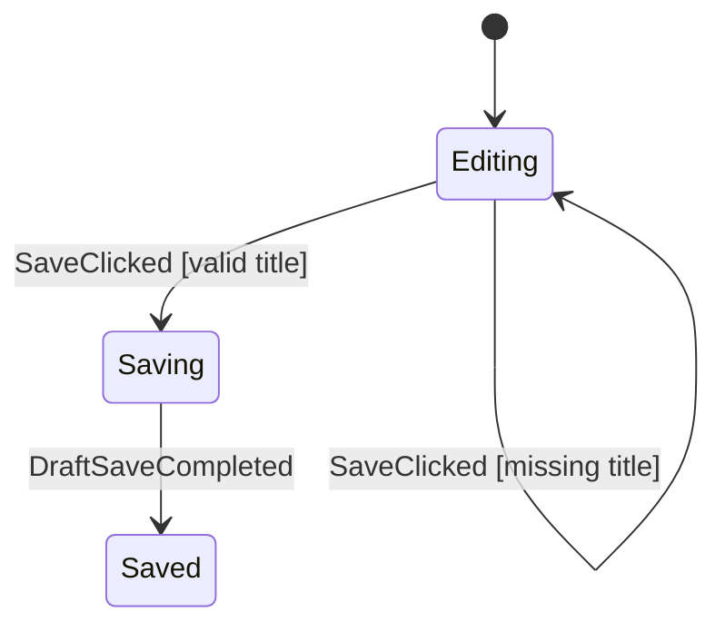

<div align="center">

# Afsm

**복잡한 Android 화면 흐름을 명시적으로 만듭니다.**

코드로 읽고, IDE에서 보고, 테스트로 증명하는 `ViewModel` 흐름용 순수
Kotlin 상태 머신입니다.

[](CHANGELOG.md)
[](afsm-ide-plugin/README.md)
[](https://kotlinlang.org)
[](https://developer.android.com)
[](LICENSE)
[](https://github.com/kez-lab/afsm/actions/workflows/ci.yml)

[English](README.md) · **한국어** · [라이브 데모와 문서](https://kez-lab.org/afsm/) · [Discussions](https://github.com/kez-lab/afsm/discussions)

</div>

<p align="center">
  
</p>

<p align="center"><sub>JCEF 없이 Afsm Graph Preview가 렌더링한 Auth 머신입니다.</sub></p>

> [!IMPORTANT]
> **새 기능: Android Studio/IntelliJ IDEA용 Afsm Graph Preview.** gutter에서
> 생성된 머신을 열고, 이벤트별 전이 방향과 상태 정보를 확인하고, 머신 코드를
> 바꾸지 않은 채 로컬 다이어그램을 정리할 수 있습니다.

Afsm은 Android 팀이 복잡한 화면 흐름을 더 쉽게 읽고 검증하며 안전하게
변경할 수 있도록 만드는 도구입니다. `ViewModel`의 `state.copy(...)`,
코루틴, 콜백, 테스트에 흩어진 비즈니스 흐름 규칙을 하나의 순수 Kotlin
상태 머신으로 옮기되, Android `ViewModel`은 lifecycle, `StateFlow`, saved
state, repository와 UI 어댑터 역할을 그대로 담당합니다.

의미 있는 단계, 재시도, 동시 또는 오래된 비동기 결과, 현재 단계에 따라
달라지는 규칙이 있는 화면에 Afsm을 사용하세요. 단순한 화면은 일반
`ViewModel + StateFlow`가 더 명확하다면 그대로 두는 것이 좋습니다.

## 새 기능 — IDE Graph Preview

`Afsm Graph Preview`는 `@AfsmGraph` 옆에서 생성된 머신 topology를 바로
살펴볼 수 있는 inspection canvas입니다.

- **전이 방향을 바로 읽습니다.** 시작점, 채워진 도착 화살표, 경로 방향 마커,
  event 우선 라벨로 Fit 상태에서도 전이 주체와 방향을 구분합니다.
- **캔버스 공간을 빼앗지 않습니다.** 선택 정보는 전체 폭 그래프 위에 잠시
  떠 있고, hover로 event, guard, command와 양쪽 상태를 확인합니다.
- **연결을 유지한 채 정리합니다.** state와 transition route를 로컬에서
  움직여도 연결은 끊어지지 않으며 Kotlin/Mermaid 파일도 바꾸지 않습니다.
- **JCEF가 필요 없습니다.** 제한된 Afsm MMD parser, ELK Layered layout,
  Java2D renderer를 사용하며 Chromium이나 Mermaid JS에 의존하지 않습니다.

pre-release 플러그인을 빌드한 뒤 생성된 ZIP을 설치하세요.

```bash
cd afsm-ide-plugin
./gradlew buildPlugin
```

**Settings → Plugins → Install Plugin from Disk**에서
`build/distributions/afsm-ide-plugin-0.1.1-SNAPSHOT.zip`을 선택합니다.
Refresh, Inspect, Arrange, 확대·축소와 호환성 정보는
[플러그인 가이드](afsm-ide-plugin/README.md)에 정리되어 있습니다.

## 하나의 흐름, 세 가지 검토 화면

| 화면 | 가장 잘 보여주는 것 |
|---|---|
| **Machine** | 정확한 state, data, guard, command와 실행 순서 |
| **Graph Preview** | 전체 흐름 topology와 이름 있는 전이 조건 |
| **Tests** | payload 동작과 그래프에 보이지 않는 handled/ignored/invalid 정책 |

## Afsm을 만들기 시작한 이유

복잡한 Android 화면은 각각의 핸들러는 합리적으로 보여도 전체 흐름은
`ViewModel` 불리언 플래그, 코루틴, repository 콜백에 흩어져 한눈에 보이지 않는 상태가 되곤 합니다.

### 문제: 불리언 플래그 난무 및 불가능한 상태 조합 (Before)

```kotlin
// 기존 ViewModel: 암시적이고 깨지기 쉬운 상태 관리
class DraftViewModel : ViewModel() {
    var isLoading by mutableStateOf(false)
    var isSaving by mutableStateOf(false)
    var isSaved by mutableStateOf(false)
    var errorMessage by mutableStateOf<String?>(null)

    fun save(title: String) {
        if (isSaving || isLoading) return // 연타 클릭 방어 필요
        if (title.isBlank()) {
            errorMessage = "제목을 입력하세요."
            return
        }
        isSaving = true
        viewModelScope.launch {
            try {
                repository.save(title)
                isSaved = true
                isSaving = false // 플래그를 누락하거나 유효하지 않은 조합(isSaving=true & isSaved=true) 발생 위험!
            } catch (e: Exception) {
                errorMessage = e.message
                isSaving = false
            }
        }
    }
}
```

### 해결: 명시적 Phase와 결정적 상태 머신 (After)

Afsm을 사용하면 비즈니스 흐름 규칙을 명시적인 `Phase`, `Event`, `Command`를 가진 순수 Kotlin 상태 머신으로 격리합니다.

```kotlin
// Afsm: 화면 전이 규칙의 단일 진실 공급원 (Single Source of Truth)
val draftMachine: AfsmDefaultMachine<DraftState, DraftEvent, DraftCommand> = afsmMachine {
    initial(DraftPhase.Editing, DraftData())

    phase(DraftPhase.Editing) {
        on<DraftEvent.SaveClicked> {
            case("valid title", condition = { data.title.isNotBlank() }) {
                transitionTo(DraftPhase.Saving)
            }
            case("missing title", condition = { data.title.isBlank() }) {
                updateData { copy(errorMessage = "제목을 입력하세요.") }
            }
        }
    }

    phase(DraftPhase.Saving) {
        onEnter { command("SaveDraft") { DraftCommand.SaveDraft(data.title) } }
        on<DraftEvent.DraftSaveCompleted> { transitionTo(DraftPhase.Saved) }
        on<DraftEvent.DraftSaveFailed> {
            updateData { data, event -> data.copy(errorMessage = event.message) }
            transitionTo(DraftPhase.Editing)
        }
    }

    phase(DraftPhase.Saved)
}
```

## 세 가지 개념

공개 머신 어휘는 의도적으로 작게 유지합니다.

| 개념 | 의미 |
|---|---|
| `State` | 현재 `Phase`와 지속되는 비즈니스 `Data` |
| `Event` | 머신 입력. 사용자 의도 또는 외부 작업 결과 |
| `Command` | Android host에 외부 작업 실행을 요청하는 값 |

`Phase`와 `Data`는 보통 `AfsmState<Phase, Data>`로 묶습니다. 외부 작업을
시작하지 않는 화면은 `AfsmNoCommand`를 사용할 수 있습니다.

### Command가 분리된 이유

순수 머신은 suspend repository, database, timer, SDK를 직접 호출하면 안
됩니다. 대신 `Command`를 반환하고 `ViewModel`이 실행한 뒤 결과를 새
`Event`로 전달합니다.

```text
UI 의도 -> Event -> 순수 머신 -> State + Command
                                      |
                                      v
                              ViewModel이 작업 실행
                                      |
                                      v
                                   결과 Event
```

이 분리 덕분에 전이는 결정적이고 JVM에서 테스트할 수 있습니다. 또한 state를
다시 수집하거나 복원했다는 이유만으로 외부 작업이 우연히 재실행되는 것도
막을 수 있습니다.

Afsm에는 별도의 `Effect` 출력 채널이 없습니다. 제품 완료 결과는 state에
남깁니다. Done 클릭 뒤 editor 닫기처럼 UI에서 시작해 UI에서 끝나는 동작은
직접 UI 콜백으로 유지합니다. navigation이 필요하면 route가 durable 완료
state를 `LaunchedEffect`로 관찰할 수 있습니다.

## 최소 머신

```kotlin
sealed interface DraftPhase {
    data object Editing : DraftPhase
    data object Saving : DraftPhase
    data object Saved : DraftPhase
}

data class DraftData(
    val title: String = "",
    val errorMessage: String? = null,
)

typealias DraftState = AfsmState<DraftPhase, DraftData>

sealed interface DraftEvent {
    data class TitleChanged(val value: String) : DraftEvent
    data object SaveClicked : DraftEvent
    data object DraftSaveCompleted : DraftEvent
}

sealed interface DraftCommand {
    data class SaveDraft(val title: String) : DraftCommand
}

val draftMachine: AfsmDefaultMachine<DraftState, DraftEvent, DraftCommand> =
    afsmMachine {
        initial(DraftPhase.Editing, DraftData())

        phase(DraftPhase.Editing) {
            on<DraftEvent.TitleChanged> {
                updateData { data, event ->
                    data.copy(title = event.value, errorMessage = null)
                }
            }

            on<DraftEvent.SaveClicked> {
                case("valid title", condition = { data.title.isNotBlank() }) {
                    transitionTo(DraftPhase.Saving)
                }
                case("missing title", condition = { data.title.isBlank() }) {
                    updateData { copy(errorMessage = "Title is required.") }
                }
            }
        }

        phase(DraftPhase.Saving) {
            onEnter {
                command("SaveDraft") { DraftCommand.SaveDraft(data.title) }
            }
            on<DraftEvent.DraftSaveCompleted> {
                transitionTo(DraftPhase.Saved)
            }
        }

        phase(DraftPhase.Saved)
    }
```

### 생성된 상태 전이도 (State Diagram)

실행 가능한 머신 정의로부터 검증 가능한 Mermaid 다이어그램이 자동 생성됩니다:



규칙 내부에서는 일반 Kotlin을 사용하세요. 하나의 event에 생성 그래프에도
나타나야 하는 이름 있는 조건 결과가 여러 개 있을 때만 `case(...)`를
사용합니다.

## Android 경계

머신 내부에서는 event를 사용하지만 Compose UI가 event 타입을 알 필요는
없습니다. `ViewModel`에는 기능을 드러내는 동사형 메서드를 노출합니다.

```kotlin
class DraftViewModel(
    private val repository: DraftRepository,
) : ViewModel() {
    private val host = afsmHost(
        machine = draftMachine,
        commandHandler = { command: DraftCommand, send ->
            when (command) {
                is DraftCommand.SaveDraft -> {
                    repository.save(command.title)
                    send(DraftEvent.DraftSaveCompleted)
                }
            }
        },
    )

    val state: StateFlow<DraftState> = host.state

    fun updateTitle(value: String) = host.send(DraftEvent.TitleChanged(value))
    fun save() = host.send(DraftEvent.SaveClicked)
}
```

```kotlin
@Composable
fun DraftRoute(viewModel: DraftViewModel) {
    val state by viewModel.state.collectAsStateWithLifecycle()

    DraftScreen(
        title = state.data.title,
        onTitleChange = viewModel::updateTitle,
        onSave = viewModel::save,
    )
}
```

이는 의도적인 Android 코드입니다. Afsm이 하나의 범용
`onEvent(Event)` MVI 경계를 공개하도록 요구하지 않습니다.

## 예제 학습 사다리 (Example Ladder)

Afsm은 간단한 에디터부터 복잡한 비동기 트랜잭션까지 4단계의 표준 학습 경로를 제공합니다:

| 단계 | 예제 | 주요 학습 개념 | 상세 가이드 | 생성된 그래프 |
|---|---|---|---|---|
| **1** | **Draft** | 최소 `Phase + Data + Command` & ViewModel 호스팅 | [Draft 튜토리얼](docs/getting-started.md) | [DraftQuickstart.mmd](consumer-smoke/app/build/generated/afsm/mmd/DraftQuickstart.mmd) |
| **2** | **Auth** | 폼 유효성 검증, 로그인 결과 이벤트, 상태 기반 화면 이동 | [Auth 가이드](docs/auth-walkthrough.md) | [AuthStateMachine.mmd](sample-shop/build/generated/afsm/mmd/AuthStateMachine.mmd) |
| **3** | **Checkout** | Nav argument 동적 초기 상태, 결제 재시도, request-id stale 결과 방어, 상태 복원 | [Checkout 가이드](docs/checkout-walkthrough.md) | [CheckoutStateMachine.mmd](sample-shop/build/generated/afsm/mmd/CheckoutStateMachine.mmd) |
| **4** | **Product Editor** | 중첩 draft 편집, phase 소유 협력적 업로드 취소, 심사 반려 및 재제출 | [Product Editor 가이드](docs/product-editor-walkthrough.md) | [ProductEditorStateMachine.mmd](sample-shop/build/generated/afsm/mmd/ProductEditorStateMachine.mmd) |

## 머신, 그래프, 테스트가 모두 필요한 이유

phase 내부 람다는 규칙을 해당 규칙이 유효한 상태 가까이에 둡니다. 반면 큰
머신의 전체 흐름을 한눈에 훑기에는 적합하지 않습니다. 그래서 Afsm은 세
산출물을 하나의 읽기 계약으로 봅니다.

| 산출물 | 가장 잘 답하는 질문 |
|---|---|
| 생성된 `.mmd` 그래프 | 이름 있는 조건과 entry command를 포함한 전체 topology는 무엇인가? |
| 머신 소스 | 정확히 어떤 data, guard, command와 순서를 사용하는가? |
| 전이 테스트 | payload 세부 사항과 그래프에 보이지 않는 `Handled`, `Ignored`, `Invalid` 동작이 증명됐는가? |

그래프는 장식도 아니고 코드를 대체하지도 않습니다. phase-local 규칙의
지역성이라는 트레이드오프를 보완해 reviewer에게 생성된 전체 머신 지도를
제공합니다.

그래프가 실행 가능한 머신에서 생성된다는 사실만으로는 신뢰할 수 없습니다.
커밋된 그래프를 매 빌드마다 머신과 비교해야 의미가 생깁니다. Gradle 플러그인이
그 비교를 담당합니다.

```bash
./gradlew :your-module:generateAfsmMmd   # build/에 다이어그램 생성
./gradlew :your-module:updateAfsmMmd     # 커밋 대상 baseline으로 복사
./gradlew :your-module:verifyAfsmMmd     # baseline이 낡았으면 실패
```

baseline 디렉터리가 있으면 `verifyAfsmMmd`가 `check`에 연결되므로, 머신을
바꾸고 다이어그램을 커밋하지 않으면 빌드가 diff와 함께 실패합니다.

## 런타임 실패 정책

호스팅된 머신은 실행 중인 화면의 일부이므로, 실패했을 때의 동작을 우연에
맡기지 않고 `AfsmConfig`가 결정합니다.

| 실패 | 기본값 (`AfsmConfig()`) | `AfsmConfig.strict()` |
|---|---|---|
| 잘못된 전이 | 진단 기록, 호스트 유지 | throw |
| reducer 예외 | 진단 기록, 상태 유지 | throw |
| command 핸들러 예외 | 진단 기록, 호스트 유지 | throw |
| 큐 오버플로 | 진단 기록, 해당 작업 드롭 | throw |

기록을 기본값으로 둔 이유는 호스트가 멈추는 것이 사용자에게 가장 나쁜 결과이기
때문입니다. 화면은 계속 그려지지만 아무 입력도 받지 않는 상태가 됩니다. 기록
정책은 화면을 살려 두고 문제를 `AfsmConfig.logger`로 보냅니다. 이 logger는
지정하기 전까지 `AfsmLogger.None`이므로 **반드시 직접 지정하세요.**

```kotlin
private val host = afsmHost(
    machine = draftMachine,
    commandHandler = { command, send -> /* ... */ },
    config = if (BuildConfig.DEBUG) {
        AfsmConfig.strict(logger = androidAfsmLogger)
    } else {
        AfsmConfig(logger = androidAfsmLogger)
    },
)
```

command 핸들러는 호스트 스코프에서 실행되며 `viewModelScope`에서는 main
dispatcher입니다. main-safe하지 않은 작업을 호출한다면
`AfsmConfig.commandContext = Dispatchers.IO`를 지정하세요. 호스트가 멈췄는지는
`AfsmHost.isActive`로 알 수 있고, 멈춘 호스트는 항상
`AfsmDiagnosticCode.HostStopped` 진단을 남깁니다.

## 처음 시작하는 순서

1. 화면이 머신을 둘 만큼 복잡한지 먼저 판단합니다.
2. DSL을 쓰기 전에 phase와 중요한 전이를 그립니다.
3. 제품 역할이 드러나는 `*Flow.kt`에 `State`, `Event`, `Command`를 정의합니다.
4. phase-local 규칙을 구현하고 실제 조건이 있을 때만 `case`를 사용합니다.
5. 순수 머신을 먼저 테스트합니다.
6. 일반 Android `ViewModel`에서 실행하고 동사형 메서드를 노출합니다.
7. 머신·그래프·테스트를 나란히 검토합니다.

[시작 가이드](docs/getting-started.md)에서 시작한 뒤
[모델링 규칙](docs/modeling-rules.md)과
[그래프 생성](docs/graph-generation.md)을 읽으세요.

## Codex로 Afsm 사용하기

다른 Android 프로젝트에서 Afsm을 도입할 때 사용할 수 있는 영문
[`use-afsm` 스킬](.agents/skills/use-afsm/SKILL.md)이 저장소에 포함되어
있습니다. 이 스킬은 적용 적합성 판단, 기존 동작 목록화,
State/Event/Command 모델링, 순수 전이 테스트, ViewModel 연결, 복원 안전성,
생성 그래프 검토까지 안내합니다.

`$skill-installer`에 이 저장소의 스킬 폴더를 지정한 뒤, 사용하는 프로젝트에서
`$use-afsm`을 호출하세요.

```text
$skill-installer Install use-afsm from https://github.com/kez-lab/afsm/tree/main/.agents/skills/use-afsm
```

스킬은 consumer 프로젝트의 기존 Afsm 버전과 배포 경로를 먼저 확인합니다.
Afsm은 pre-release이며, 이후 minor 릴리스에서 호환성이 깨질 경우
마이그레이션 안내를 함께 제공합니다.

## pre-release 빌드 설치

현재 원격 배포는 검증 완료 범위가 아닙니다. 다른 프로젝트에서 사용하기 전에
저장소 artifact를 Maven Local에 게시하세요.

```bash
./gradlew publishToMavenLocal
./gradlew -p afsm-graph-gradle-plugin publishToMavenLocal
```

consumer 프로젝트의 dependency repository에 `mavenLocal()`을 추가한 뒤 현재
저장소 버전을 사용합니다.

```kotlin
dependencies {
    implementation("io.github.afsm:afsm-core:0.1.0")
    implementation("io.github.afsm:afsm-runtime:0.1.0")
    implementation("io.github.afsm:afsm-viewmodel:0.1.0")
    testImplementation("io.github.afsm:afsm-test:0.1.0")
}
```

그래프 생성을 사용할 때는 `id("io.github.afsm.graph") version "0.1.0"`과
`ksp("io.github.afsm:afsm-graph-ksp:0.1.0")`을 추가하고,
`pluginManagement.repositories`에도 `mavenLocal()`을 둡니다. 별도의
[`consumer-smoke`](consumer-smoke/README.md) 프로젝트가 실제로 동작하는 표준
consumer 예제입니다. Afsm은 [Apache-2.0](LICENSE)으로 배포됩니다.

## 모듈

| 모듈 | 역할 |
|---|---|
| `afsm-core` | 순수 Kotlin 머신, DSL, topology, Mermaid 렌더링 |
| `afsm-runtime` | 직렬 event 처리와 command 실행 |
| `afsm-viewmodel` | `ViewModel.afsmHost(...)` 통합 |
| `afsm-test` | 전이 assertion helper |
| `afsm-graph-ksp` | 생성 graph registry |
| `afsm-graph-gradle-plugin` | `.mmd` export task |
| `afsm-ide-plugin` | Android Studio/IntelliJ Java2D graph preview |
| `sample-shop` | Android reference flow |
| `consumer-smoke` | 외부 consumer 컴파일·동작 gate |

## 빌드와 검증

```bash
./gradlew :afsm-core:test :afsm-runtime:test :afsm-test:test
./gradlew :sample-shop:testDebugUnitTest :sample-shop:verifyAfsmMmd
./scripts/verify-release-local.sh --no-daemon
```

모든 pull request는 동일한 단위 테스트, `apiCheck`, 그래프 검증, Maven Local
consumer smoke 빌드를 [CI](.github/workflows/ci.yml)에서 실행합니다.

Afsm은 pre-release입니다. 실제 Android 팀의 사용성과 안전성을 더 높인다는
근거가 있다면 API는 변경될 수 있으며, 호환성을 깨는 변경에는 API·문서·
마이그레이션 안내를 함께 제공합니다.

## 아키텍처 FAQ

### StateMachine ➔ Command ➔ ViewModel ➔ Event 구조가 번거롭게 느껴지지 않나요?

Afsm은 상태 머신(순수 비즈니스 규칙)과 ViewModel(비동기 I/O 실행)을 명확히 분리합니다:

1. **모킹 없는 0.1ms 단위의 순수 JVM 단위 테스트**: 머신 내부에서 Repository를 직접 호출하거나 코루틴을 실행하지 않으므로, 복잡한 Mockito나 테스트 디스패처 없이 모든 전이와 엣지 케이스를 순수 데이터만으로 서브 밀리초 단위로 100% 검증할 수 있습니다.
2. **상태 전이 규칙의 단일 공급원 (Single Source of Truth)**: 화면의 모든 비즈니스 흐름은 `*StateMachine.kt`와 Mermaid 다이어그램 한곳에만 존재합니다. ViewModel은 비즈니스 분기(`if/else`) 없이 Command를 실행하고 결과 Event를 회신하는 단순 어댑터(Thin Bridge)가 되어 복잡성이 사라집니다.
3. **화면 복잡도에 따른 유연한 선택**: 단순한 조회/표시 화면(`Loading -> Content / Error`)에는 일반 `ViewModel + StateFlow` 패턴을 권장합니다. 다단계 고분기, 결제 재시도, 늦게 도착한 비동기 응답(Stale result) 방어가 필요한 복잡한 화면에 Afsm을 적용할 때 진가가 발휘됩니다.

자세한 토론은 [GitHub Discussions #62](https://github.com/kez-lab/afsm/discussions/62)에서 참여할 수 있습니다.

## 알려진 한계

- **복원(restoration) 모델링은 머신 밖에 있습니다.** `SavedStateHandle`을 시작
  phase로 되돌리는 코드는 평범한 `ViewModel` 코드이며, 그 복원 경로는 생성된
  그래프에 나타나지 않습니다.
  [복원 정책](docs/restoration-command-ui-policy.md)을 참고하세요.
- **초기 상태에서는 `onEnter`가 실행되지 않습니다.** 첫 진입에 작업을 시작해야
  하면 `ScreenEntered` 같은 이벤트를 명시적으로 dispatch합니다.
- **phase와 event 라벨은 Kotlin simple name에서 옵니다**(enum은 엔트리 이름).
  simple name이 같은 두 phase 타입은 충돌하며 머신 빌드가 중복 phase 오류로
  실패합니다.
- **그래프 생성은 모듈의 unit test 런타임 classpath를 재사용합니다.** 따라서
  `generateAfsmMmd` 이전에 해당 모듈의 unit test 소스가 컴파일되어야 합니다.

[공개 API](docs/afsm-public-api.md), [테스트](docs/testing-guide.md),
[예제](docs/examples.md), [Auth](docs/auth-walkthrough.md),
[Checkout](docs/checkout-walkthrough.md),
[Product editor](docs/product-editor-walkthrough.md)를 이어서 읽으세요.
