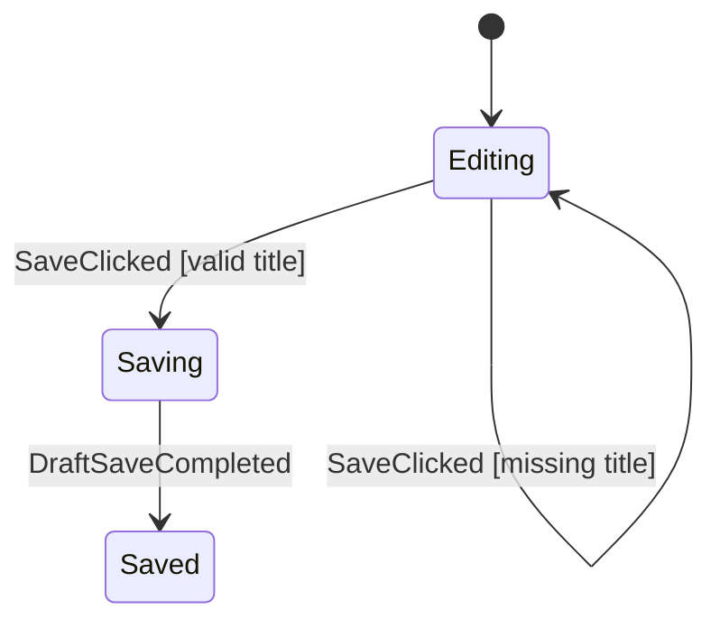

<div align="center">

# Afsm

**Make complex Android screen flow explicit.**

Pure Kotlin state machines for `ViewModel` flows — readable in code, visible in
the IDE, and provable in tests.

[](CHANGELOG.md)
[](afsm-ide-plugin/README.md)
[](https://kotlinlang.org)
[](https://developer.android.com)
[](LICENSE)
[](https://github.com/kez-lab/afsm/actions/workflows/ci.yml)

**English** · [한국어](README.ko.md) · [Live demo & docs](https://kez-lab.org/afsm/) · [Discussions](https://github.com/kez-lab/afsm/discussions)

</div>

<p align="center">
  
</p>

<p align="center"><sub>The Auth machine rendered by the JCEF-free Afsm Graph Preview.</sub></p>

> [!IMPORTANT]
> **New: Afsm Graph Preview for Android Studio and IntelliJ IDEA.** Open a
> generated machine from the gutter, follow event-labelled transitions, inspect
> state metadata, and arrange the local diagram without changing machine code.

Afsm helps Android teams make complex screen flows easier to read, verify, and
change safely. It moves business-flow rules scattered across `ViewModel`
`state.copy(...)` calls, coroutines, callbacks, and tests into one plain Kotlin
state machine, while Android `ViewModel` remains the lifecycle, `StateFlow`,
saved-state, repository, and UI adapter.

Use Afsm for screens with meaningful phases, retries, concurrent or stale async
results, and rules that depend on the current phase. Keep ordinary
`ViewModel + StateFlow` for simple screens when it is clearer.

## New — Graph Preview in the IDE

`Afsm Graph Preview` turns the generated machine topology into an inspection
canvas beside `@AfsmGraph` declarations.

- **Read direction immediately:** source dots, filled target arrows, route
  markers, and event-first labels keep transition ownership visible at Fit zoom.
- **Inspect without losing canvas space:** selection context floats over the
  full-width graph, while hover reveals event, guard, command, and endpoints.
- **Arrange safely:** drag states or transition routes locally; connections stay
  attached and Kotlin/Mermaid sources are never rewritten.
- **Works without JCEF:** the plugin uses a constrained Afsm MMD parser, ELK
  Layered layout, and Java2D rendering instead of Chromium or Mermaid JS.

Build the pre-release plugin and install the generated ZIP from disk:

```bash
cd afsm-ide-plugin
./gradlew buildPlugin
```

Then select `build/distributions/afsm-ide-plugin-0.1.1-SNAPSHOT.zip` in
**Settings → Plugins → Install Plugin from Disk**. See the
[plugin guide](afsm-ide-plugin/README.md) for Refresh, Inspect, Arrange, zoom,
and compatibility details.

## One Flow, Three Review Surfaces

| Surface | What it makes clear |
|---|---|
| **Machine** | Exact state, data, guard, command, and execution order |
| **Graph Preview** | Whole-flow topology and named transition conditions |
| **Tests** | Payload behavior and graph-invisible handled/ignored/invalid policy |

## Why I Started Afsm

Complex Android screens often reach a point where every individual handler looks
reasonable, but the complete screen flow is scattered across `ViewModel` boolean flags,
coroutines, repository callbacks, and UI handlers.

### The Problem: Boolean Flag & State Explosion (Before)

```kotlin
// Traditional ViewModel: Implicit, fragile flow state
class DraftViewModel : ViewModel() {
    var isLoading by mutableStateOf(false)
    var isSaving by mutableStateOf(false)
    var isSaved by mutableStateOf(false)
    var errorMessage by mutableStateOf<String?>(null)

    fun save(title: String) {
        if (isSaving || isLoading) return // What if the user clicks twice?
        if (title.isBlank()) {
            errorMessage = "Title is required"
            return
        }
        isSaving = true
        viewModelScope.launch {
            try {
                repository.save(title)
                isSaved = true
                isSaving = false // Easy to produce invalid combinations (e.g. isSaving=true & isSaved=true)
            } catch (e: Exception) {
                errorMessage = e.message
                isSaving = false
            }
        }
    }
}
```

### The Solution: Explicit Phase & Deterministic Machine (After)

With Afsm, business flow rules are moved into a pure Kotlin state machine with explicit `Phase`s, `Event`s, and `Command`s.

```kotlin
// Afsm: Single source of truth for flow transitions
val draftMachine: AfsmDefaultMachine<DraftState, DraftEvent, DraftCommand> = afsmMachine {
    initial(DraftPhase.Editing, DraftData())

    phase(DraftPhase.Editing) {
        on<DraftEvent.SaveClicked> {
            case("valid title", condition = { data.title.isNotBlank() }) {
                transitionTo(DraftPhase.Saving)
            }
            case("missing title", condition = { data.title.isBlank() }) {
                updateData { copy(errorMessage = "Title is required.") }
            }
        }
    }

    phase(DraftPhase.Saving) {
        onEnter { command("SaveDraft") { DraftCommand.SaveDraft(data.title) } }
        on<DraftEvent.DraftSaveCompleted> { transitionTo(DraftPhase.Saved) }
        on<DraftEvent.DraftSaveFailed> {
            updateData { data, event -> data.copy(errorMessage = event.message) }
            transitionTo(DraftPhase.Editing)
        }
    }

    phase(DraftPhase.Saved)
}
```

## Three Concepts

The public machine vocabulary is deliberately small:

| Concept | Meaning |
|---|---|
| `State` | Current `Phase` plus durable business `Data` |
| `Event` | An input to the machine: user intent or external-work result |
| `Command` | A value asking the Android host to perform external work |

`Phase` and `Data` normally use `AfsmState<Phase, Data>`. A screen that never
starts external work can use `AfsmNoCommand`.

### Why Command Is Separate

The pure machine must not call a suspend repository, database, timer, or SDK.
Instead it returns a `Command`; `ViewModel` executes it and dispatches the result
as a new `Event`.

```text
UI intent -> Event -> pure machine -> State + Command
                                      |
                                      v
                              ViewModel executes work
                                      |
                                      v
                                  result Event
```

This separation keeps transitions deterministic and JVM-testable. It also
prevents external work from being accidentally restarted merely because state
was recollected or restored.

Afsm has no separate `Effect` output channel. Product completion belongs in
state. UI-only actions initiated by the UI, such as closing an editor after a
Done click, stay direct UI callbacks. A route can react to a durable completion
state with `LaunchedEffect` when navigation is required.

## Minimal Machine

```kotlin
sealed interface DraftPhase {
    data object Editing : DraftPhase
    data object Saving : DraftPhase
    data object Saved : DraftPhase
}

data class DraftData(
    val title: String = "",
    val errorMessage: String? = null,
)

typealias DraftState = AfsmState<DraftPhase, DraftData>

sealed interface DraftEvent {
    data class TitleChanged(val value: String) : DraftEvent
    data object SaveClicked : DraftEvent
    data object DraftSaveCompleted : DraftEvent
}

sealed interface DraftCommand {
    data class SaveDraft(val title: String) : DraftCommand
}

val draftMachine: AfsmDefaultMachine<DraftState, DraftEvent, DraftCommand> =
    afsmMachine {
        initial(DraftPhase.Editing, DraftData())

        phase(DraftPhase.Editing) {
            on<DraftEvent.TitleChanged> {
                updateData { data, event ->
                    data.copy(title = event.value, errorMessage = null)
                }
            }

            on<DraftEvent.SaveClicked> {
                case("valid title", condition = { data.title.isNotBlank() }) {
                    transitionTo(DraftPhase.Saving)
                }
                case("missing title", condition = { data.title.isBlank() }) {
                    updateData { copy(errorMessage = "Title is required.") }
                }
            }
        }

        phase(DraftPhase.Saving) {
            onEnter {
                command("SaveDraft") { DraftCommand.SaveDraft(data.title) }
            }
            on<DraftEvent.DraftSaveCompleted> {
                transitionTo(DraftPhase.Saved)
            }
        }

        phase(DraftPhase.Saved)
    }
```

### Generated State Diagram

The executable machine automatically generates a verifiable Mermaid state diagram:



Use ordinary Kotlin inside a rule. Use `case(...)` only when one event has
multiple named conditional outcomes that should appear in the generated graph.

## Android Boundary

The machine uses events internally; the Compose UI does not need to know those
event types. Expose verb-named feature methods from the `ViewModel`:

```kotlin
class DraftViewModel(
    private val repository: DraftRepository,
) : ViewModel() {
    private val host = afsmHost(
        machine = draftMachine,
        commandHandler = { command: DraftCommand, send ->
            when (command) {
                is DraftCommand.SaveDraft -> {
                    repository.save(command.title)
                    send(DraftEvent.DraftSaveCompleted)
                }
            }
        },
    )

    val state: StateFlow<DraftState> = host.state

    fun updateTitle(value: String) = host.send(DraftEvent.TitleChanged(value))
    fun save() = host.send(DraftEvent.SaveClicked)
}
```

```kotlin
@Composable
fun DraftRoute(viewModel: DraftViewModel) {
    val state by viewModel.state.collectAsStateWithLifecycle()

    DraftScreen(
        title = state.data.title,
        onTitleChange = viewModel::updateTitle,
        onSave = viewModel::save,
    )
}
```

This is intentional Android code, not a requirement to expose one generic
`onEvent(Event)` MVI boundary.

## Example Ladder

Afsm provides a 4-step canonical learning path ranging from simple editors to complex async flows:

| Level | Feature | Key Concepts | Walkthrough | Generated Graph |
|---|---|---|---|---|
| **1** | **Draft** | Minimal `Phase + Data + Command` & ViewModel host | [Draft Guide](docs/getting-started.md) | [DraftQuickstart.mmd](consumer-smoke/app/build/generated/afsm/mmd/DraftQuickstart.mmd) |
| **2** | **Auth** | Form validation, login result events, state-driven navigation | [Auth Walkthrough](docs/auth-walkthrough.md) | [AuthStateMachine.mmd](sample-shop/build/generated/afsm/mmd/AuthStateMachine.mmd) |
| **3** | **Checkout** | Nav arguments dynamic initial state, payment retry, request-id stale result handling, restoration | [Checkout Walkthrough](docs/checkout-walkthrough.md) | [CheckoutStateMachine.mmd](sample-shop/build/generated/afsm/mmd/CheckoutStateMachine.mmd) |
| **4** | **Product Editor** | Nested draft editing, phase-owned cooperative upload cancellation, review rejection & resubmission | [Product Editor Walkthrough](docs/product-editor-walkthrough.md) | [ProductEditorStateMachine.mmd](sample-shop/build/generated/afsm/mmd/ProductEditorStateMachine.mmd) |

## Why Machine, Graph, and Tests Are All Needed

Phase-local lambdas keep each rule close to the state where it is valid, but a
large machine is not the best whole-flow overview. Afsm therefore treats three
artifacts as one reading contract:

| Artifact | Best question it answers |
|---|---|
| generated `.mmd` graph | What is the complete topology, including named conditions and entry commands? |
| machine source | What exact data, guards, commands, and ordering does this rule use? |
| transition tests | What payload details and graph-invisible `Handled`, `Ignored`, or `Invalid` behavior are proven? |

The graph is not decoration and it is not a substitute for code. It compensates
for the locality tradeoff of phase-scoped rules by giving reviewers a generated,
whole-machine map.

Because the graph is generated from the executable machine, it can only be
trusted if the committed copy is compared against the machine on every build.
The Gradle plugin provides that comparison:

```bash
./gradlew :your-module:generateAfsmMmd   # write diagrams into build/
./gradlew :your-module:updateAfsmMmd     # copy them into the committed baseline
./gradlew :your-module:verifyAfsmMmd     # fail when the baseline is out of date
```

`verifyAfsmMmd` runs as part of `check` whenever a baseline directory exists, so
a changed machine with a stale committed diagram fails the build with a diff.

## Runtime Failure Policy

A hosted machine is part of a running screen, so `AfsmConfig` decides what a
failure does rather than leaving it to chance.

| Failure | Default (`AfsmConfig()`) | `AfsmConfig.strict()` |
|---|---|---|
| Invalid transition | diagnostic, host stays usable | throws |
| Reducer throws | diagnostic, state unchanged | throws |
| Command handler throws | diagnostic, host stays usable | throws |
| Queue overflow | diagnostic, work dropped | throws |

The recording defaults exist because a stopped host is the worst outcome for a
user: the screen keeps rendering but stops responding. Recording keeps the
screen alive and reports the problem through `AfsmConfig.logger`, which is
`AfsmLogger.None` until you supply one — always supply one.

```kotlin
private val host = afsmHost(
    machine = draftMachine,
    commandHandler = { command, send -> /* ... */ },
    config = if (BuildConfig.DEBUG) {
        AfsmConfig.strict(logger = androidAfsmLogger)
    } else {
        AfsmConfig(logger = androidAfsmLogger)
    },
)
```

Command handlers run on the hosting scope, which is the main dispatcher for
`viewModelScope`. Set `AfsmConfig.commandContext = Dispatchers.IO` when a
command calls work that is not main-safe. `AfsmHost.isActive` reports whether a
host stopped, and a stopped host always records an `AfsmDiagnosticCode.HostStopped`
diagnostic.

## First-Use Path

1. Decide whether the screen is complex enough to justify a machine.
2. Draw phases and important transitions before writing DSL.
3. Define `State`, `Event`, and `Command` in a product-role `*Flow.kt` file.
4. Implement phase-local rules and use `case` only for real conditions.
5. Test the pure machine first.
6. Host it in a normal Android `ViewModel` and expose verb-named methods.
7. Generate and review the `.mmd` graph beside the machine and tests.

Start with [Getting started](docs/getting-started.md), then read
[Modeling rules](docs/modeling-rules.md) and [Graph generation](docs/graph-generation.md).

## Use Afsm With Codex

The repository includes an English
[`use-afsm` skill](.agents/skills/use-afsm/SKILL.md) for adopting Afsm from
another Android project. It guides Codex through fit assessment, behavior
inventory, State/Event/Command modeling, pure transition tests, ViewModel
integration, restoration safety, and generated graph review.

Point `$skill-installer` at this repository folder, then invoke `$use-afsm` in
the consuming project:

```text
$skill-installer Install use-afsm from https://github.com/kez-lab/afsm/tree/main/.agents/skills/use-afsm
```

The skill checks the consumer's existing Afsm version and distribution path
instead of guessing public coordinates. Afsm is pre-release, so breaking
changes may appear in a later minor release with migration notes.

## Install the Pre-release Build

Remote publication is not the current proof boundary. Publish the repository
artifacts to Maven Local before trying Afsm in another project:

```bash
./gradlew publishToMavenLocal
./gradlew -p afsm-graph-gradle-plugin publishToMavenLocal
```

Add `mavenLocal()` to the consuming project's dependency repositories, then use
the current repository version:

```kotlin
dependencies {
    implementation("io.github.afsm:afsm-core:0.1.0")
    implementation("io.github.afsm:afsm-runtime:0.1.0")
    implementation("io.github.afsm:afsm-viewmodel:0.1.0")
    testImplementation("io.github.afsm:afsm-test:0.1.0")
}
```

For graph generation, add `id("io.github.afsm.graph") version "0.1.0"` and
`ksp("io.github.afsm:afsm-graph-ksp:0.1.0")`, with `mavenLocal()` also present
in `pluginManagement.repositories`. The separate
[`consumer-smoke`](consumer-smoke/README.md) project is the canonical working
consumer example. Afsm is licensed under [Apache-2.0](LICENSE).

## Modules

| Module | Purpose |
|---|---|
| `afsm-core` | Pure Kotlin machine, DSL, topology, Mermaid rendering |
| `afsm-runtime` | Serialized event processing and command execution |
| `afsm-viewmodel` | `ViewModel.afsmHost(...)` integration |
| `afsm-test` | Transition assertion helpers |
| `afsm-graph-ksp` | Generated graph registry |
| `afsm-graph-gradle-plugin` | `.mmd` export task |
| `afsm-ide-plugin` | Android Studio/IntelliJ Java2D graph preview |
| `sample-shop` | Android reference flows |
| `consumer-smoke` | External consumer compile and behavior gate |

## Build and Verify

```bash
./gradlew :afsm-core:test :afsm-runtime:test :afsm-test:test
./gradlew :sample-shop:testDebugUnitTest :sample-shop:verifyAfsmMmd
./scripts/verify-release-local.sh --no-daemon
```

Every pull request runs the same unit tests, `apiCheck`, graph verification, and
the Maven Local consumer smoke build in
[CI](.github/workflows/ci.yml).

Afsm is pre-release. APIs may change when usability or safety evidence shows
that a better design serves real Android teams; each breaking change will carry
API, documentation, and migration updates.

## Architecture FAQ

### Isn't the StateMachine ➔ Command ➔ ViewModel ➔ Event loop too much back-and-forth?

Afsm purposefully decouples pure state transitions from asynchronous I/O:

1. **0.1ms Mock-Free JVM Tests**: Because the machine does not call repositories or run coroutines, every transition, edge-case, and duplicate event defense is tested with pure data in sub-millisecond unit tests without Mockito, test dispatchers, or coroutine harnesses.
2. **Whole-Flow Visibility**: All screen flow rules live in `*StateMachine.kt` and the auto-generated Mermaid diagram. The ViewModel becomes a thin 5-line adapter that executes external work and sends result events without containing business decision branches (`if/else`).
3. **Selective Adoption**: For simple loading/content/error screens, keep ordinary `ViewModel + StateFlow`. Use Afsm when multi-step branches, retries, or stale async results make explicit phase transitions valuable.

Join the discussion at [GitHub Discussions #62](https://github.com/kez-lab/afsm/discussions/62).

## Known Limitations

- **Restoration modelling lives outside the machine.** Mapping a
  `SavedStateHandle` back to a starting phase is ordinary `ViewModel` code, and
  those restore paths do not appear in the generated graph. See
  [Restoration policy](docs/restoration-command-ui-policy.md).
- **`onEnter` does not run for the initial state.** A host that must start work
  on first composition dispatches an explicit event such as `ScreenEntered`.
- **Phase and event labels come from Kotlin simple names** (enum entries use the
  entry name). Two phase types that share a simple name collide, and the machine
  fails to build with a duplicate-phase error.
- **Graph generation reuses the module's unit test runtime classpath**, so the
  unit test sources of the module must compile before `generateAfsmMmd` runs.

See [Public API](docs/afsm-public-api.md), [Testing](docs/testing-guide.md),
[Examples](docs/examples.md), [Auth](docs/auth-walkthrough.md),
[Checkout](docs/checkout-walkthrough.md), and
[Product editor](docs/product-editor-walkthrough.md).
