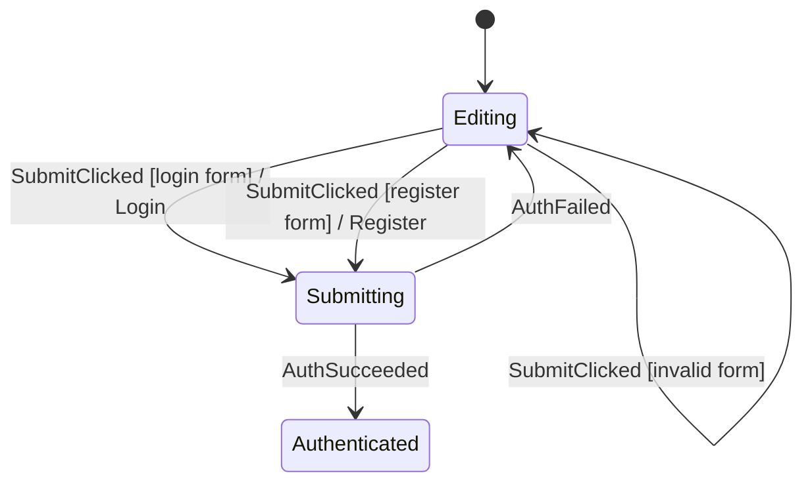

# Auth 화면 가이드 (Auth Walkthrough)

소스 코드 위치:
- `feature/auth/AuthFlow.kt`
- `feature/auth/AuthStateMachine.kt`
- `feature/auth/AuthViewModel.kt`
- `feature/auth/AuthScreen.kt`
- `AuthStateMachineTest.kt`

---

## 1. 상태 전이 흐름 (Flow)



- `Editing`: 폼 입력과 유효성 검증을 소유합니다.
- `Submitting`: 로그인/회원가입 결과를 수신하는 유일한 Phase입니다.
- `Authenticated(session)`: 인증 완료 상태를 지속합니다.

---

## 2. 조건부 제출 분기 (Conditional Submit)

`SubmitClicked`는 로그인 폼, 회원가입 폼, 유효하지 않은 폼이라는 3개의 명확한 조건 분기가 있으므로 `case`를 사용합니다:

```kotlin
on<AuthEvent.SubmitClicked> {
    case("login form", condition = { data.canSubmitLoginRequest() }) {
        command("Login") {
            AuthCommand.Login(data.form.email, data.form.password)
        }
        transitionTo(AuthPhase.Submitting)
    }

    case("register form", condition = { data.canSubmitRegistrationRequest() }) {
        command("Register") {
            AuthCommand.Register(
                data.form.name,
                data.form.email,
                data.form.password,
            )
        }
        transitionTo(AuthPhase.Submitting)
    }

    case("invalid form", condition = { data.hasSubmitError() }) {
        updateData { withSubmitError() }
    }
}
```

---

## 3. Android 경계 (ViewModel)

`AuthViewModel`이 `Login` 및 `Register` 커맨드를 실행하고 세션을 저장한 뒤 `AuthSucceeded` 또는 `AuthFailed` 이벤트를 전송합니다. UI에는 다음과 같은 동사형 메서드를 노출합니다:

```kotlin
fun selectMode(mode: AuthMode)
fun updateName(value: String)
fun updateEmail(value: String)
fun updatePassword(value: String)
fun submit()
```

`AuthScreen` 컴포저블은 `AuthEvent` 객체를 전혀 알 필요가 없습니다.

---

## 4. 인증 완료와 화면 이동 (Navigation)

인증 성공은 이미 `AuthPhase.Authenticated(session)` 상태로 머신에 기록됩니다. `AuthRoute`는 이 상태를 관찰하여 다음 화면으로 이동합니다:

```kotlin
LaunchedEffect(renderState.isAuthenticated) {
    if (renderState.isAuthenticated) onAuthenticated()
}
```

별도의 1회성 Navigation 이벤트 채널 없이, Navigation 소유권은 Route가 갖고 인증 완료 상태는 머신이 소유합니다.
