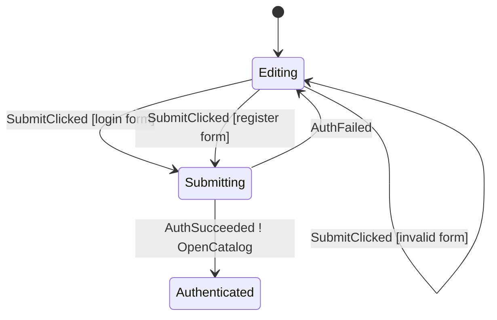

# Auth Walkthrough

Auth is the smallest real Android example.

Use it when you want to understand how Afsm fits a normal form screen without
the size of Checkout or ProductEditor.

Read Auth after you finish the minimum Draft path in
[getting-started.md](getting-started.md): build the machine, add JVM transition
tests, host it from a ViewModel, and add one ViewModel wiring test.

## From Draft To Auth

Keep the same mental model from Draft:

- transition rules stay in a plain Kotlin machine,
- `ViewModel.afsmHost(...)` owns Android lifecycle, command execution, state,
  and effects,
- repository results come back as typed events,
- pure JVM transition tests are still the first tests to read.

Auth adds only the next small Android-screen concepts:

- two form modes, login and register, handled by guarded `case(...)` branches,
- session persistence in the command handler after a repository success,
- a feature-owned render state before Compose rendering,
- one real route effect, `AuthEffect.OpenCatalog`, while the authenticated
  session remains durable state.

It still avoids the larger Checkout topics: dynamic initial state, async
loading, request ids, stale command results, retry policy, and durable
completion navigation.

## Files

- `sample-shop/src/main/kotlin/afsm/sample/shop/feature/auth/AuthContract.kt`
- `sample-shop/src/main/kotlin/afsm/sample/shop/feature/auth/AuthStateMachine.kt`
- `sample-shop/src/main/kotlin/afsm/sample/shop/feature/auth/AuthViewModel.kt`
- `sample-shop/src/main/kotlin/afsm/sample/shop/feature/auth/AuthScreen.kt`
- `sample-shop/src/test/kotlin/afsm/sample/shop/feature/auth/AuthStateMachineTest.kt`

## Graph



Generated file:

```text
sample-shop/build/generated/afsm/mmd/AuthStateMachine.mmd
```

## Contract Shape

Auth uses the standard graphable shape:

```kotlin
typealias AuthState = AfsmState<AuthPhase, AuthData>
```

Phases are small:

```kotlin
sealed interface AuthPhase {
    data object Editing : AuthPhase
    data object Submitting : AuthPhase
    data class Authenticated(val session: UserSession) : AuthPhase
}
```

Data carries form data:

```kotlin
data class AuthData(
    val mode: AuthMode = AuthMode.Login,
    val form: AuthForm = AuthForm(),
    val errorMessage: String? = null,
)
```

This is the basic Afsm split: phase describes where the flow is, data carries
screen data.

## Submit Flow

Read `SubmitClicked` as one ordered branch:

```text
AuthScreen
-> AuthViewModel.onEvent(SubmitClicked)
-> authStateMachine validates the current data
-> updateData normalizes the form
-> command(Login/Register) is emitted
-> transitionTo(Submitting)
-> ViewModel command handler calls the repository
-> AuthSucceeded/AuthFailed is dispatched back into the machine
```

The `command(...)` block observes data after earlier `updateData(...)`
statements in the same accepted case. That is why the real sample can normalize
the form once, then build the login/register command from `data.form`.

## Validation Branches

`SubmitClicked` has two successful named cases and one invalid-input case:

```kotlin
on<AuthEvent.SubmitClicked> {
    case(
        label = "login form",
        condition = { data.canSubmitLoginRequest() },
    ) {
        command(label = "Login") { AuthCommand.Login(...) }
        transitionTo(AuthPhase.Submitting)
    }

    case(
        label = "register form",
        condition = { data.canSubmitRegistrationRequest() },
    ) {
        command(label = "Register") { AuthCommand.Register(...) }
        transitionTo(AuthPhase.Submitting)
    }

    case(
        label = "invalid form",
        condition = { data.hasSubmitError() },
    ) {
        updateData { copy(errorMessage = submitError()) }
    }
}
```

This is the recommended pattern for forms: valid paths move phase and emit
commands, invalid input stays in the current phase with data error state.

## ViewModel Wiring

Auth uses the simplest `afsmHost(machine = ...)` form because its initial state
is static:

```kotlin
class AuthViewModel(
    private val authRepository: AuthRepository,
    private val sessionRepository: SessionRepository,
) : ViewModel() {
    private val host = afsmHost(
        machine = authStateMachine,
        commandHandler = { command: AuthCommand, dispatchEvent ->
            when (command) {
                is AuthCommand.Login -> {
                    authRepository.login(
                        email = command.email,
                        password = command.password,
                    ).fold(
                        onSuccess = { session ->
                            sessionRepository.setSession(session)
                            dispatchEvent(AuthEvent.AuthSucceeded(session))
                        },
                        onFailure = { error ->
                            dispatchEvent(AuthEvent.AuthFailed(error.message ?: "Login failed."))
                        },
                    )
                }

                is AuthCommand.Register -> {
                    authRepository.register(
                        name = command.name,
                        email = command.email,
                        password = command.password,
                    ).fold(
                        onSuccess = { session ->
                            sessionRepository.setSession(session)
                            dispatchEvent(AuthEvent.AuthSucceeded(session))
                        },
                        onFailure = { error ->
                            dispatchEvent(AuthEvent.AuthFailed(error.message ?: "Registration failed."))
                        },
                    )
                }
            }
        },
    )

    val state: StateFlow<AuthState> = host.state
    val effects: Flow<AuthEffect> = host.effects

    fun onEvent(event: AuthEvent) {
        host.dispatch(event)
    }
}
```

The command handler owns repository/session work and returns success or failure
to the machine as typed events.

## Render State Boundary

Auth is small, but it still maps `AuthState` to `AuthRenderState` before
rendering. This keeps Compose focused on ordinary screen choices such as
loading state, selected mode, form values, and authenticated email:

```kotlin
val state by viewModel.state.collectAsStateWithLifecycle()
val renderState = state.toRenderState()

AuthScreen(
    state = renderState,
    onEvent = viewModel::onEvent,
)
```

Use this pattern when a screen starts interpreting several phases for UI
enablement, labels, or terminal display. The first Draft screen can pass
`DraftState` directly until that mapping earns its own model.

## Effect Policy

Successful auth transitions to a durable phase:

```kotlin
AuthPhase.Authenticated(session)
```

It also emits `AuthEffect.OpenCatalog` for route-level navigation. The state is
the business result; the effect is only UI behavior.

## Tests To Read

Read `AuthStateMachineTest` in this order:

1. `register submit trims inputs enters loading and emits register command`
2. `submit with invalid password handles without phase change and does not emit command`
3. `auth success moves from submitting to authenticated and emits catalog effect`
4. `auth command result without loading is invalid`
5. `form changes update data inside editing phase`
