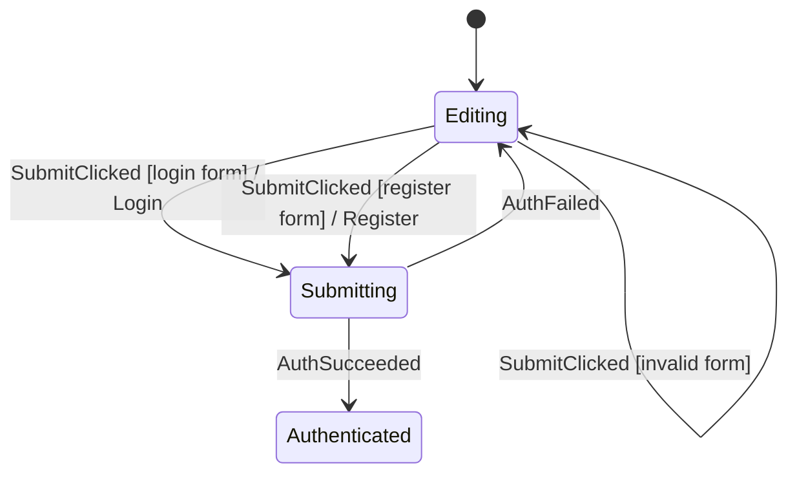

# Auth Walkthrough

Source:

- `feature/auth/AuthFlow.kt`
- `feature/auth/AuthStateMachine.kt`
- `feature/auth/AuthViewModel.kt`
- `feature/auth/AuthScreen.kt`
- `AuthStateMachineTest.kt`

## Flow



`Editing` owns form changes and validation. `Submitting` is the only phase that
accepts auth results. `Authenticated(session)` is durable completion.

## Conditional submit

`SubmitClicked` uses `case` because login, registration, and invalid form are
three real named outcomes. They also appear in the generated graph.

```kotlin
on<AuthEvent.SubmitClicked> {
    case("login form", condition = { data.canSubmitLoginRequest() }) {
        command("Login") {
            AuthCommand.Login(data.form.email, data.form.password)
        }
        transitionTo(AuthPhase.Submitting)
    }

    case("register form", condition = { data.canSubmitRegistrationRequest() }) {
        command("Register") {
            AuthCommand.Register(
                data.form.name,
                data.form.email,
                data.form.password,
            )
        }
        transitionTo(AuthPhase.Submitting)
    }

    case("invalid form", condition = { data.hasSubmitError() }) {
        updateData { withSubmitError() }
    }
}
```

## Android boundary

`AuthViewModel` executes `Login` and `Register` commands, stores the session,
and dispatches `AuthSucceeded` or `AuthFailed`. The UI calls ordinary methods:

```kotlin
fun selectMode(mode: AuthMode)
fun updateName(value: String)
fun updateEmail(value: String)
fun updatePassword(value: String)
fun submit()
```

`AuthScreen` never constructs `AuthEvent`.

## Completion and navigation

Authentication success is already represented by
`AuthPhase.Authenticated(session)`. `AuthRoute` reacts to the derived durable
state:

```kotlin
LaunchedEffect(renderState.isAuthenticated) {
    if (renderState.isAuthenticated) onAuthenticated()
}
```

There is no duplicate navigation output. The route owns navigation; the machine
owns authentication completion.

## Tests to read

- registration normalizes input and emits `Register`,
- invalid password stays in `Editing`,
- success reaches durable `Authenticated`,
- late command result in `Editing` is `Invalid`,
- form changes are `Handled` data updates.
