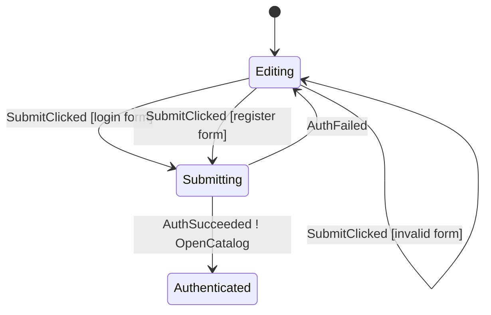

# Auth Walkthrough

Auth is the smallest real Android example.

Use it when you want to understand how Afsm fits a normal form screen without
the size of Checkout or ProductEditor.

## Files

- `sample-shop/src/main/kotlin/afsm/sample/shop/feature/auth/AuthContract.kt`
- `sample-shop/src/main/kotlin/afsm/sample/shop/feature/auth/AuthStateMachine.kt`
- `sample-shop/src/main/kotlin/afsm/sample/shop/feature/auth/AuthViewModel.kt`
- `sample-shop/src/main/kotlin/afsm/sample/shop/feature/auth/AuthScreen.kt`
- `sample-shop/src/test/kotlin/afsm/sample/shop/feature/auth/AuthStateMachineTest.kt`

## Graph



Generated file:

```text
sample-shop/build/generated/afsm/mmd/AuthStateMachine.mmd
```

## Contract Shape

Auth uses the standard graphable shape:

```kotlin
typealias AuthState = AfsmState<AuthPhase, AuthData>
```

Phases are small:

```kotlin
sealed interface AuthPhase {
    data object Editing : AuthPhase
    data object Submitting : AuthPhase
    data class Authenticated(val session: UserSession) : AuthPhase
}
```

Data carries form data:

```kotlin
data class AuthData(
    val mode: AuthMode = AuthMode.Login,
    val form: AuthForm = AuthForm(),
    val errorMessage: String? = null,
)
```

This is the basic Afsm split: phase describes where the flow is, data carries
screen data.

## Submit Flow

Read `SubmitClicked` as one ordered branch:

```text
AuthScreen
-> AuthViewModel.onEvent(SubmitClicked)
-> AuthStateMachine validates the current data
-> updateData normalizes the form
-> command(Login/Register) is emitted
-> transitionTo(Submitting)
-> ViewModel command handler calls the repository
-> AuthSucceeded/AuthFailed is dispatched back into the machine
```

The `command(...)` block observes data after earlier `updateData(...)`
statements in the same accepted case. That is why the real sample can normalize
the form once, then build the login/register command from `data.form`.

## Validation Branches

`SubmitClicked` has two successful named cases and one invalid-input case:

```kotlin
on<AuthEvent.SubmitClicked> {
    case(
        label = "login form",
        condition = { data.canSubmitLoginRequest() },
    ) {
        command(label = "Login") { AuthCommand.Login(...) }
        transitionTo(AuthPhase.Submitting)
    }

    case(
        label = "register form",
        condition = { data.canSubmitRegistrationRequest() },
    ) {
        command(label = "Register") { AuthCommand.Register(...) }
        transitionTo(AuthPhase.Submitting)
    }

    case(
        label = "invalid form",
        condition = { data.hasSubmitError() },
    ) {
        updateData { copy(errorMessage = submitError()) }
    }
}
```

This is the recommended pattern for forms: valid paths move phase and emit
commands, invalid input stays in the current phase with data error state.

## ViewModel Wiring

Auth uses the simplest `afsmHost(machine = ...)` form because its initial state
is static:

```kotlin
private val host = afsmHost(
    machine = AuthStateMachine,
    commandHandler = { command: AuthCommand, dispatch ->
        // repository call -> AuthSucceeded/AuthFailed
    },
)
```

The ViewModel exposes `host.state` and `host.effects`, then delegates UI input
to `host.dispatch(event)`.

## Effect Policy

Successful auth transitions to a durable phase:

```kotlin
AuthPhase.Authenticated(session)
```

It also emits `AuthEffect.OpenCatalog` for route-level navigation. The state is
the business result; the effect is only UI behavior.

## Tests To Read

Read `AuthStateMachineTest` in this order:

1. `register submit trims inputs enters loading and emits register command`
2. `submit with invalid password handles without phase change and does not emit command`
3. `auth success moves from submitting to authenticated and emits catalog effect`
4. `auth command result without loading is invalid`
5. `form changes update data inside editing phase`
