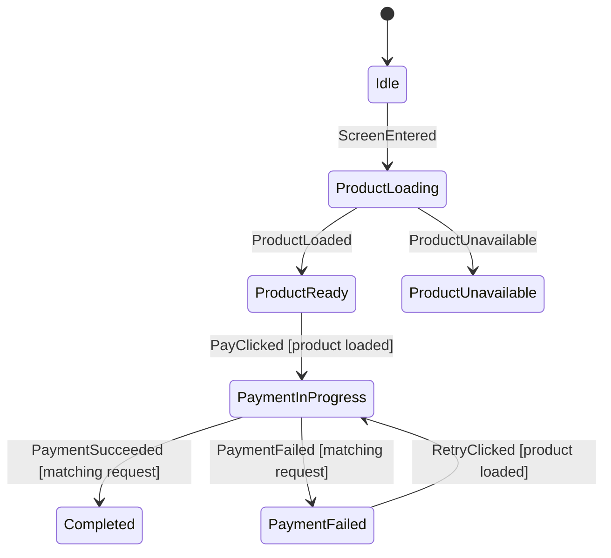

# Checkout 결제 화면 가이드 (Checkout Walkthrough)

Checkout은 가독성과 비동기 안전성을 보여주는 Afsm의 핵심 참조 예제입니다.

소스 코드 위치:
- `feature/checkout/CheckoutFlow.kt`
- `feature/checkout/CheckoutStateMachine.kt`
- `feature/checkout/CheckoutViewModel.kt`
- `feature/checkout/CheckoutRestoration.kt`
- `feature/checkout/CheckoutScreen.kt`
- `CheckoutStateMachineTest.kt`

---

## 1. 그래프 먼저 확인하기



생성된 `.mmd` 다이어그램을 통해 화면의 전체 위상(Topology)을 먼저 파악한 후, 머신 코드에서 세부 데이터 조작 규칙을 확인합니다.

---

## 2. 동적 초기 상태 (Dynamic Initial State)

화면 진입 시 전달받는 `productId` 및 `SavedStateHandle`의 복원 데이터에 따라 초기 상태가 결정되므로 `AfsmDefaultMachine`이 아닌 `AfsmMachine`을 사용합니다:

```kotlin
private val initialState = checkoutStateFromSavedState(
    savedStateHandle = savedStateHandle,
    navigationProductId = productId,
)

private val host = afsmHost(
    machine = checkoutStateMachine,
    initialState = initialState,
    commandHandler = ...,
)
```

---

## 3. 진입 커맨드 (Entry Commands)

`ProductLoading`에 진입하면 `LoadProduct`를, `PaymentInProgress(requestId)`에 진입하면 `SubmitPayment`를 발행합니다:

```kotlin
phase<CheckoutPhase.PaymentInProgress> {
    onEnter {
        command("SubmitPayment") {
            CheckoutCommand.SubmitPayment(
                requestId = phase.requestId,
                product = requireNotNull(data.product),
            )
        }
    }
}
```

Command는 값(Value)일 뿐이며, `CheckoutViewModel`이 실제 결제 API를 호출하고 결과를 머신에 Event로 전달합니다.

---

## 4. 늦게 도착한 비동기 결과(Stale Result) 방어

```kotlin
on<CheckoutEvent.PaymentSucceeded> {
    case(
        label = "matching request",
        condition = { phase.requestId == event.requestId },
    ) {
        transitionTo<CheckoutPhase.Completed> {
            CheckoutPhase.Completed(event.receipt.orderId)
        }
    }

    ignore(
        reason = "Stale payment success result.",
        condition = { phase.requestId != event.requestId },
    )
}
```

Phase 페이로드와 결과 이벤트가 동일한 상관관계 ID(`requestId`)를 공유하므로, 이전 요청의 늦은 응답이 새로운 결제 시도를 덮어쓰거나 오작동을 일으키지 않습니다.

---

## 5. 지속되는 완료 상태 (Durable Completion)

`CheckoutPhase.Completed(orderId)`가 결제 완료의 단일 진실 공급원입니다. Route 컴포저블은 이 상태를 감지하여 주문 완료 화면으로 이동합니다:

```kotlin
LaunchedEffect(renderState.orderId) {
    if (renderState.isComplete) onPaymentComplete()
}
```

프로세스가 재생성되어 복원되더라도 완료 상태는 그대로 유지됩니다.

---

## 6. 안전한 상태 복원 정책 (Restoration Policy)

- **주문 완료 상태** -> `Completed(orderId)` 복원 (새로운 커맨드 없음)
- **결제 요청 중 프로세스가 종료된 경우** -> `PaymentStatusUnknown(requestId)`로 복원 (자동 재결제 방지)
- **그 외 초기 상태** -> `Idle`에서 시작하여 `ScreenEntered` 이벤트 전달

결제는 중복 발생 시 심각한 문제를 초래하므로, 결과를 알 수 없는 경우 자동 재시도 대신 명시적인 상태 불확실 Phase로 복원합니다.
