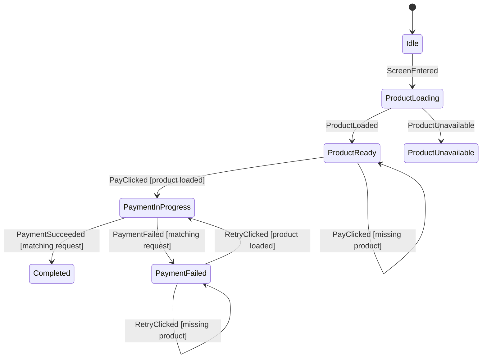

# Checkout Walkthrough

Checkout is the recommended example after Auth.

It is small enough to read in one sitting, but it has the Android problems that
make a state machine worthwhile: screen entry, loading, payment, retry, stale
async results, durable completion, and optional navigation.

## Files

- `sample-shop/src/main/kotlin/afsm/sample/shop/feature/checkout/CheckoutContract.kt`
- `sample-shop/src/main/kotlin/afsm/sample/shop/feature/checkout/CheckoutStateMachine.kt`
- `sample-shop/src/main/kotlin/afsm/sample/shop/feature/checkout/CheckoutViewModel.kt`
- `sample-shop/src/main/kotlin/afsm/sample/shop/feature/checkout/CheckoutScreen.kt`
- `sample-shop/src/test/kotlin/afsm/sample/shop/feature/checkout/CheckoutStateMachineTest.kt`

## Graph

Generate the graph:

```bash
./gradlew :sample-shop:generateAfsmMmd
```

Current graph shape:



The generated file also includes entry command notes:

- `ProductLoading` enters with `LoadProduct`.
- `PaymentInProgress` enters with `SubmitPayment`.

## Contract Shape

Checkout uses the standard graphable state shape:

```kotlin
typealias CheckoutState = AfsmState<CheckoutPhase, CheckoutData>
```

`CheckoutPhase` is the finite graph:

```kotlin
sealed interface CheckoutPhase {
    data object Idle : CheckoutPhase
    data object ProductLoading : CheckoutPhase
    data object ProductReady : CheckoutPhase
    data class PaymentInProgress(val requestId: Long) : CheckoutPhase
    data object PaymentFailed : CheckoutPhase
    data object ProductUnavailable : CheckoutPhase
    data class Completed(val orderId: Long) : CheckoutPhase
}
```

`CheckoutData` carries durable data that should survive phase changes:

```kotlin
data class CheckoutData(
    val productId: Long,
    val product: Product? = null,
    val nextPaymentRequestId: Long = 0,
    val errorMessage: String? = null,
)
```

This keeps the graph about business phases and keeps product/form data out of
every phase constructor.

## Dynamic Initial State

Checkout starts from a navigation `productId`, so the ViewModel provides the
initial state and dispatches an explicit startup event:

```kotlin
class CheckoutViewModel(
    productId: Long,
    private val productRepository: ProductRepository,
    private val paymentRepository: PaymentRepository,
    private val sessionRepository: SessionRepository,
) : ViewModel() {
    private val host = afsmHost(
        machine = CheckoutStateMachine,
        initialState = checkoutState(productId = productId),
        commandHandler = { command: CheckoutCommand, dispatch ->
            when (command) {
                is CheckoutCommand.LoadProduct -> {
                    val product = productRepository.findProduct(command.productId)
                    if (product == null) {
                        dispatch(CheckoutEvent.ProductUnavailable)
                    } else {
                        dispatch(CheckoutEvent.ProductLoaded(product))
                    }
                }

                is CheckoutCommand.SubmitPayment -> {
                    val session = sessionRepository.currentSession()
                    if (session == null) {
                        dispatch(
                            CheckoutEvent.PaymentFailed(
                                requestId = command.requestId,
                                message = "Login is required.",
                            ),
                        )
                    } else {
                        paymentRepository.submitPayment(
                            session = session,
                            product = command.product,
                        ).fold(
                            onSuccess = { receipt ->
                                dispatch(
                                    CheckoutEvent.PaymentSucceeded(
                                        requestId = command.requestId,
                                        receipt = receipt,
                                    ),
                                )
                            },
                            onFailure = { error ->
                                dispatch(
                                    CheckoutEvent.PaymentFailed(
                                        requestId = command.requestId,
                                        message = error.message ?: "Payment failed.",
                                    ),
                                )
                            },
                        )
                    }
                }
            }
        },
    )

    val state: StateFlow<CheckoutState> = host.state
    val effects: Flow<CheckoutEffect> = host.effects

    init {
        host.dispatch(CheckoutEvent.ScreenEntered)
    }

    fun onEvent(event: CheckoutEvent) {
        host.dispatch(event)
    }
}
```

This is the standard path for graphable machines with navigation arguments,
deep links, or `SavedStateHandle` restoration.

Do not rely on initial state construction to run `onEnter`. Checkout starts in
`Idle`; `ScreenEntered` moves it to `ProductLoading`, whose `onEnter` emits the
`LoadProduct` command.

## Commands

Commands are emitted when entering work phases:

```kotlin
phase(CheckoutPhase.ProductLoading) {
    onEnter {
        command(label = "LoadProduct") {
            CheckoutCommand.LoadProduct(data.productId)
        }
    }
}
```

```kotlin
phase<CheckoutPhase.PaymentInProgress> {
    onEnter {
        command(label = "SubmitPayment") {
            val product = requireNotNull(data.product)
            CheckoutCommand.SubmitPayment(
                requestId = phase.requestId,
                product = product,
            )
        }
    }
}
```

The state machine does not call repositories. The ViewModel command handler
does that work and dispatches typed result events back to the host.

## Stale Result Policy

Payment commands carry a request id:

```kotlin
data class PaymentInProgress(val requestId: Long)
data class SubmitPayment(val requestId: Long, val product: Product)
data class PaymentSucceeded(val requestId: Long, val receipt: OrderReceipt)
data class PaymentFailed(val requestId: Long, val message: String)
```

Only matching results are accepted:

```kotlin
case(
    label = "matching request",
    condition = { phase.requestId == event.requestId },
) {
    effect(label = "PaymentCompleted") {
        CheckoutEffect.PaymentCompleted(event.receipt.orderId)
    }
    transitionTo<CheckoutPhase.Completed> {
        CheckoutPhase.Completed(orderId = event.receipt.orderId)
    }
}

ignore(
    reason = "Stale payment success result.",
    condition = { phase.requestId != event.requestId },
)
```

This is the reference pattern for async work that can complete after retry or
screen movement.

## Missing Data Branches

When a phase requires data that might be absent, model the negative branch explicitly instead
of relying on an unconditional fallback case:

```kotlin
case(
    label = "product loaded",
    condition = { data.product != null },
) {
    transitionTo<CheckoutPhase.PaymentInProgress> {
        CheckoutPhase.PaymentInProgress(requestId = data.nextPaymentRequestId + 1)
    }
}

case(
    label = "missing product",
    condition = { data.product == null },
) {
    updateData { copy(errorMessage = "Product is required before payment.") }
}
```

This keeps source code and generated `.mmd` labels aligned.

## Ignore Is Optional

You do not need to list every impossible event in every phase. If an event is
not valid and not expected, omit it and let Afsm report an invalid transition.

Checkout uses `ignore(...)` only for expected harmless events, such as duplicate
screen entry while loading or stale payment results after retry. That keeps
diagnostics useful without teaching users to enumerate a full event matrix.

## Durable Completion Plus Optional Effect

Payment completion is modeled as state:

```kotlin
CheckoutPhase.Completed(orderId)
```

The navigation callback is also emitted as an effect:

```kotlin
effect(CheckoutEffect.PaymentCompleted(orderId))
```

If the effect is missed, the screen can still render the completed order from
state. This is the recommended Android policy for required product progress.

## Render State

The UI does not need to know every internal phase. `CheckoutState.toRenderState`
maps phase/data to a screen model:

```kotlin
val state by viewModel.state.collectAsStateWithLifecycle()

CheckoutScreen(
    state = state.toRenderState(),
    onPayClick = { viewModel.onEvent(CheckoutEvent.PayClicked) },
    onRetryClick = { viewModel.onEvent(CheckoutEvent.RetryClicked) },
)
```

This keeps the machine graph precise while keeping Compose rendering ordinary.
The render state should expose UI choices directly. For example, Checkout maps
phases to a `primaryAction` instead of making the button infer retry behavior
from `errorMessage`.

## Tests To Read

Read `CheckoutStateMachineTest` in this order:

1. `screen entered loads product exactly once`
2. `pay clicked with loaded product enters payment phase and emits submit command`
3. `payment failure enters failure phase and retry can emit payment command`
4. `payment success completes checkout and emits completion effect`
5. `stale payment success result is ignored`
6. `topology exposes Checkout graph without sample events`

These tests are the executable spec for the example.
