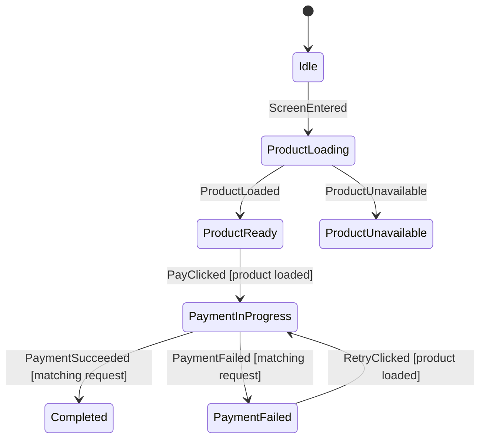

# Checkout Walkthrough

Checkout is the primary readability and safety example.

Source:

- `feature/checkout/CheckoutFlow.kt`
- `feature/checkout/CheckoutStateMachine.kt`
- `feature/checkout/CheckoutViewModel.kt`
- `feature/checkout/CheckoutRestoration.kt`
- `feature/checkout/CheckoutScreen.kt`
- `CheckoutStateMachineTest.kt`

## Read the graph first



The generated `.mmd` file is the whole-flow index. Then read machine source for
exact data and commands, and tests for stale, duplicate, invalid, and restoration
behavior that the default graph intentionally does not show.

## Dynamic initial state

The machine is `AfsmMachine`, not `AfsmDefaultMachine`, because the runtime
product id and `SavedStateHandle` determine the usable start state.

```kotlin
private val initialState = checkoutStateFromSavedState(
    savedStateHandle = savedStateHandle,
    navigationProductId = productId,
)

private val host = afsmHost(
    machine = checkoutStateMachine,
    initialState = initialState,
    commandHandler = ...,
)
```

## Entry commands

Entering `ProductLoading` emits `LoadProduct`. Entering
`PaymentInProgress(requestId)` emits `SubmitPayment`.

```kotlin
phase<CheckoutPhase.PaymentInProgress> {
    onEnter {
        command("SubmitPayment") {
            CheckoutCommand.SubmitPayment(
                requestId = phase.requestId,
                product = requireNotNull(data.product),
            )
        }
    }
}
```

The command is a value. `CheckoutViewModel` performs repository work and returns
the result as an event.

## Stale-result safety

```kotlin
on<CheckoutEvent.PaymentSucceeded> {
    case(
        label = "matching request",
        condition = { phase.requestId == event.requestId },
    ) {
        transitionTo<CheckoutPhase.Completed> {
            CheckoutPhase.Completed(event.receipt.orderId)
        }
    }

    ignore(
        reason = "Stale payment success result.",
        condition = { phase.requestId != event.requestId },
    )
}
```

The phase payload and result event carry the same correlation id. A late result
cannot overwrite a newer attempt.

## Durable completion

`CheckoutPhase.Completed(orderId)` is the single source of truth for completion.
The route reacts to the derived order id:

```kotlin
LaunchedEffect(renderState.orderId) {
    if (renderState.isComplete) onPaymentComplete()
}
```

This also defines restoration behavior: restored completion is still completion.
There is no separate best-effort payment-completed output.

## Android API

The screen calls:

```kotlin
viewModel.pay()
viewModel.retry()
```

The ViewModel keeps machine events internal, owns repositories and
`SavedStateHandle`, and dispatches command results.

## Restoration policy

- completed order -> `Completed(orderId)`, no command,
- payment known to be pending after recreation ->
  `PaymentStatusUnknown(requestId)`, no automatic retry,
- otherwise -> start from `Idle` and dispatch `ScreenEntered`.

Unknown payment status exists because repeating payment is unsafe.

## Tests to read

- load and unavailable paths,
- pay, failure, and retry,
- duplicate pay/retry while pending,
- matching versus stale success/failure,
- completed-state duplicates,
- restored completion and unknown status,
- topology assertions and `.mmd` rendering.
