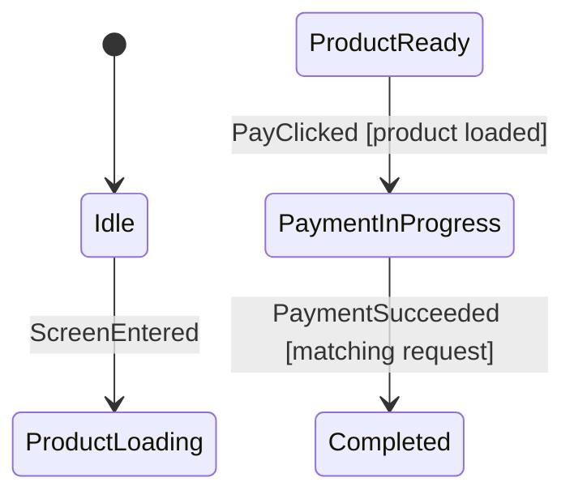

# Graph Generation

Afsm generates Mermaid state diagrams from executable machine topology. The
graph exists to make a whole flow visible when phase-local lambdas make the
source intentionally local.

## What the graph includes

- initial phase when the machine has one,
- phases,
- external transitions,
- named `case` conditions,
- command labels,
- entry and exit command notes,
- phase-owned invocation start/cancel notes.

`Handled`, `Ignored`, and `Invalid` behavior is not all shown in the default
flow graph. Read tests for those semantics.

## Annotate a machine

```kotlin
@AfsmGraph(
    id = "Checkout",
    fileName = "CheckoutStateMachine.mmd",
)
internal val checkoutMachine:
    AfsmMachine<CheckoutState, CheckoutEvent, CheckoutCommand> =
    afsmMachine(initialPhase = CheckoutPhase.Idle) {
        // phases and rules
    }
```

The exposed value must implement `AfsmMachine<State, Event, Command>` or
`AfsmDefaultMachine<State, Event, Command>`.

## Configure KSP and the plugin

```kotlin
plugins {
    id("com.google.devtools.ksp")
    id("io.github.afsm.graph")
}

dependencies {
    ksp("io.github.afsm:afsm-graph-ksp:0.1.0-SNAPSHOT")
}
```

For the repository sample, the processor is supplied by `project(":afsm-graph-ksp")`.

## Generate diagrams

```bash
./gradlew :sample-shop:generateAfsmMmd
```

Output:

```text
sample-shop/build/generated/afsm/mmd/
├── AuthStateMachine.mmd
├── CheckoutStateMachine.mmd
└── ProductEditorStateMachine.mmd
```

Example:



## Flow versus full rendering

`AfsmMmdOptions.Flow` is the review-oriented default. It favors business
topology. `AfsmMmdOptions.Full` can include more internal transitions when
debugging.

```kotlin
val mmd = machine.topology.toMmd(AfsmMmdOptions.Full)
```

## Review rule

Review graph, machine, and tests in the same change. The graph answers “where
can the flow go?”, the machine answers “how exactly?”, and tests answer “which
edge conditions are proven?”. Do not hand-edit generated build output.
