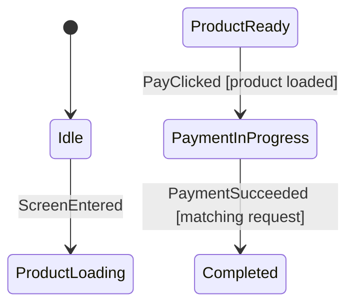

# Graph Generation

Afsm generates Mermaid state diagrams from executable machine topology. The
graph exists to make a whole flow visible when phase-local lambdas make the
source intentionally local.

## What the graph includes

- initial phase when the machine has one,
- phases,
- external transitions,
- named `case` conditions,
- command labels,
- entry and exit command notes,
- phase-owned invocation start/cancel notes.

`Handled`, `Ignored`, and `Invalid` behavior is not all shown in the default
flow graph. Read tests for those semantics.

## Annotate a machine

```kotlin
@AfsmGraph(
    id = "Checkout",
    fileName = "CheckoutStateMachine.mmd",
)
internal val checkoutMachine:
    AfsmMachine<CheckoutState, CheckoutEvent, CheckoutCommand> =
    afsmMachine(initialPhase = CheckoutPhase.Idle) {
        // phases and rules
    }
```

The exposed value must implement `AfsmMachine<State, Event, Command>` or
`AfsmDefaultMachine<State, Event, Command>`.

## Configure KSP and the plugin

```kotlin
plugins {
    id("com.google.devtools.ksp")
    id("io.github.afsm.graph")
}

dependencies {
    ksp("io.github.afsm:afsm-graph-ksp:0.1.0-SNAPSHOT")
}
```

For the repository sample, the processor is supplied by `project(":afsm-graph-ksp")`.

## Generate diagrams

```bash
./gradlew :sample-shop:generateAfsmMmd
```

Output:

```text
sample-shop/build/generated/afsm/mmd/
├── AuthStateMachine.mmd
├── CheckoutStateMachine.mmd
└── ProductEditorStateMachine.mmd
```

Example:


```mermaid
stateDiagram-v2
  [*] --> Idle
  Idle --> ProductLoading: ScreenEntered
  ProductReady --> PaymentInProgress: PayClicked [product loaded]
  PaymentInProgress --> Completed: PaymentSucceeded [matching request]
```

## Flow versus full rendering

`AfsmMmdOptions.Flow` is the review-oriented default. It favors business
topology. `AfsmMmdOptions.Full` can include more internal transitions when
debugging.

```kotlin
val mmd = machine.topology.toMmd(AfsmMmdOptions.Full)
```

## Commit a baseline and verify it

A regenerated diagram proves nothing on its own. Commit the generated diagrams
and let the build compare them against the machine on every run.

```bash
./gradlew :sample-shop:updateAfsmMmd   # writes sample-shop/afsm-graph/*.mmd
./gradlew :sample-shop:verifyAfsmMmd   # fails when the committed copy is stale
```

`verifyAfsmMmd` is wired into `check` whenever the baseline directory exists, so
changing a machine without updating its diagram fails the build:

```text
Afsm graphs differ from the checked-in baseline in sample-shop/afsm-graph:
  - out of date: AuthStateMachine.mmd
      -   Editing --> Submitting: SubmitClicked [login form] / Login
      +   Editing --> Submitting: SubmitClicked [login form] / SignIn

Run ':sample-shop:updateAfsmMmd' and commit the result.
```

Configure the baseline location with `afsmGraph.checkedInDir`, and opt out of
the `check` wiring with `afsmGraph.verifyOnCheck.set(false)`.

## How generation runs

`generateAfsmMmd` is a `JavaExec` task that runs `afsm.core.AfsmMmdExport`
against the module's unit test runtime classpath. That classpath is used because
it is the one Android classpath containing main classes, generated KSP output,
dependencies, and the mockable `android.jar`; the module's unit test sources
must therefore compile, but its unit tests are never run by graph generation.
The plugin does not add a test framework to the consuming project and does not
generate sources into its test source set.

## Review rule

Review graph, machine, and tests in the same change. The graph answers “where
can the flow go?”, the machine answers “how exactly?”, and tests answer “which
edge conditions are proven?”. Do not hand-edit generated build output; update
the committed baseline with `updateAfsmMmd` instead.
