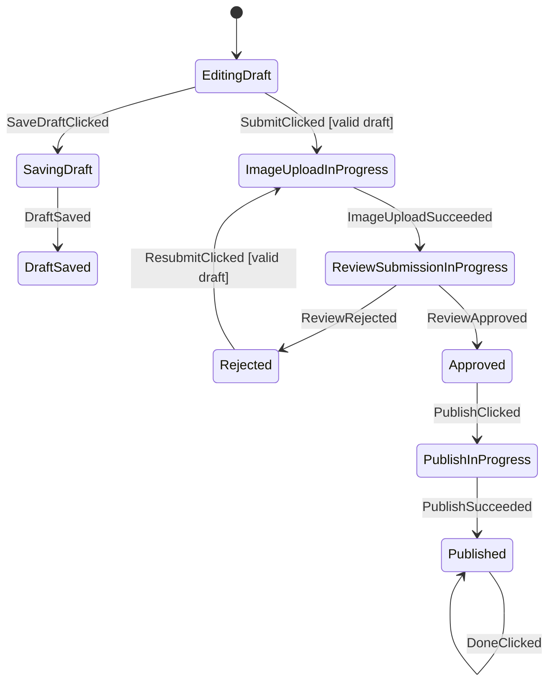

# ProductEditor Walkthrough

ProductEditor is the complex-flow reference example.

Read it after Auth and Checkout. It is intentionally larger because it proves
Afsm can keep a high-branching Android screen reviewable.

## Files

- `sample-shop/src/main/kotlin/afsm/sample/shop/feature/editor/ProductEditorContract.kt`
- `sample-shop/src/main/kotlin/afsm/sample/shop/feature/editor/ProductEditorStateMachine.kt`
- `sample-shop/src/main/kotlin/afsm/sample/shop/feature/editor/ProductEditorViewModel.kt`
- `sample-shop/src/main/kotlin/afsm/sample/shop/feature/editor/ProductEditorScreen.kt`
- `sample-shop/src/test/kotlin/afsm/sample/shop/feature/editor/ProductEditorStateMachineTest.kt`

## Graph

Generate the graph:

```bash
./gradlew :sample-shop:generateAfsmMmd
```

Current main flow:



Generated file:

```text
sample-shop/build/generated/afsm/mmd/ProductEditorStateMachine.mmd
```

## Why This Example Exists

ProductEditor shows the case where ordinary `ViewModel + copy(...)` updates can
hide the flow:

- draft editing,
- draft save confirmation,
- image upload,
- mock review submission,
- rejection and resubmission,
- approval,
- publish,
- completion.

The generated graph lets a reviewer understand the flow before reading the
Compose screen.

## Phase And Context

ProductEditor uses:

```kotlin
typealias ProductEditorState =
    AfsmState<ProductEditorPhase, ProductEditorContext>
```

Phases describe the business condition:

```kotlin
EditingDraft
SavingDraft
DraftSaved
ImageUploadInProgress
ReviewSubmissionInProgress(uploadToken)
Rejected(reason)
Approved
PublishInProgress
Published(productId, title)
```

Context carries draft data:

```kotlin
data class ProductEditorContext(
    val draft: ProductDraft = ProductDraft(),
    val errorMessage: String? = null,
)
```

The important modeling choice: `ProductDraft` is not passed through every phase.
It lives in context. Payload phases carry only data that belongs specifically to
that phase, such as `uploadToken`, rejection reason, or published product id.

## Entry Commands

Long-running work is phase-owned:

```kotlin
state(ProductEditorPhase.ImageUploadInProgress) {
    onEnter(commandLabels = listOf("StartImageUpload")) {
        command(ProductEditorCommand.StartImageUpload(context.draft))
    }
}
```

```kotlin
state<ProductEditorPhase.ReviewSubmissionInProgress> {
    onEnter(commandLabels = listOf("StartReviewSubmission")) {
        command(
            ProductEditorCommand.StartReviewSubmission(
                draft = context.draft,
                uploadToken = phase.uploadToken,
            ),
        )
    }
}
```

This keeps transition branches focused on phase movement and context updates.

## Validation

Invalid submit does not fake a phase transition. It stays in the current phase
with context error state:

```kotlin
on<ProductEditorEvent.SubmitClicked> {
    transitionTo(
        phase = ProductEditorPhase.ImageUploadInProgress,
        guardLabel = "valid draft",
        guard = { context.draft.form.validationError() == null },
    ) {
        updateContext { normalizeDraftForSubmit() }
    }

    otherwise(label = "invalid draft") {
        updateContext { withValidationError() }
    }
}
```

This is the recommended shape for validation failures.

## Tests To Read

Read `ProductEditorStateMachineTest` in this order:

1. `save draft transitions to saving phase and phase entry emits save command`
2. `submit from editing transitions only by phase and starts image upload from context draft`
3. `invalid draft re-enters editing phase with validation error in context`
4. `image upload success increments review attempt in context and submits review command`
5. `rejected draft can be resubmitted through upload again without passing draft through phase`
6. `approved draft publishes product through phase entry command`
7. `topology exposes ProductEditor graph without sample events`

These tests are the practical review checklist for complex Afsm screens.
