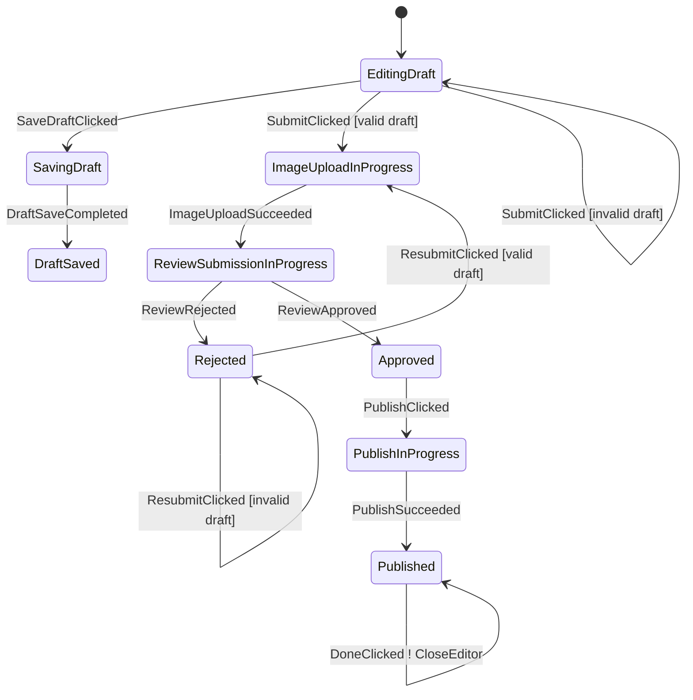

# ProductEditor Walkthrough

ProductEditor is the complex-flow reference example.

Read it after Auth and Checkout. It is intentionally larger because it proves
Afsm can keep a high-branching Android screen reviewable.

## Files

- `sample-shop/src/main/kotlin/afsm/sample/shop/feature/editor/ProductEditorContract.kt`
- `sample-shop/src/main/kotlin/afsm/sample/shop/feature/editor/ProductEditorStateMachine.kt`
- `sample-shop/src/main/kotlin/afsm/sample/shop/feature/editor/ProductEditorViewModel.kt`
- `sample-shop/src/main/kotlin/afsm/sample/shop/feature/editor/ProductEditorScreen.kt`
- `sample-shop/src/test/kotlin/afsm/sample/shop/feature/editor/ProductEditorStateMachineTest.kt`

## Graph

Generate the graph:

```bash
./gradlew :sample-shop:generateAfsmMmd
```

Current main flow:



Generated file:

```text
sample-shop/build/generated/afsm/mmd/ProductEditorStateMachine.mmd
```

## Why This Example Exists

ProductEditor shows the case where ordinary `ViewModel + copy(...)` updates can
hide the flow:

- draft editing,
- draft save confirmation,
- image upload,
- mock review submission,
- rejection and resubmission,
- approval,
- publish,
- completion.

The generated graph lets a reviewer understand the flow before reading the
Compose screen.

## Render State Boundary

ProductEditor keeps the internal FSM phase precise, but Compose does not render
directly from every phase. `ProductEditorState.toRenderState()` maps the FSM
snapshot to ordinary UI data:

| FSM condition | UI state |
|---|---|
| `EditingDraft` | fields enabled, save draft secondary action, submit primary action |
| `SavingDraft` | fields disabled, processing button |
| `DraftSaved` | fields disabled, continue editing secondary action, submit primary action |
| `ImageUploadInProgress` / `ReviewSubmissionInProgress` / `PublishInProgress` | fields disabled, processing button |
| `Rejected(reason)` | fields enabled, review note, continue editing secondary action, resubmit primary action |
| `Approved` | fields disabled, continue editing secondary action, publish primary action |
| `Published(title)` | draft fields hidden, published title, done primary action |

This is the recommended Android boundary: the state machine owns phase and
transition correctness, while Compose receives a stable render model that can
survive internal phase refactors.

## Phase And Data

ProductEditor uses:

```kotlin
typealias ProductEditorState =
    AfsmState<ProductEditorPhase, ProductEditorData>
```

Phases describe the business condition:

```kotlin
EditingDraft
SavingDraft
DraftSaved
ImageUploadInProgress
ReviewSubmissionInProgress(uploadToken)
Rejected(reason)
Approved
PublishInProgress
Published(productId, title)
```

Data carries draft data:

```kotlin
data class ProductEditorData(
    val draft: ProductDraft = ProductDraft(),
    val errorMessage: String? = null,
)
```

The important modeling choice: `ProductDraft` is not passed through every phase.
It lives in data. Payload phases carry only data that belongs specifically to
that phase, such as `uploadToken`, rejection reason, or published product id.

## Entry Commands

Long-running work is phase-owned:

```kotlin
phase(ProductEditorPhase.ImageUploadInProgress) {
    onEnter {
        command(label = "StartImageUpload") {
            ProductEditorCommand.StartImageUpload(data.draft)
        }
    }
}
```

```kotlin
phase<ProductEditorPhase.ReviewSubmissionInProgress> {
    onEnter {
        command(label = "StartReviewSubmission") {
            ProductEditorCommand.StartReviewSubmission(
                draft = data.draft,
                uploadToken = phase.uploadToken,
            )
        }
    }
}
```

This keeps transition branches focused on phase movement and data updates.

## Transition Execution Order

For a phase-changing branch, Afsm runs:

```text
source onExit -> case actions -> target phase factory -> target onEnter
```

If a source phase has no `onExit`, Afsm skips that step. For payload phases,
call `transitionTo<PayloadPhase> { ... }` inside a `case` to create the next
phase value. Keep data updates, commands, and effects as separate statements
in that case so `transitionTo` keeps one meaning: phase change.
The payload phase factory runs after the case actions, so it sees data
updates made earlier in the same case.

That order matters when the target `onEnter` command reads updated data.
For example, image upload success increments `reviewAttempt` in the transition
block, then `ReviewSubmissionInProgress.onEnter` submits the updated draft:

```kotlin
phase(ProductEditorPhase.ImageUploadInProgress) {
    on<ProductEditorEvent.ImageUploadSucceeded> {
        case {
            updateData {
                copy(
                    draft = draft.copy(
                        reviewAttempt = draft.reviewAttempt + 1,
                    ),
                    errorMessage = null,
                )
            }
            transitionTo<ProductEditorPhase.ReviewSubmissionInProgress> {
                ProductEditorPhase.ReviewSubmissionInProgress(
                    uploadToken = event.uploadToken,
                )
            }
        }
    }
}

phase<ProductEditorPhase.ReviewSubmissionInProgress> {
    onEnter {
        command(label = "StartReviewSubmission") {
            ProductEditorCommand.StartReviewSubmission(
                draft = data.draft,
                uploadToken = phase.uploadToken,
            )
        }
    }
}
```

Read this as one edge:

```text
ImageUploadInProgress
-> ImageUploadSucceeded
-> update data
-> enter ReviewSubmissionInProgress
-> emit StartReviewSubmission
```

## Validation

Invalid submit does not fake a phase transition. It stays in the current phase
with data error state:

```kotlin
on<ProductEditorEvent.SubmitClicked> {
    case(
        label = "valid draft",
        condition = { data.canStartReviewSubmission() },
    ) {
        updateData { normalizeDraftForSubmit() }
        transitionTo(ProductEditorPhase.ImageUploadInProgress)
    }

    case(
        label = "invalid draft",
        condition = { data.hasReviewSubmissionError() },
    ) {
        updateData { withReviewSubmissionError() }
    }
}
```

This is the recommended shape for validation failures.

The valid/invalid submit branches are repeated in `EditingDraft`, `DraftSaved`,
and `Rejected` on purpose. A helper could hide the repetition, but it would also
hide the graph-relevant fact that each source phase accepts the event. In Afsm
examples, prefer keeping phase movement visible and helperizing only pure data
transformations such as `normalizeDraftForSubmit()`.

## Tests To Read

Read `ProductEditorStateMachineTest` in this order:

1. `save draft transitions to saving phase and phase entry emits save command`
2. `submit from editing transitions only by phase and starts image upload from data draft`
3. `invalid draft keeps editing phase with review submission error in data`
4. `image upload success increments review attempt in data and submits review command`
5. `rejected draft can be resubmitted through upload again without passing draft through phase`
6. `approved draft publishes product through phase entry command`
7. `render state hides internal phase details from product editor ui`
8. `topology exposes ProductEditor graph without sample events`

These tests are the practical review checklist for complex Afsm screens.
