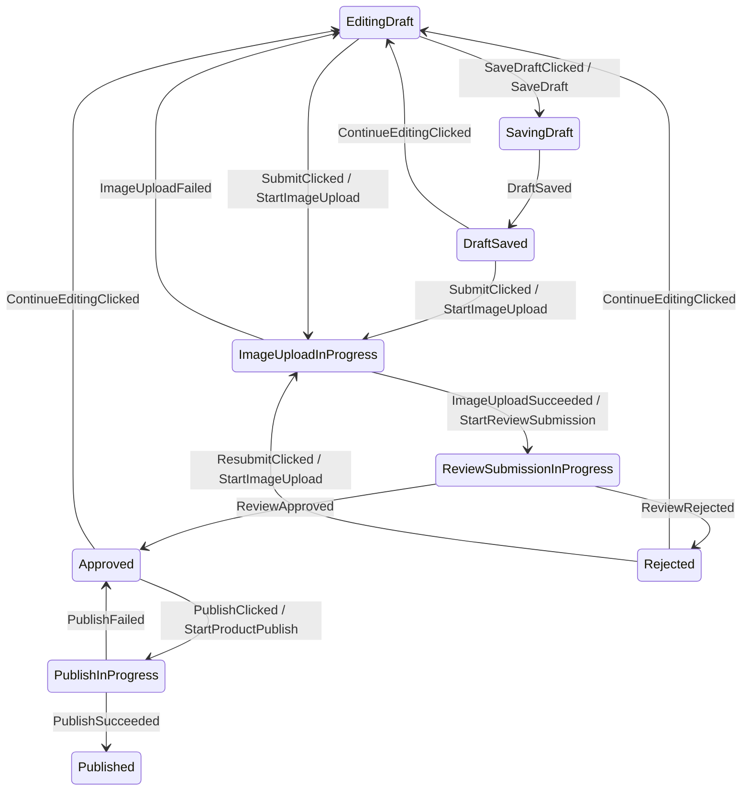

# Afsm v3 Executable DSL

This page is the canonical current direction for Afsm v3.

Afsm v3 should move from `when`-based helper APIs to a scoped executable statechart DSL.

The DSL must be the single source of truth for:

- runtime behavior,
- state diagram generation,
- transition tests,
- documentation examples.

Do not build a separate graph-only DSL beside a reducer implementation. That duplicates behavior and creates synchronization risk.

## Decision

Use a scoped executable DSL as the recommended v3 authoring model for complex Android FSM screens.

Keep the Android architecture boundary:

```text
Compose/View
-> ViewModel
-> AfsmHost
-> AfsmMachine DSL interpreter
-> StateFlow<UiState>
```

The `ViewModel` remains the Android lifecycle and business state holder adapter. The state machine remains plain Kotlin and Android-free.

## Reference Constraints

Afsm v3 is constrained by Android architecture and statechart practice.

Android:

- UI state should be produced by a state holder, commonly a `ViewModel` for screen-level business state.
- Events are transient inputs; state is durable output consumed by UI.
- UI-originated business events should be handled by the ViewModel/state holder.
- ViewModel-originated UI actions should usually become UI state; one-shot effects are exceptional.
- UI behavior logic such as navigation, snackbar display, focus, scroll, and animations stays in UI or UI-scoped state holders unless business logic requires otherwise.

References:

- [Android State holders and UI state](https://developer.android.com/topic/architecture/ui-layer/stateholders)
- [Android UI State production](https://developer.android.com/topic/architecture/ui-layer/state-production)
- [Android UI events](https://developer.android.com/topic/architecture/ui-layer/events)

Statechart references:

- [XState transitions](https://stately.ai/docs/transitions)
- [XState actions](https://stately.ai/docs/actions)
- [XState guards](https://stately.ai/docs/guards)
- [W3C SCXML](https://www.w3.org/TR/scxml/)
- [Square Workflow](https://square.github.io/workflow/)

## Why DSL

The `when + transitionTo(Phase) + PhaseEntryPolicy` spike proved a useful concept but exposed product-level problems:

- Graph generation depends on source-code inference.
- The current phase/event scope is not structurally declared.
- Entry policy hides behavior that users expect to see near the state.
- Context update, condition checks, command emission, and transition are still split across files.
- Users must follow conventions precisely or graph extraction and runtime behavior drift apart.

A scoped executable DSL makes the structure explicit:

```text
state scope
-> event handler
-> condition
-> update context
-> emit command
-> transition target
```

This matches standard statechart vocabulary while keeping Android execution in `ViewModel`/`AfsmHost`.

## Core Concepts

| Concept | Meaning | Android Mapping |
|---|---|---|
| `State` | Full UI state exposed to Android | `StateFlow<S>` |
| `Phase` | Finite statechart node | Renderable business phase |
| `Context` | Extended state carried across phases | Form data, ids, retry count, validation error |
| `Event` | Something that happened | User input or command result |
| `Condition` | Named boolean decision before a case is accepted | Validation, retry allowance, auth requirement |
| `updateContext` | Explicit context update | Immutable state data update |
| `Command` | Host-executed work emitted by transition or entry | Repository/use case call, timer, local DB write |
| `Effect` | UI-side one-shot output | Close screen, launch permission, optional navigation signal |
| `Entry` | Work when entering a phase | Start async command, clear error |
| `Exit` | Work when leaving a phase | Cancel timer, clear transient context |

Current v3 APIs use the word `Command` consistently for host-executed transition outputs.

## 2026-05-21 Usability Revision

The public DSL remains the primary authoring model, but the default style should
read closer to ordinary Android/Kotlin event handling.

Accepted direction:

- Use `case(label, condition = ...) { ... }` for named alternatives inside an
  `on<Event>` block.
- Treat `transitionTo(phase)` as phase change only. Do not hide context updates,
  commands, or effects inside the `transitionTo` call in public examples.
- Treat context-only handling as `updateContext { ... }`; if no transition is
  declared, the machine stays in the current phase.
- Use `updateContext { context, event -> ... }` when the context update needs
  the typed event payload. This avoids a second update verb while making event
  payload usage visible.
- Prefer named cases such as `case("valid draft", condition = { ... })` over
  anonymous predicates. The condition still needs domain code, but the
  label explains the business branch in code and generated diagrams.
- Public topology metadata uses `conditionLabel`; the earlier `guardLabel`
  name is superseded because the user-facing DSL says `condition`.
- Remove DSL-level `stay(...)` and `otherwise(...)` from the public source
  surface. The low-level `Afsm.stay(...)` reducer helper may remain for custom
  reducers, but graphable `afsmMachine { ... }` users should not need it.

Revised event shape:

```kotlin
state(ProductEditorPhase.EditingDraft) {
    on<ProductEditorEvent.TitleChanged> {
        updateContext { context, event ->
            context.copy(
                draft = context.draft.withTitle(event.value),
                errorMessage = null,
            )
        }
    }

    on<ProductEditorEvent.SubmitClicked> {
        case(
            label = "valid draft",
            condition = { context.draft.validationMessage() == null },
        ) {
            updateContext {
                copy(
                    draft = draft.normalized(),
                    errorMessage = null,
                )
            }
            transitionTo(ProductEditorPhase.ImageUploadInProgress)
        }

        case(
            label = "invalid draft",
            condition = { context.draft.validationMessage() != null },
        ) {
            updateContext {
                copy(errorMessage = draft.validationMessage())
            }
        }
    }
}
```

This shape keeps the graphable statechart structure while reducing the surprise
that `stay` and `otherwise` created for Android developers. A no-transition
case is simply an accepted event that updates context, emits outputs, or both.

## Current Naming Decision

The API should avoid making `AfsmReducer` and the executable DSL object sound like the same thing.

Current naming:

| Type | Role |
|---|---|
| `AfsmReducer<S, E, C, F>` | Host-facing reducer contract used by `AfsmHost` and Android `ViewModel` integration. It receives the full screen state `S`. |
| `AfsmState<P, X>` | Standard Afsm state value: finite `phase` plus extended `context`. |
| `AfsmMachine<S, E, C, F>` | Graphable feature-boundary reducer with an initial state and topology metadata. Use this once `State = AfsmState<Phase, Context>` has been named. |
| `AfsmPhaseMachine<P, X, E, C, F>` | Executable machine definition built by the DSL. It implements `AfsmMachine<AfsmState<P, X>, E, C, F>`. |

This means Android developers use the standard Afsm state directly:

```kotlin
typealias ProductEditorState = AfsmState<ProductEditorPhase, ProductEditorContext>

fun productEditorState(
    phase: ProductEditorPhase = ProductEditorPhase.EditingDraft,
    context: ProductEditorContext = ProductEditorContext(),
): ProductEditorState = AfsmState(phase = phase, context = context)
```

Custom sealed UI states are still possible through a feature-owned `AfsmReducer`, but the core API no longer ships an adapter base because it creates a second state model and mapping boilerplate.

The same-named factory pattern does not work with Kotlin `typealias` because it conflicts with the aliased constructor. Use a feature-local lowercase factory such as `productEditorState()` for defaults.

Pre-release compatibility aliases were removed before public documentation. Public examples should use only `AfsmReducer`, `AfsmMachine`, `afsmMachine`, and `AfsmState`.

## Ignore Semantics

Omitting an event handler is not the same as `ignore(...)`.

- Omitted handler: the event is not valid or not expected in that phase. The interpreter returns `AfsmDecision.Invalid`.
- `ignore(reason = ...)`: the event is expected but intentionally no-op, such as duplicate submit while a command is already running.
- `invalid(reason = ...)`: the event is handled so the reason is explicit, but it still represents a wrong transition.

`ignore(...)` exists for decision logs, tests, and host observability. It does not create a state-diagram edge because no state transition happened.

## Proposed Authoring Shape

Target developer experience:

```kotlin
private typealias ProductEditorMachine =
    AfsmMachine<ProductEditorState, ProductEditorEvent, ProductEditorCommand, ProductEditorEffect>

private fun productEditorMachine(): ProductEditorMachine = afsmMachine {
    initial(
        phase = ProductEditorPhase.EditingDraft,
        context = ProductEditorContext(),
    )

    state(ProductEditorPhase.EditingDraft) {
        on<ProductEditorEvent.TitleChanged> {
            updateContext { context, event ->
                context.copy(
                    draft = context.draft.withTitle(event.value),
                    errorMessage = null,
                )
            }
        }

        on<ProductEditorEvent.SaveDraftClicked> {
            transitionTo(ProductEditorPhase.SavingDraft)
        }

        on<ProductEditorEvent.SubmitClicked> {
            case(
                label = "valid draft",
                condition = { context.draft.validationMessage() == null },
            ) {
                updateContext { copy(draft = draft.normalized(), errorMessage = null) }
                transitionTo(ProductEditorPhase.ImageUploadInProgress)
            }

            case(
                label = "invalid draft",
                condition = { context.draft.validationMessage() != null },
            ) {
                updateContext {
                    copy(errorMessage = draft.validationMessage())
                }
            }
        }
    }

    state(ProductEditorPhase.SavingDraft) {
        onEnter {
            command(ProductEditorCommand.SaveDraft(context.draft))
        }

        on<ProductEditorEvent.DraftSaved> {
            transitionTo(ProductEditorPhase.DraftSaved)
        }
    }
}
```

Important properties:

- `state(Phase)` creates a structural state scope.
- `on<Event>` creates a structural event scope.
- `AfsmEventBranchScope` is the receiver behind `on<Event> { ... }`; its job is only to declare ordered graphable branches for that event.
- `case(...)` creates a named graphable branch inside the event scope.
- `transitionTo(...)` and `transitionTo<PayloadPhase> { ... }` change phase inside a case.
- `updateContext(...)`, `command(...)`, and `effect(...)` are explicit case actions.
- `ignore(...)` and `invalid(...)` handle events without adding state-diagram edges.
- `onEnter` and `onExit` are state-local and visible.
- `updateContext` updates context immutably.
- `command` emits host-executed work.
- `effect` emits UI-side one-shot output.
- `transitionTo` changes phase; omitting `transitionTo` means the event is handled in the current phase.
- The same definition is executable and graphable.

## ProductEditor Pseudo Implementation

The current spike uses a ProductEditor-like subset to validate the authoring style before migrating the real sample.

Core shape:

```kotlin
sealed interface ProductEditorPhase {
    data object EditingDraft : ProductEditorPhase
    data object SavingDraft : ProductEditorPhase
    data object DraftSaved : ProductEditorPhase
    data object ImageUploadInProgress : ProductEditorPhase

    data class ReviewSubmissionInProgress(
        val uploadToken: String,
    ) : ProductEditorPhase

    data class Rejected(
        val reason: String,
    ) : ProductEditorPhase

    data object Approved : ProductEditorPhase
    data object PublishInProgress : ProductEditorPhase

    data class Published(
        val productId: Long,
        val title: String,
    ) : ProductEditorPhase
}

data class ProductEditorContext(
    val draft: ProductDraft = ProductDraft(),
    val errorMessage: String? = null,
)
```

Graphable machine excerpt:

```kotlin
private typealias ProductEditorMachine =
    AfsmMachine<ProductEditorState, ProductEditorEvent, ProductEditorCommand, ProductEditorEffect>

private fun productEditorMachine(): ProductEditorMachine = afsmMachine {
    initial(ProductEditorPhase.EditingDraft, ProductEditorContext())

    state(ProductEditorPhase.EditingDraft) {
        on<ProductEditorEvent.TitleChanged> {
            updateContext { context, event ->
                context.copy(
                    draft = context.draft.withTitle(event.value),
                    errorMessage = null,
                )
            }
        }

        on<ProductEditorEvent.SaveDraftClicked> {
            transitionTo(ProductEditorPhase.SavingDraft)
        }

        on<ProductEditorEvent.SubmitClicked> {
            case(
                label = "valid draft",
                condition = { context.draft.form.validationError() == null },
            ) {
                updateContext { normalizeDraftForSubmit() }
                transitionTo(ProductEditorPhase.ImageUploadInProgress)
            }

            case(
                label = "invalid draft",
                condition = { context.draft.form.validationError() != null },
            ) {
                updateContext { withValidationError() }
            }
        }
    }

    state(ProductEditorPhase.SavingDraft) {
        onEnter {
            command(ProductEditorCommand.SaveDraft(context.draft))
        }

        on<ProductEditorEvent.DraftSaved> {
            transitionTo(ProductEditorPhase.DraftSaved)
        }
    }

    state(ProductEditorPhase.ImageUploadInProgress) {
        onEnter {
            command(ProductEditorCommand.StartImageUpload(context.draft))
        }

        on<ProductEditorEvent.ImageUploadSucceeded> {
            case {
                updateContext {
                    copy(
                        draft = draft.copy(reviewAttempt = draft.reviewAttempt + 1),
                        errorMessage = null,
                    )
                }
                transitionTo<ProductEditorPhase.ReviewSubmissionInProgress> {
                    ProductEditorPhase.ReviewSubmissionInProgress(
                        uploadToken = event.uploadToken,
                    )
                }
            }
        }
    }

    state<ProductEditorPhase.ReviewSubmissionInProgress> {
        onEnter {
            command(
                ProductEditorCommand.StartReviewSubmission(
                    draft = context.draft,
                    uploadToken = phase.uploadToken,
                ),
            )
        }
    }

    state<ProductEditorPhase.Published> {
        on<ProductEditorEvent.DoneClicked> {
            effect(label = "CloseEditor") { ProductEditorEffect.CloseEditor }
        }
    }
}
```

This started as pseudo-code. The current `afsm-core` spike now validates the graphable core shape in executable Kotlin test code for `initial`, `state(phase)`, `state<PayloadPhase>`, `on<Event>`, `case`, `transitionTo`, `transitionTo<PayloadPhase>`, `updateContext`, `onEnter`, `onExit`, `command`, `ignore`, `invalid`, and `effect`.

## MMD Output

The machine definition can produce `.mmd` source without source scanning or sample-state fixtures:



Context-only `updateContext` operations are not separate graph files; they are runtime behavior attached to named graphable `case(...)` branches. If a case does not call `transitionTo(...)`, it is handled in the current phase.

Current sample generation:

```bash
./gradlew :sample-shop:generateAfsmMmd
```

Output:

```text
sample-shop/build/generated/afsm/mmd/ProductEditorStateMachine.mmd
sample-shop/build/generated/afsm/mmd/AuthStateMachine.mmd
sample-shop/build/generated/afsm/mmd/CheckoutStateMachine.mmd
```

The generation task writes only the `.mmd` file. It does not create an explanatory document beside the graph.

The follow-up KSP design is [[afsm-ksp-mmd-generation|Afsm KSP MMD Generation]].

## Runtime Semantics

The v3 DSL compiles into an `AfsmPhaseMachine` definition.

Execution contract:

```kotlin
interface AfsmPhaseMachine<P : Any, X : Any, E : Any, C : Any, F : Any> :
    AfsmMachine<AfsmState<P, X>, E, C, F> {
    val initialState: AfsmState<P, X>
    val topology: AfsmTopology

    fun transition(
        state: AfsmState<P, X>,
        event: E,
): AfsmTransition<AfsmState<P, X>, C, F>
}

data class AfsmState<P : Any, X : Any>(
    val phase: P,
    val context: X,
)
```

For the normal phase/context screen shape, features can alias `AfsmState` and delegate the machine directly:

```kotlin
typealias ProductEditorState = AfsmState<ProductEditorPhase, ProductEditorContext>

fun productEditorState(
    phase: ProductEditorPhase = ProductEditorPhase.EditingDraft,
    context: ProductEditorContext = ProductEditorContext(),
): ProductEditorState = AfsmState(phase = phase, context = context)

object ProductEditorStateMachine : ProductEditorMachine by productEditorMachine()
```

If a feature needs a custom Android-facing sealed state, it can implement a feature-owned `AfsmReducer`; public examples should prefer `AfsmState<Phase, Context>` so topology, runtime state, and ViewModel state remain one model.

`AfsmHost` can stay conceptually the same:

```text
dispatch(event)
-> serialize event
-> reducer.transition(state, event)
-> update StateFlow
-> execute commands sequentially
-> dispatch result events
-> emit effects
```

## Android ViewModel Shape

ViewModel usage should stay small:

```kotlin
class ProductEditorViewModel(
    private val productRepository: ProductRepository,
) : ViewModel() {
    private val host = afsmHost(
        machine = ProductEditorStateMachine,
        commandHandler = { command, dispatch ->
            when (command) {
                is ProductEditorCommand.SaveDraft -> {
                    productRepository.saveDraft(command.draft)
                    dispatch(ProductEditorEvent.DraftSaved)
                }

                is ProductEditorCommand.StartImageUpload -> {
                    val token = productRepository.uploadImages(command.draft)
                    dispatch(ProductEditorEvent.ImageUploadSucceeded(token))
                }
            }
        },
    )

    val state = host.state
    val effects = host.effects

    fun onEvent(event: ProductEditorEvent) {
        host.dispatch(event)
    }
}
```

The UI should still receive immutable state and callbacks. Do not pass the `ViewModel` deep into composables.

## API Design Rules

1. The DSL must be executable. No graph-only DSL.
2. The DSL must be Android-free.
3. `ViewModel` integration must remain an adapter, not a required base class.
4. The machine definition must expose enough topology metadata for graph generation.
5. Guards must be visible where branch decisions happen.
6. Entry commands must be state-local and testable.
7. Context updates must use explicit `updateContext`.
8. Async work must be emitted as commands, not launched from the DSL itself.
9. Effects should be rare and reserved for UI-side one-shot behavior.
10. Simple screens should keep ordinary ViewModel state instead of adopting Afsm ceremony.

## Implementation Plan

### Step 1: API Compile Spike

Add a new isolated core test file or small internal package that validates the DSL shape in Kotlin without changing sample-shop yet.

Target surface:

```kotlin
afsmMachine<P, X, E, C, F> { ... }
initial(phase, context)
state(phase) { ... }
state<PSubtype> { ... }
on<EventSubtype> { ... }
onEnter { ... }
case(label = "valid branch", condition = { ... }) { ... }
transitionTo(phase)
transitionTo<PayloadPhase> { ... }
ignore(reason = "...")
invalid(reason = "...")
updateContext { ... }
updateContext { context, event -> ... }
command(command)
effect(effect)
```

Success criteria:

- ProductEditor pseudo-flow compiles in test code.
- Event subtype access works without unsafe casts in user code.
- Phase subtype access works for payload phases like `ReviewSubmissionInProgress`.
- Builder syntax is readable enough for Android developers.

Result on 2026-05-09:

- Added the initial executable chart types to `afsm-core`; after later naming feedback, the current public direction is `AfsmReducer` for the low-level host contract, `AfsmMachine<S, E, C, F>` for graphable feature-boundary machines, and `AfsmPhaseMachine<P, X, E, C, F>` for the DSL-built phase/context machine.
- Updated on 2026-05-10: `AfsmChartState<P, X>` was superseded by `AfsmState<P, X>` as the standard phase/context state value. It was removed before public API stabilization.
- Added a minimal executable DSL in `afsm-core`: `afsmMachine`, `initial`, `state`, `on`, `onEnter`, `case`, `transitionTo`, `updateContext`, `command`, and `effect`.
- Added `AfsmExecutableDslCompileCheckTest` with a ProductEditor-like flow.
- Verified that event subtype access, typed payload phase access, named condition branches, entry command emission, and effect-only no-transition cases work in compiled Kotlin tests.
- Superseded by the follow-up graphability spike and 2026-05-21 usability pass: branch targets now need to be declared through `case { transitionTo(...) }` or direct unconditional `transitionTo(...)` inside `on<Event>` so the machine can expose topology metadata without sample events.

### Step 2: Interpreter Spike

Implement enough interpreter behavior to execute one event:

- find current state definition,
- find matching event handler,
- evaluate conditions in declaration order,
- apply `updateContext` operations in order,
- apply one transition target,
- run exit/transition/entry outputs in deterministic order,
- return `AfsmTransition<AfsmState<P, X>, C, F>`.

Current spike status:

- Implemented current state lookup, event handler lookup, ordered case matching, ordered `onExit -> case actions -> target phase factory -> onEnter`, ordered `updateContext`, command collection, effect collection, and `Stayed` versus `Transitioned` decisions.
- Build-time validation now rejects missing initial state declarations, duplicate state declarations, duplicate event handlers in a state, and transition targets that have no declared state.
- `ignore(...)` and `invalid(...)` now preserve `AfsmDecision.Ignored` / `AfsmDecision.Invalid` for handled non-graph transitions.

### Step 3: Graph Exporter

Add a plain Kotlin `.mmd` exporter over the machine definition.

Success criteria:

- ProductEditor `.mmd` graph is generated from the machine object.
- No source scanning is required.
- Optional command, effect, condition, kind, and fallback metadata can be attached to topology edges.

Result on 2026-05-09:

- Added `AfsmTopology`, `AfsmTopologyState`, `AfsmTopologyTransition`, and `AfsmTopology.toMmd()`.
- Added machine `topology`.
- Changed event declarations so branch targets are known at build time through direct `transitionTo(...)` calls and named `case(...) { transitionTo(...) }` branches. The earlier `stay`/`otherwise` branch surface is superseded.
- Verified topology export without executing sample events.
- Added `:sample-shop:generateAfsmMmd` to generate `sample-shop/build/generated/afsm/mmd/ProductEditorStateMachine.mmd`.
- Current limitation: topology metadata is available on declared edges, but entry-node rendering is still future work.

### Step 4: ProductEditor Migration

Port ProductEditor from `when + PhaseEntryPolicy` to the executable DSL.

Success criteria:

- Existing ProductEditor state machine tests remain behaviorally equivalent.
- Android sample still builds.
- The DSL file reads more like the state diagram than the current reducer file.

Result on 2026-05-09:

- Migrated real `sample-shop` ProductEditor away from `AfsmPhasedStateMachine` and `ProductEditorPhaseEntryPolicy`.
- Kept `ProductEditorState` conceptually as `ProductEditorPhase + ProductEditorContext`; this was later made explicit with `typealias ProductEditorState = AfsmState<ProductEditorPhase, ProductEditorContext>`.
- Wrapped the DSL machine in `ProductEditorStateMachine` so existing `AfsmHost`/`ViewModel` integration still works through `AfsmReducer<ProductEditorState, ...>`.
- Added `AfsmMachineAdapter` during the spike to hide topology forwarding and state adaptation, then removed it before public API stabilization because it encouraged two state models.
- Added a ProductEditor unit test that verifies topology export without sample events.
- Android CLI smoke verification passed after the migration.

Update on 2026-05-10:

- Added `AfsmState<P, X>` as the standard state value in `afsm-core`.
- `AfsmPhaseMachine` now implements `AfsmMachine<AfsmState<P, X>, E, C, F>` directly.
- ProductEditor now defines `typealias ProductEditorState = AfsmState<ProductEditorPhase, ProductEditorContext>`.
- ProductEditor no longer needs phase/context adapter mapping; `ProductEditorStateMachine` delegates to the machine.
- Kotlin does not allow a same-named `ProductEditorState(...)` factory beside a typealias constructor, so the sample uses `productEditorState()` for default/initial construction.

### Step 5: Public API Decision

Decide naming before public release:

- `Command` vs `Command` vs `TransitionCommand`.
- `effect` delivery policy.
- whether `AfsmMachine` is the final public name for executable machines.
- whether DSL lives in `afsm-core` or an `afsm-dsl` module.

## Superseded Direction

The previous v3 direction was:

```text
State = Phase + Context
+ transitionTo(Phase)
+ hidden PhaseEntryPolicy
```

It remains useful as implementation background, but it is no longer the preferred public authoring model.

Reason:

- `PhaseEntryPolicy` hides too much from the user.
- `when` reducers require convention-heavy graph extraction.
- state/event topology is implicit in code structure rather than represented as data.

The phased helper may still be useful internally or as a lower-level API, but the public v3 recommendation should be the executable DSL.
