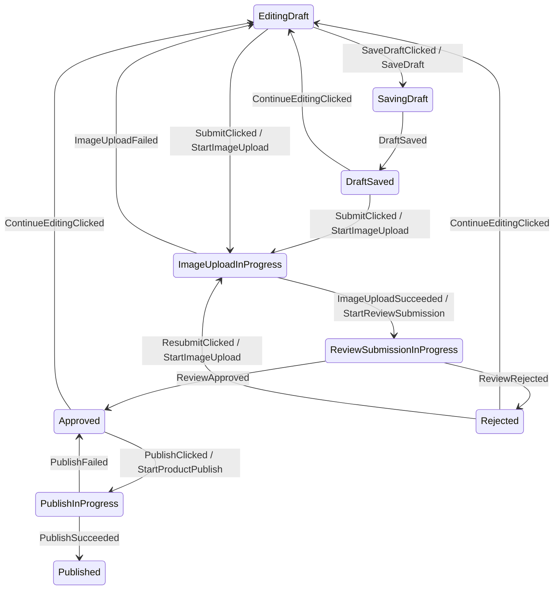

# Afsm v3 Executable DSL

This page is the canonical current direction for Afsm v3.

Afsm v3 should move from `when`-based helper APIs to a scoped executable statechart DSL.

The DSL must be the single source of truth for:

- runtime behavior,
- state diagram generation,
- transition tests,
- documentation examples.

Do not build a separate graph-only DSL beside a reducer implementation. That duplicates behavior and creates synchronization risk.

## Decision

Use a scoped executable DSL as the recommended v3 authoring model for complex Android FSM screens.

Keep the Android architecture boundary:

```text
Compose/View
-> ViewModel
-> AfsmHost
-> AfsmMachine DSL interpreter
-> StateFlow<UiState>
```

The `ViewModel` remains the Android lifecycle and business state holder adapter. The state machine remains plain Kotlin and Android-free.

## Reference Constraints

Afsm v3 is constrained by Android architecture and statechart practice.

Android:

- UI state should be produced by a state holder, commonly a `ViewModel` for screen-level business state.
- Events are transient inputs; state is durable output consumed by UI.
- UI-originated business events should be handled by the ViewModel/state holder.
- ViewModel-originated UI actions should usually become UI state; one-shot effects are exceptional.
- UI behavior logic such as navigation, snackbar display, focus, scroll, and animations stays in UI or UI-scoped state holders unless business logic requires otherwise.

References:

- [Android State holders and UI state](https://developer.android.com/topic/architecture/ui-layer/stateholders)
- [Android UI State production](https://developer.android.com/topic/architecture/ui-layer/state-production)
- [Android UI events](https://developer.android.com/topic/architecture/ui-layer/events)

Statechart references:

- [XState transitions](https://stately.ai/docs/transitions)
- [XState actions](https://stately.ai/docs/actions)
- [XState guards](https://stately.ai/docs/guards)
- [W3C SCXML](https://www.w3.org/TR/scxml/)
- [Square Workflow](https://square.github.io/workflow/)

## Why DSL

The `when + transitionTo(Phase) + PhaseEntryPolicy` spike proved a useful concept but exposed product-level problems:

- Graph generation depends on source-code inference.
- The current phase/event scope is not structurally declared.
- Entry policy hides behavior that users expect to see near the state.
- Context update, guard, command emission, and transition are still split across files.
- Users must follow conventions precisely or graph extraction and runtime behavior drift apart.

A scoped executable DSL makes the structure explicit:

```text
state scope
-> event handler
-> guard
-> update context
-> emit transition action
-> transition target
```

This matches standard statechart vocabulary while keeping Android execution in `ViewModel`/`AfsmHost`.

## Core Concepts

| Concept | Meaning | Android Mapping |
|---|---|---|
| `State` | Full UI state exposed to Android | `StateFlow<S>` |
| `Phase` | Finite statechart node | Renderable business phase |
| `Context` | Extended state carried across phases | Form data, ids, retry count, validation error |
| `Event` | Something that happened | User input or command result |
| `Guard` | Boolean decision before transition | Validation, retry allowance, auth requirement |
| `updateContext` | Explicit context update | Immutable state data update |
| `Action` | Host-executed work emitted by transition or entry | Repository/use case call, timer, local DB write |
| `Effect` | UI-side one-shot output | Close screen, launch permission, optional navigation signal |
| `Entry` | Work when entering a phase | Start async command, clear error |
| `Exit` | Work when leaving a phase | Cancel timer, clear transient context |

Current implemented APIs use the word `Command`. For v3, the user-facing name should likely be `Action` or `TransitionAction`. This page uses `Action` for readability, but the final naming decision remains open.

## Proposed Authoring Shape

Target developer experience:

```kotlin
val ProductEditorMachine = afsmMachine<
    ProductEditorPhase,
    ProductEditorContext,
    ProductEditorEvent,
    ProductEditorAction,
    ProductEditorEffect,
> {
    initial(
        phase = ProductEditorPhase.EditingDraft,
        context = ProductEditorContext(),
    )

    state(ProductEditorPhase.EditingDraft) {
        on<ProductEditorEvent.TitleChanged> {
            stay {
                updateContext {
                    copy(
                        draft = draft.withTitle(event.value),
                        errorMessage = null,
                    )
                }
            }
        }

        on<ProductEditorEvent.SaveDraftClicked> {
            transitionTo(ProductEditorPhase.SavingDraft)
        }

        on<ProductEditorEvent.SubmitClicked> {
            transitionTo(
                phase = ProductEditorPhase.ImageUploadInProgress,
                guard = { context.draft.isValidForSubmission() },
            ) {
                updateContext { copy(draft = draft.normalized(), errorMessage = null) }
            }

            otherwise {
                updateContext {
                    copy(errorMessage = draft.validationMessage())
                }
            }
        }
    }

    state(ProductEditorPhase.SavingDraft) {
        onEnter {
            action(ProductEditorAction.SaveDraft(context.draft))
        }

        on<ProductEditorEvent.DraftSaved> {
            transitionTo(ProductEditorPhase.DraftSaved)
        }
    }
}
```

Important properties:

- `state(Phase)` creates a structural state scope.
- `on<Event>` creates a structural event scope.
- `AfsmEventBranchScope` is the receiver behind `on<Event> { ... }`; its job is only to declare ordered graphable branches for that event.
- `transitionTo(...)`, `transitionTo<PayloadPhase>(phase = { ... })`, `stay(...)`, and `otherwise(...)` create graphable branches inside the event scope.
- `onEnter` and `onExit` are state-local and visible.
- `updateContext` updates context immutably.
- `action` emits host-executed work.
- `effect` emits UI-side one-shot output.
- `transitionTo` changes phase; `stay` handles context/effect updates without changing phase.
- The same definition is executable and graphable.

## ProductEditor Pseudo Implementation

The current spike uses a ProductEditor-like subset to validate the authoring style before migrating the real sample.

Core shape:

```kotlin
sealed interface ProductEditorPhase {
    data object EditingDraft : ProductEditorPhase
    data object SavingDraft : ProductEditorPhase
    data object DraftSaved : ProductEditorPhase
    data object ImageUploadInProgress : ProductEditorPhase

    data class ReviewSubmissionInProgress(
        val uploadToken: String,
    ) : ProductEditorPhase

    data class Rejected(
        val reason: String,
    ) : ProductEditorPhase

    data object Approved : ProductEditorPhase
    data object PublishInProgress : ProductEditorPhase

    data class Published(
        val productId: Long,
        val title: String,
    ) : ProductEditorPhase
}

data class ProductEditorContext(
    val draft: ProductDraft = ProductDraft(),
    val errorMessage: String? = null,
)
```

Graphable machine excerpt:

```kotlin
val ProductEditorMachine = afsmMachine<
    ProductEditorPhase,
    ProductEditorContext,
    ProductEditorEvent,
    ProductEditorAction,
    ProductEditorEffect,
> {
    initial(ProductEditorPhase.EditingDraft, ProductEditorContext())

    state(ProductEditorPhase.EditingDraft) {
        on<ProductEditorEvent.TitleChanged> {
            stay {
                updateContext { copy(draft = draft.withTitle(event.value), errorMessage = null) }
            }
        }

        on<ProductEditorEvent.SaveDraftClicked> {
            transitionTo(ProductEditorPhase.SavingDraft)
        }

        on<ProductEditorEvent.SubmitClicked> {
            transitionTo(
                phase = ProductEditorPhase.ImageUploadInProgress,
                guard = { context.draft.isValidForSubmission() },
            ) {
                updateContext { copy(draft = draft.normalized(), errorMessage = null) }
            }

            otherwise {
                updateContext { copy(errorMessage = draft.validationMessage()) }
            }
        }
    }

    state(ProductEditorPhase.SavingDraft) {
        onEnter {
            action(ProductEditorAction.SaveDraft(context.draft))
        }

        on<ProductEditorEvent.DraftSaved> {
            transitionTo(ProductEditorPhase.DraftSaved)
        }
    }

    state(ProductEditorPhase.ImageUploadInProgress) {
        onEnter {
            action(ProductEditorAction.StartImageUpload(context.draft))
        }

        on<ProductEditorEvent.ImageUploadSucceeded> {
            transitionTo<ProductEditorPhase.ReviewSubmissionInProgress>(
                phase = {
                    ProductEditorPhase.ReviewSubmissionInProgress(
                        uploadToken = event.uploadToken,
                    )
                },
            ) {
                updateContext {
                    copy(
                        draft = draft.copy(reviewAttempt = draft.reviewAttempt + 1),
                        errorMessage = null,
                    )
                }
            }
        }
    }

    state<ProductEditorPhase.ReviewSubmissionInProgress> {
        onEnter {
            action(
                ProductEditorAction.StartReviewSubmission(
                    draft = context.draft,
                    uploadToken = phase.uploadToken,
                ),
            )
        }
    }

    state<ProductEditorPhase.Published> {
        on<ProductEditorEvent.DoneClicked> {
            stay {
                effect(ProductEditorEffect.CloseEditor)
            }
        }
    }
}
```

This started as pseudo-code. The current `afsm-core` spike now validates the graphable core shape in executable Kotlin test code for `initial`, `state(phase)`, `state<PayloadPhase>`, `on<Event>`, `transitionTo`, `transitionTo<PayloadPhase>`, `stay`, `otherwise`, `updateContext`, `onEnter`, `action`, and `effect`.

## MMD Output

The machine definition can produce `.mmd` source without source scanning or sample-state fixtures:



Context-only `updateContext` operations are not separate graph files; they are runtime behavior attached to graphable `stay(...)`, `transitionTo(...)`, or `otherwise(...)` branches.

Current sample generation:

```bash
./gradlew :sample-shop:generateAfsmMmd
```

Output:

```text
sample-shop/build/generated/afsm/mmd/ProductEditorStateMachine.mmd
```

The generation task writes only the `.mmd` file. It does not create an explanatory document beside the graph.

The follow-up KSP design is [[afsm-ksp-mmd-generation|Afsm KSP MMD Generation]].

## Runtime Semantics

The v3 DSL should compile into an `AfsmMachine` definition.

Execution contract:

```kotlin
interface AfsmMachine<P : Any, X : Any, E : Any, A : Any, F : Any> {
    val initialSnapshot: AfsmSnapshot<P, X>
    val topology: AfsmTopology

    fun transition(
        snapshot: AfsmSnapshot<P, X>,
        event: E,
    ): AfsmTransition<AfsmSnapshot<P, X>, A, F>
}

data class AfsmSnapshot<P : Any, X : Any>(
    val phase: P,
    val context: X,
)
```

`AfsmHost` can stay conceptually the same:

```text
dispatch(event)
-> serialize event
-> machine.transition(snapshot, event)
-> update StateFlow
-> execute actions sequentially
-> dispatch result events
-> emit effects
```

## Android ViewModel Shape

ViewModel usage should stay small:

```kotlin
class ProductEditorViewModel(
    private val productRepository: ProductRepository,
) : ViewModel() {
    private val host = afsmHost(
        machine = ProductEditorMachine,
        actionHandler = { action, dispatch ->
            when (action) {
                is ProductEditorAction.SaveDraft -> {
                    productRepository.saveDraft(action.draft)
                    dispatch(ProductEditorEvent.DraftSaved)
                }

                is ProductEditorAction.StartImageUpload -> {
                    val token = productRepository.uploadImages(action.draft)
                    dispatch(ProductEditorEvent.ImageUploadSucceeded(token))
                }
            }
        },
    )

    val state = host.state
    val effects = host.effects

    fun onEvent(event: ProductEditorEvent) {
        host.dispatch(event)
    }
}
```

The UI should still receive immutable state and callbacks. Do not pass the `ViewModel` deep into composables.

## API Design Rules

1. The DSL must be executable. No graph-only DSL.
2. The DSL must be Android-free.
3. `ViewModel` integration must remain an adapter, not a required base class.
4. The machine definition must expose enough topology metadata for graph generation.
5. Guards must be visible where branch decisions happen.
6. Entry actions must be state-local and testable.
7. Context updates must use explicit `updateContext`.
8. Async work must be emitted as actions, not launched from the DSL itself.
9. Effects should be rare and reserved for UI-side one-shot behavior.
10. Simple screens should keep ordinary ViewModel state instead of adopting Afsm ceremony.

## Implementation Plan

### Step 1: API Compile Spike

Add a new isolated core test file or small internal package that validates the DSL shape in Kotlin without changing sample-shop yet.

Target surface:

```kotlin
afsmMachine<P, X, E, A, F> { ... }
initial(phase, context)
state(phase) { ... }
state<PSubtype> { ... }
on<EventSubtype> { ... }
onEnter { ... }
transitionTo(phase, guard = { ... }) { ... }
transitionTo<PayloadPhase>(phase = { ... }) { ... }
stay { ... }
otherwise { ... }
updateContext { ... }
action(action)
effect(effect)
```

Success criteria:

- ProductEditor pseudo-flow compiles in test code.
- Event subtype access works without unsafe casts in user code.
- Phase subtype access works for payload phases like `ReviewSubmissionInProgress`.
- Builder syntax is readable enough for Android developers.

Result on 2026-05-09:

- Added `AfsmMachine<P, X, E, A, F>` and `AfsmSnapshot<P, X>` to `afsm-core`.
- Added a minimal executable DSL in `afsm-core`: `afsmMachine`, `initial`, `state`, `on`, `onEnter`, `transitionTo`, `stay`, `otherwise`, `updateContext`, `action`, and `effect`.
- Added `AfsmExecutableDslCompileCheckTest` with a ProductEditor-like flow.
- Verified that event subtype access, typed payload phase access, guard fallback, entry action emission, and effect-only stayed transitions work in compiled Kotlin tests.
- Superseded by the follow-up graphability spike: branch targets now need to be declared in `transitionTo(...)`/`stay(...)` inside `on<Event>` so the machine can expose topology metadata without sample events.

### Step 2: Interpreter Spike

Implement enough interpreter behavior to execute one event:

- find current state definition,
- find matching event handler,
- evaluate guards in declaration order,
- apply `updateContext` operations in order,
- apply one transition target,
- run exit/transition/entry outputs in deterministic order,
- return `AfsmTransition<AfsmSnapshot<P, X>, A, F>`.

Current spike status:

- Implemented current state lookup, event handler lookup, ordered branch matching, ordered `updateContext`, target `onEnter`, command/action collection, effect collection, and `Stayed` versus `Transitioned` decisions.
- `onExit`, duplicate handler validation, and action labels in topology remain unimplemented.

### Step 3: Graph Exporter

Add a plain Kotlin `.mmd` exporter over the machine definition.

Success criteria:

- ProductEditor `.mmd` graph is generated from the machine object.
- No source scanning is required.
- `action(...)` labels can appear on edges or entry nodes.

Result on 2026-05-09:

- Added `AfsmTopology`, `AfsmTopologyState`, `AfsmTopologyTransition`, and `AfsmTopology.toMmd()`.
- Added `AfsmMachine.topology`.
- Changed event declarations so branch targets are known at build time: `on<Event> { transitionTo(...) { ... } }`, `on<Event> { transitionTo<PayloadPhase>(phase = { ... }) { ... } }`, `stay { ... }`, and `otherwise { ... }`.
- Verified topology export without executing sample events.
- Added `:sample-shop:generateAfsmMmd` to generate `sample-shop/build/generated/afsm/mmd/ProductEditorStateMachine.mmd`.
- Current limitation: topology currently records phase/event edges only; action labels, guard labels, entry nodes, and duplicate declaration diagnostics remain future work.

### Step 4: ProductEditor Migration

Port ProductEditor from `when + PhaseEntryPolicy` to the executable DSL.

Success criteria:

- Existing ProductEditor state machine tests remain behaviorally equivalent.
- Android sample still builds.
- The DSL file reads more like the state diagram than the current reducer file.

Result on 2026-05-09:

- Migrated real `sample-shop` ProductEditor away from `AfsmPhasedStateMachine` and `ProductEditorPhaseEntryPolicy`.
- Kept `ProductEditorState = ProductEditorPhase + ProductEditorContext` as the Android-facing state shape.
- Wrapped the DSL `AfsmMachine<ProductEditorPhase, ProductEditorContext, ...>` in `ProductEditorStateMachine` so existing `AfsmHost`/`ViewModel` integration still works through `AfsmStateMachine<ProductEditorState, ...>`.
- Added a ProductEditor unit test that verifies topology export without sample events.
- Android CLI smoke verification passed after the migration.

### Step 5: Public API Decision

Decide naming before public release:

- `Command` vs `Action` vs `TransitionAction`.
- `effect` delivery policy.
- whether `AfsmSnapshot` is public or hidden behind feature state mapping.
- whether DSL lives in `afsm-core` or an `afsm-dsl` module.

## Superseded Direction

The previous v3 direction was:

```text
State = Phase + Context
+ transitionTo(Phase)
+ hidden PhaseEntryPolicy
```

It remains useful as implementation background, but it is no longer the preferred public authoring model.

Reason:

- `PhaseEntryPolicy` hides too much from the user.
- `when` reducers require convention-heavy graph extraction.
- state/event topology is implicit in code structure rather than represented as data.

The phased helper may still be useful internally or as a lower-level API, but the public v3 recommendation should be the executable DSL.
