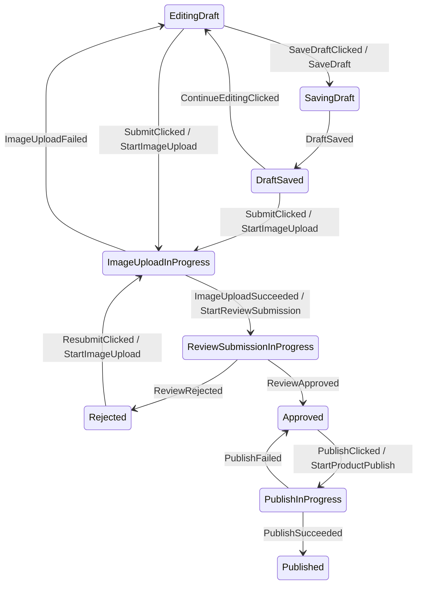

# Afsm v3 Phased State API

This page is the canonical current direction for Afsm v3.

The file path still contains `topology-first-api` for continuity, but the current design is no longer DSL-first and is no longer sealed-state-subtype-first.

The current direction is:

```text
State = Phase + Context
+ transitionTo(Phase)
+ hidden PhaseEntryPolicy for context/command/effect entry rules
+ graph generation from Phase transitions
```

## Current Decision

Use a phased-state authoring profile for complex Android screens where state diagrams are a first-class goal.

The state machine code should show the abstract flow:

```kotlin
ProductEditorEvent.SubmitClicked -> transitionTo(
    ProductEditorPhase.ImageUploadInProgress,
)

is ProductEditorEvent.ImageUploadSucceeded -> transitionTo(
    ProductEditorPhase.ReviewSubmissionInProgress(
        uploadToken = event.uploadToken,
    ),
)

is ProductEditorEvent.ImageUploadFailed -> transitionTo(
    ProductEditorPhase.EditingDraft,
)
```

The state machine should not repeatedly assemble:

```kotlin
state.copy(
    phase = ProductEditorPhase.ImageUploadInProgress,
    context = state.context.copy(...),
)
```

That context update belongs in a feature-local phase entry policy.

## Mental Model

Afsm v3 should separate the Android screen state into two axes:

| Axis | Meaning | Example |
|---|---|---|
| `State` | The full value exposed through `StateFlow` | `ProductEditorState(phase, context)` |
| `Phase` | The finite node used for state diagrams | `ImageUploadInProgress` |
| `Context` | Durable data carried across phases | `draft`, `errorMessage` |
| `EntryPolicy` | Rules applied when entering a phase | normalize draft, clear errors, emit command |

This matches extended-state-machine terminology:

```text
finite state = Phase
extended state = Context
```

The rendered state diagram should use phases, not every possible context value.

## Proposed Core Shape

The phased profile can sit on top of the existing v2 runtime contract.

```kotlin
interface AfsmPhasedState<S : Any, P : Any, X : Any> {
    val phase: P
    val context: X

    fun with(
        phase: P,
        context: X,
    ): S
}
```

`S` is still the state emitted to Android UI. `P` is the finite phase. `X` is the context.

Phase entry is delegated to a policy:

```kotlin
interface AfsmPhaseEntryPolicy<P : Any, X : Any, E : Any, C : Any, F : Any> {
    fun enter(
        from: P,
        target: P,
        event: E,
        context: X,
    ): AfsmPhaseEntry<X, C, F>
}

data class AfsmPhaseEntry<X : Any, C : Any, F : Any>(
    val context: X,
    val commands: List<C> = emptyList(),
    val effects: List<F> = emptyList(),
)
```

The transition scope owns the current `state`, current `event`, and entry policy:

```kotlin
class AfsmPhasedTransitionScope<S, P, X, E, C, F>(
    val state: S,
    private val event: E,
    private val entryPolicy: AfsmPhaseEntryPolicy<P, X, E, C, F>,
) where S : AfsmPhasedState<S, P, X> {

    fun transitionTo(target: P): AfsmTransition<S, C, F> {
        val entry = entryPolicy.enter(
            from = state.phase,
            target = target,
            event = event,
            context = state.context,
        )

        return Afsm.transitionTo(
            state = state.with(
                phase = target,
                context = entry.context,
            ),
            commands = entry.commands,
            effects = entry.effects,
        )
    }

    fun updateContext(
        update: (X) -> X,
        commands: (X) -> List<C> = { emptyList() },
        effects: (X) -> List<F> = { emptyList() },
    ): AfsmTransition<S, C, F> {
        val nextContext = update(state.context)

        return Afsm.stay(
            state = state.with(
                phase = state.phase,
                context = nextContext,
            ),
            commands = commands(nextContext),
            effects = effects(nextContext),
        )
    }
}
```

This is not a topology DSL. It is a runtime authoring scope that lets feature state machines express phase transitions directly.

## ProductEditor Sketch

ProductEditor state becomes:

```kotlin
data class ProductEditorState(
    override val phase: ProductEditorPhase = ProductEditorPhase.EditingDraft,
    override val context: ProductEditorContext = ProductEditorContext(),
) : AfsmPhasedState<ProductEditorState, ProductEditorPhase, ProductEditorContext> {

    override fun with(
        phase: ProductEditorPhase,
        context: ProductEditorContext,
    ): ProductEditorState {
        return copy(
            phase = phase,
            context = context,
        )
    }
}
```

The phases become the diagram nodes:

```kotlin
sealed interface ProductEditorPhase {
    data object EditingDraft : ProductEditorPhase
    data object SavingDraft : ProductEditorPhase
    data object DraftSaved : ProductEditorPhase
    data object ImageUploadInProgress : ProductEditorPhase

    data class ReviewSubmissionInProgress(
        val uploadToken: String,
    ) : ProductEditorPhase

    data class Rejected(
        val reason: String,
    ) : ProductEditorPhase

    data object Approved : ProductEditorPhase
    data object PublishInProgress : ProductEditorPhase

    data class Published(
        val productId: Long,
        val title: String,
    ) : ProductEditorPhase
}
```

Durable data is kept in context:

```kotlin
data class ProductEditorContext(
    val draft: ProductDraft = ProductDraft(),
    val errorMessage: String? = null,
)
```

Phase entry rules are hidden behind a feature-local policy:

```kotlin
class ProductEditorPhaseEntryPolicy :
    AfsmPhaseEntryPolicy<
        ProductEditorPhase,
        ProductEditorContext,
        ProductEditorEvent,
        ProductEditorCommand,
        ProductEditorEffect,
    > {

    override fun enter(
        from: ProductEditorPhase,
        target: ProductEditorPhase,
        event: ProductEditorEvent,
        context: ProductEditorContext,
    ): AfsmPhaseEntry<ProductEditorContext, ProductEditorCommand, ProductEditorEffect> {
        return when (target) {
            ProductEditorPhase.SavingDraft -> {
                AfsmPhaseEntry(
                    context = context.copy(errorMessage = null),
                    commands = listOf(
                        ProductEditorCommand.SaveDraft(context.draft),
                    ),
                )
            }

            ProductEditorPhase.DraftSaved -> {
                AfsmPhaseEntry(
                    context = context.copy(errorMessage = null),
                )
            }

            ProductEditorPhase.ImageUploadInProgress -> {
                val draft = context.draft.normalized()

                AfsmPhaseEntry(
                    context = context.copy(
                        draft = draft,
                        errorMessage = null,
                    ),
                    commands = listOf(
                        ProductEditorCommand.StartImageUpload(draft),
                    ),
                )
            }

            is ProductEditorPhase.ReviewSubmissionInProgress -> {
                val draft = context.draft.copy(
                    reviewAttempt = context.draft.reviewAttempt + 1,
                )

                AfsmPhaseEntry(
                    context = context.copy(
                        draft = draft,
                        errorMessage = null,
                    ),
                    commands = listOf(
                        ProductEditorCommand.StartReviewSubmission(
                            draft = draft,
                            uploadToken = target.uploadToken,
                        ),
                    ),
                )
            }

            ProductEditorPhase.EditingDraft -> {
                val errorMessage = when (event) {
                    is ProductEditorEvent.ImageUploadFailed -> event.message
                    else -> null
                }

                AfsmPhaseEntry(
                    context = context.copy(
                        errorMessage = errorMessage,
                    ),
                )
            }

            ProductEditorPhase.PublishInProgress -> {
                AfsmPhaseEntry(
                    context = context.copy(errorMessage = null),
                    commands = listOf(
                        ProductEditorCommand.StartProductPublish(context.draft),
                    ),
                )
            }

            is ProductEditorPhase.Rejected,
            ProductEditorPhase.Approved,
            is ProductEditorPhase.Published -> {
                AfsmPhaseEntry(context)
            }
        }
    }
}
```

Then the state machine reducer can focus on flow:

```kotlin
private fun reduceEditingDraft(
    event: ProductEditorEvent,
): ProductEditorTransition {
    return when (event) {
        is ProductEditorEvent.TitleChanged -> transitionTo(ProductEditorPhase.EditingDraft)

        ProductEditorEvent.SaveDraftClicked -> transitionTo(ProductEditorPhase.SavingDraft)

        ProductEditorEvent.SubmitClicked -> {
            val validationError = state.context.draft.validationError()
            if (validationError != null) {
                transitionTo(ProductEditorPhase.EditingDraft)
            } else {
                transitionTo(ProductEditorPhase.ImageUploadInProgress)
            }
        }

        else -> invalid("Event is not valid while editing a draft.")
    }
}
```

The correction from the ProductEditor spike is important: `SaveDraftClicked` should transition to `SavingDraft` when draft saving is user-visible flow. Actual data is separated into context, but flow states should not be hidden as context flags.

## State Diagram Policy

Generated diagrams should use phase transitions.



Context-only changes are not primary graph edges:

```text
EditingDraft + TitleChanged
-> transitionTo(EditingDraft)
-> PhaseEntryPolicy updates context.draft
-> still EditingDraft
```

They may be shown in a secondary "self updates" report, but they should not clutter the main state diagram.

## Why Hide Context Entry Rules

The sealed-state-subtype style made every phase constructor carry context:

```kotlin
ProductEditorState.ImageUploadInProgress(draft)
ProductEditorState.ReviewSubmissionInProgress(draft, uploadToken)
ProductEditorState.Rejected(draft, reason)
```

That makes data preservation explicit, but creates repeated boilerplate and makes Android developers feel they lost the familiar `UiState.copy(...)` model.

The phased profile keeps both goals:

- state diagrams stay clean because transitions target phases,
- data preservation stays reliable because context is still one immutable value,
- entry-specific normalization is centralized in `PhaseEntryPolicy`,
- the reducer reads like a flow table instead of a state assembly function.

## Constraints

Do not let entry policy become invisible magic.

Rules:

- `PhaseEntryPolicy` must be feature-local and near the state machine.
- Phase entry rules must be covered by unit tests.
- Important guard decisions should remain in the reducer when they decide whether a phase transition is allowed.
- Entry policy should normalize context and emit transition actions; it should not hide major branching that changes the graph.
- A phase should not trigger work merely because UI observed it; work should still be emitted as commands from the transition result.

Validation example:

```text
Given EditingDraft with valid draft
When SubmitClicked
Then phase is ImageUploadInProgress
And context.draft is normalized
And StartImageUpload is emitted with the normalized draft
```

## Graph Extraction Plan

The first proof should extract graph edges from the phased profile:

```text
Scan ProductEditorStateMachine.kt
-> find reducer branches by current phase and event
-> find transitionTo(ProductEditorPhase.X(...)) calls
-> infer From from the surrounding phase branch
-> infer Event from the event branch
-> infer To from the transitionTo phase argument
-> infer commands from PhaseEntryPolicy where practical
-> render Mermaid
```

KSP is not required for the first proof.

KSP becomes useful only if:

- source scanning is too fragile,
- graph generation must run automatically during builds,
- compile-time validation between phase transitions and entry policy is required,
- teams want generated graph files as checked-in artifacts.

## Runtime Policy

Runtime remains v2-compatible:

- `AfsmStateMachine<S, E, C, F>` remains the execution contract.
- `AfsmTransition<S, C, F>` remains the transition result.
- `AfsmHost` remains the serialized runtime loop.
- invalid/ignored/stayed decisions remain normal transition results.

The phased profile is an authoring layer over the v2 runtime, not a replacement runtime.

## Superseded Ideas

These ideas were considered and are not the current recommendation.

### Sealed State Subtypes As The Main v3 Shape

The previous v3 direction used concrete handlers such as:

```kotlin
private fun submitClicked(
    state: ProductEditorState.EditingDraft,
    event: ProductEditorEvent.SubmitClicked,
): ProductEditorTransition {
    return Afsm.transitionTo(
        state = ProductEditorState.ImageUploadInProgress(state.draft),
        commands = listOf(ProductEditorCommand.StartImageUpload(state.draft)),
    )
}
```

This is still valid for small or pure Kotlin FSMs, but it is no longer the preferred Android screen profile when graph generation and context preservation are both important.

Problem:

- every phase has to carry common context manually,
- `transitionTo(state = ...)` still exposes context assembly in the reducer,
- it tempts developers to duplicate durable data like `ProductDraft` in every state subtype.

### `transition<From, Event, To>`

Rejected as the primary style:

```kotlin
Afsm.transitionTo<From, Event, To>(...)
```

Problem:

- too verbose,
- repeats `From` and `Event`,
- makes everyday transition code unpleasant.

### `from/on/to` DSL

Rejected as the primary style:

```kotlin
topology {
    from<FromState> {
        on<Event>().to<ToState>()
    }
}
```

Problem:

- graph-friendly,
- but still introduces a framework-shaped DSL,
- duplicates runtime reducer logic unless it becomes executable,
- and the user explicitly prefers Kotlin `when` over DSL structure.

### `goTo`

Rejected as naming/API direction.

Problem:

- feels framework-specific,
- hides that this is just a transition result,
- encourages `goTo(state, commands, effects)` result assembly rather than phase-oriented transition code.

## Open Questions

- Should phased helpers live in `afsm-core`, `afsm-runtime`, or a small `afsm-phased` module?
- Should `PhaseEntryPolicy` be allowed to emit effects, or only context and commands?
- Should `updateContext` support commands directly for secondary operations such as draft save?
- Can source scanning infer enough from `transitionTo(Phase)` and `PhaseEntryPolicy`, or does graph generation need KSP?
- Should generated graph labels include transition actions discovered from entry policy, or keep commands in a separate edge metadata table?
