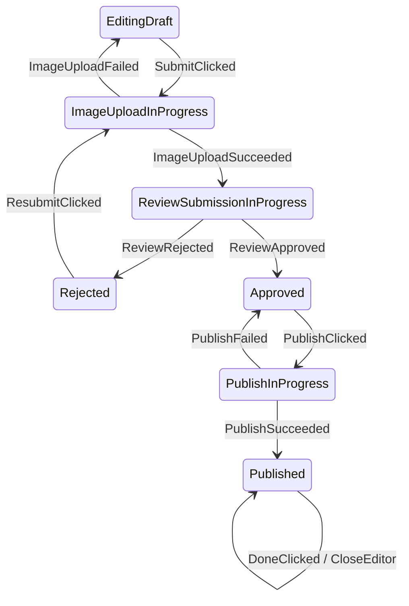
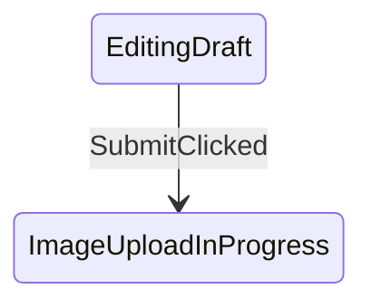

# Afsm v3 Topology-First API

This document compares the current v2 reducer-style API with a possible v3 topology-first API using `ProductEditorStateMachine` as the reference.

## Problem

Afsm exists to make Android screen flows easier to see.

The current v2 API can implement finite state machines, but the graph shape is not part of the API surface.

Current v2 shape:

```kotlin
fun transition(
    state: ProductEditorState,
    event: ProductEditorEvent,
): AfsmTransition<ProductEditorState, ProductEditorCommand, ProductEditorEffect>
```

This is flexible and Kotlin-friendly, but the state diagram must be inferred from function bodies.

For example:

```kotlin
ProductEditorEvent.SubmitClicked -> startUpload(state.draft, state)
```

The transition `EditingDraft -- SubmitClicked --> ImageUploadInProgress` is hidden in `startUpload(...)`, not declared at the transition site.

That is why Mermaid graph generation is hard: the code is behavior-first, not topology-first.

## Desired State Diagram

The ProductEditor business flow should be readable as a transition table:

```text
EditingDraft          -- SubmitClicked          --> ImageUploadInProgress
ImageUploadInProgress       -- ImageUploadSucceeded   --> ReviewSubmissionInProgress
ImageUploadInProgress       -- ImageUploadFailed      --> EditingDraft
ReviewSubmissionInProgress   -- ReviewRejected         --> Rejected
Rejected              -- ResubmitClicked        --> ImageUploadInProgress
ReviewSubmissionInProgress   -- ReviewApproved         --> Approved
Approved              -- PublishClicked         --> PublishInProgress
PublishInProgress            -- PublishSucceeded       --> Published
PublishInProgress            -- PublishFailed          --> Approved
Published             -- DoneClicked            --> Published + CloseEditor effect
```

Rendered as Mermaid:



## v2 Current Implementation

The v2 implementation is a reducer tree:

```kotlin
override fun transition(
    state: ProductEditorState,
    event: ProductEditorEvent,
): ProductEditorTransition {
    return when (state) {
        is EditingDraft -> reduceEditing(state, event)
        is SavingDraft -> reduceSaving(state, event)
        is DraftSaved -> reduceDraftSaved(state, event)
        is ImageUploadInProgress -> reduceImageUploadInProgress(state, event)
        is ReviewSubmissionInProgress -> reduceReviewSubmissionInProgress(state, event)
        is Rejected -> reduceRejected(state, event)
        is Approved -> reduceApproved(state, event)
        is PublishInProgress -> reducePublishInProgress(state, event)
        is Published -> reducePublished(state, event)
    }
}
```

Inside each reducer:

```kotlin
private fun reduceApproved(
    state: Approved,
    event: ProductEditorEvent,
): ProductEditorTransition {
    return when (event) {
        PublishClicked -> Afsm.transitionTo(
            state = PublishInProgress(state.draft),
            commands = listOf(StartProductPublish(state.draft)),
        )

        ContinueEditingClicked -> Afsm.transitionTo(
            EditingDraft(state.draft),
        )

        else -> Afsm.invalid(...)
    }
}
```

Strengths:

- Plain Kotlin.
- Easy to debug with normal breakpoints.
- No framework-like DSL.
- High flexibility for validation and helper functions.
- Existing `AfsmHost` runtime can execute it directly.

Weaknesses:

- Graph topology is not explicit.
- Helpers can hide edges.
- `Afsm.transitionTo(state = ...)` carries runtime result, not declared edge metadata.
- Graph generation either needs fragile static analysis or representative runtime samples.
- The API reads more like `Reducer<State, Event>` than a topology-first state machine.

## v3 Topology-First Idea

The previous pseudo API in this document was still too close to v2:

```kotlin
transition<FromState, Event, ToState>("label") {
    goTo(
        state = ToState(...),
        commands = listOf(...),
        effects = listOf(...),
    )
}
```

That shape has two problems:

- `FromState` is repeated on every edge even though the current typed state should already define the scope.
- `goTo(state, commands, effects)` still reads like assembling an `AfsmTransition` result object, not like authoring a state machine.

The revised v3 direction should split graph topology from runtime transition behavior.

Topology should be declared from a state scope:

```kotlin
topology {
    from<EditingDraft> {
        on<TitleChanged>().self("edit title")
        on<DescriptionChanged>().self("edit description")
        on<PriceChanged>().self("edit price")
        on<SaveDraftClicked>().to<SavingDraft>("save draft").action<SaveDraft>()
        on<SubmitClicked>().to<ImageUploadInProgress>("submit for review").action<StartImageUpload>()
    }

    from<ImageUploadInProgress> {
        on<ImageUploadSucceeded>()
            .to<ReviewSubmissionInProgress>("image upload succeeded")
            .action<StartReviewSubmission>()

        on<ImageUploadFailed>().to<EditingDraft>("image upload failed")
    }

    from<ReviewSubmissionInProgress> {
        on<ReviewRejected>().to<Rejected>("review rejected")
        on<ReviewApproved>().to<Approved>("review approved")
    }

    from<Rejected> {
        on<ResubmitClicked>().to<ImageUploadInProgress>("resubmit").action<StartImageUpload>()
        on<ContinueEditingClicked>().to<EditingDraft>("continue editing")
    }

    from<Approved> {
        on<PublishClicked>().to<PublishInProgress>("publish").action<StartProductPublish>()
        on<ContinueEditingClicked>().to<EditingDraft>("continue editing")
    }

    from<PublishInProgress> {
        on<PublishSucceeded>().to<Published>("publish succeeded")
        on<PublishFailed>().to<Approved>("publish failed")
    }

    from<Published> {
        on<DoneClicked>().self("done").effect<CloseEditor>()
    }
}
```

Runtime behavior should stay plain Kotlin:

```kotlin
override fun transition(
    state: ProductEditorState,
    event: ProductEditorEvent,
): ProductEditorTransition {
    return when (state) {
        is EditingDraft -> state.transition(event)
        is SavingDraft -> state.transition(event)
        is DraftSaved -> state.transition(event)
        is ImageUploadInProgress -> state.transition(event)
        is ReviewSubmissionInProgress -> state.transition(event)
        is Rejected -> state.transition(event)
        is Approved -> state.transition(event)
        is PublishInProgress -> state.transition(event)
        is Published -> state.transition(event)
    }
}
```

The `FromState` is now the typed receiver:

```kotlin
private fun EditingDraft.transition(
    event: ProductEditorEvent,
): ProductEditorTransition {
    return when (event) {
        is TitleChanged -> copy(
            draft = draft.updateForm { it.copy(title = event.value) },
            errorMessage = null,
        ).asTransition()

        SaveDraftClicked -> SavingDraft(draft)
            .withAction(SaveDraft(draft))

        SubmitClicked -> submitForReview()

        else -> invalid("Event is not valid while editing a draft.")
    }
}
```

And the transition body should read from the current state to the next state:

```kotlin
private fun EditingDraft.submitForReview(): ProductEditorTransition {
    val validationError = draft.form.validationError()
    if (validationError != null) {
        return copy(errorMessage = validationError)
            .stay(reason = validationError)
    }

    val nextDraft = draft.normalized()

    return ImageUploadInProgress(nextDraft)
        .withAction(StartImageUpload(nextDraft))
}
```

This is the important API direction:

```text
FromState = typed receiver/current state
Event = when branch or typed topology edge
ToState = returned next state
Transition action = chained output, not a constructor parameter list
Effect = chained UI output, not mixed into every transition call
```

The topology declaration gives graph metadata. The plain Kotlin transition functions keep local readability and breakpoint-friendly debugging.

## Graph Generation

With v3, graph generation does not need sample state/event values.

Each call registers an edge:

```kotlin
from<EditingDraft> {
    on<SubmitClicked>().to<ImageUploadInProgress>("submit for review")
}
```

The graph renderer can output:



KSP is not required for an MVP if graph metadata is registered by executing `topology()`.

Possible MVP flow:

```text
ProductEditorMachine.topology()
-> from/on/to definitions registered in memory
-> AfsmGraphRenderer.toMermaid(machine.graph)
-> docs/graphs/product-editor-state-machine.mmd
```

KSP can be considered later for automatic discovery of annotated machines, but it should not be needed to prove the concept.

## Invalid and Ignored Events

v2 forces each reducer to list invalid/ignored events to keep `when` exhaustive.

The topology companion can choose a default policy for missing edges:

```kotlin
defaultUnhandled = AfsmUnhandledPolicy.Invalid
```

Then the ProductEditor topology can list only meaningful edges.

This reduces noise but changes the mental model:

- v2: Kotlin exhaustiveness makes unhandled events explicit.
- v3 topology: the graph registry handles missing edges through a policy.

The v3 prototype must test this carefully because hidden unhandled behavior could make bugs less visible.

Runtime behavior can still keep explicit invalid/ignored branches in the plain Kotlin reducers. The graph topology and runtime reducer do not have to use the same exhaustiveness mechanism.

## Commands and Effects

Commands and effects remain valid state machine outputs.

They should be understood as transition actions:

```text
EditingDraft -- SubmitClicked --> ImageUploadInProgress
  action: StartImageUpload command
```

This is state-machine-compatible. UML state machines and Mealy-style machines can produce actions/outputs during transitions.

The problem in v2 is not commands/effects themselves. The problem is that the target state is only a returned value, not declared edge metadata.

Terminology and naming guidance are tracked in [[afsm-v3-terminology-transition-actions|Afsm v3 Terminology and Transition Actions]].

## API Comparison

| Concern | v2 reducer API | v3 topology-first API |
|---|---|---|
| Familiar Kotlin | Strong | Medium |
| Graph generation | Weak | Strong |
| Breakpoint debugging | Strong | Strong if runtime remains plain Kotlin |
| Boilerplate | Medium/high for invalid branches | Medium plus topology declaration |
| Exhaustiveness | Strong through `when` | Runtime can keep `when`; topology needs registry checks |
| DSL learning cost | Low | Low/medium if topology is a companion, not executable behavior |
| State diagram readability | Medium | Strong |
| Runtime compatibility | Already implemented | Can compile down to v2 transition behavior |

## Product Judgment

v3 should not immediately replace v2.

Recommended positioning:

```text
v2 = low-level, plain Kotlin reducer-style engine
v3 = optional from-state-scoped topology layer plus plain Kotlin transition behavior
```

This avoids forcing a DSL onto all users while still giving Afsm a clearer path to automatic state diagrams.

## Prototype Plan

1. Refine this design-only topology page first.
2. Implement a minimal experimental module, likely `afsm-machine`.
3. Support:
   - `topology { ... }`
   - `from<FromState> { ... }`
   - `on<Event>().to<ToState>(label)`
   - optional `.action<Action>()` metadata
   - optional `.effect<Effect>()` metadata
   - default unhandled policy
   - graph metadata registry
   - Mermaid renderer
4. Keep ProductEditor runtime transitions as plain Kotlin typed receiver functions.
5. Verify:
   - unit tests still express the same behavior,
   - Android CLI smoke journey still passes,
   - generated Mermaid graph matches expected topology.
6. Decide whether v3 should become:
   - official recommended API,
   - optional graph-oriented layer,
   - or abandoned if DSL cost is too high.

## Open Questions

- Should v3 require `KClass` arguments instead of reified generics for Java/binary friendliness?
- Should topology be purely metadata beside the reducer, or should it be executable enough to replace some reducer boilerplate?
- Should one `on<Event>()` edge allow multiple target states when guard branches can produce different states?
- Should validation failures be rendered as self-edges, omitted, or shown in a separate error graph?
- How should v3 prove topology and runtime reducer stay synchronized?
- Should graph labels default to type names or require explicit human labels?
