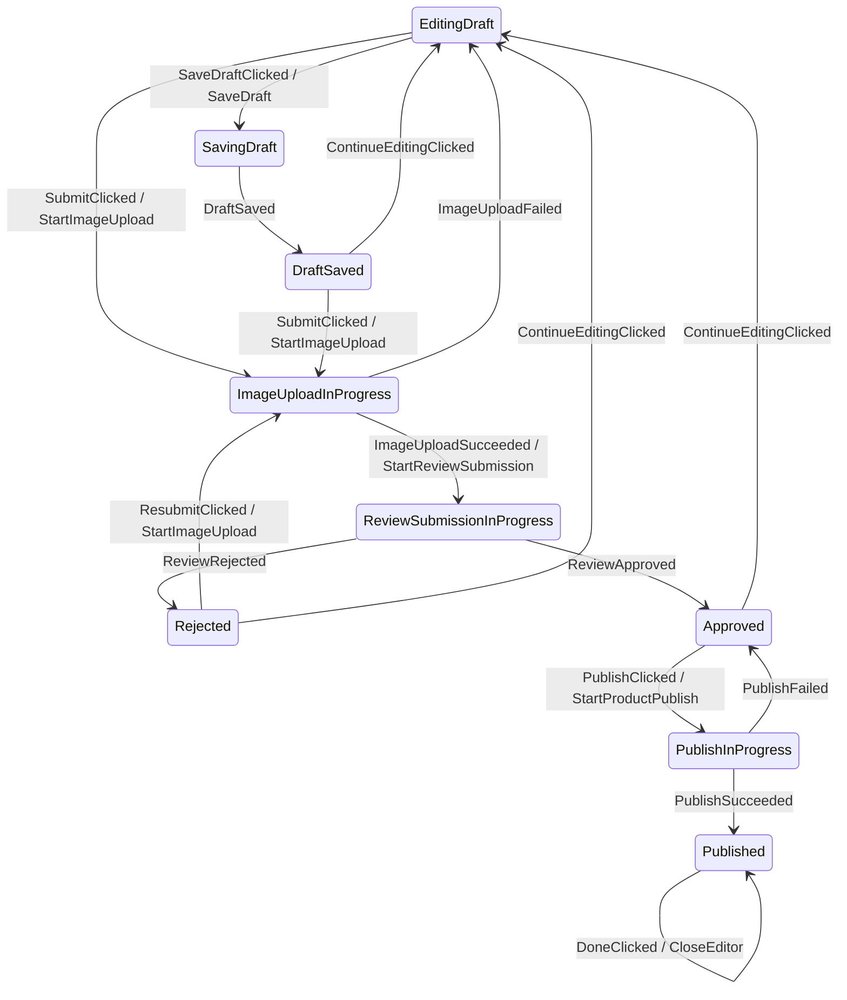

# Afsm v3 Typed Handler API

This page is the canonical current direction for Afsm v3.

The file path still contains `topology-first-api` for continuity, but the current design is no longer a DSL-first topology API. The current direction is:

```text
Plain Kotlin when
+ concrete State/Event handler functions
+ existing transitionTo result API
+ optional source/compile-time graph extraction
```

## Current Decision

Do not make a DSL the primary authoring model.

Prefer ordinary Kotlin state machine code:

```kotlin
override fun transition(
    state: ProductEditorState,
    event: ProductEditorEvent,
): ProductEditorTransition {
    return when (state) {
        is ProductEditorState.EditingDraft -> reduceEditingDraft(state, event)
        is ProductEditorState.ImageUploadInProgress -> reduceImageUploadInProgress(state, event)
        is ProductEditorState.ReviewSubmissionInProgress -> reduceReviewSubmissionInProgress(state, event)
        is ProductEditorState.Rejected -> reduceRejected(state, event)
        is ProductEditorState.Approved -> reduceApproved(state, event)
        is ProductEditorState.PublishInProgress -> reducePublishInProgress(state, event)
        is ProductEditorState.Published -> reducePublished(state, event)
        is ProductEditorState.SavingDraft -> reduceSavingDraft(state, event)
        is ProductEditorState.DraftSaved -> reduceDraftSaved(state, event)
    }
}
```

Inside each state reducer, meaningful transitions should delegate to concrete State/Event handlers:

```kotlin
private fun reduceEditingDraft(
    state: ProductEditorState.EditingDraft,
    event: ProductEditorEvent,
): ProductEditorTransition {
    return when (event) {
        ProductEditorEvent.SubmitClicked -> submitClicked(state, event)
        ProductEditorEvent.SaveDraftClicked -> saveDraftClicked(state, event)
        is ProductEditorEvent.TitleChanged -> titleChanged(state, event)
        is ProductEditorEvent.DescriptionChanged -> descriptionChanged(state, event)
        is ProductEditorEvent.PriceChanged -> priceChanged(state, event)
        else -> Afsm.invalid(state, reason = "Event is not valid while editing a draft.")
    }
}
```

The concrete handler is where graph extraction gets the edge:

```kotlin
private fun submitClicked(
    state: ProductEditorState.EditingDraft,
    event: ProductEditorEvent.SubmitClicked,
): ProductEditorTransition {
    val draft = state.draft.normalized()

    return Afsm.transitionTo(
        state = ProductEditorState.ImageUploadInProgress(draft),
        commands = listOf(ProductEditorCommand.StartImageUpload(draft)),
    )
}
```

Graph extractor interpretation:

```text
From = ProductEditorState.EditingDraft
Event = ProductEditorEvent.SubmitClicked
To = ProductEditorState.ImageUploadInProgress
Action = ProductEditorCommand.StartImageUpload
```

Rendered edge:

```text
EditingDraft -- SubmitClicked / StartImageUpload --> ImageUploadInProgress
```

## Why This Direction

This keeps the Android developer experience close to normal Kotlin:

- no graph DSL as the main API,
- no `goTo`,
- no mandatory `transitionTo<From, Event, To>`,
- no transition registry replacing Kotlin `when`,
- normal breakpoints and local helper functions still work.

It also gives Afsm a realistic path to state diagram generation:

- `From` comes from the concrete state parameter,
- `Event` comes from the concrete event parameter,
- `To` comes from the `transitionTo(state = NextState(...))` argument,
- transition action comes from the command expression,
- effect comes from the effect expression.

## TransitionTo Policy

The normal form remains:

```kotlin
Afsm.transitionTo(
    state = ProductEditorState.ImageUploadInProgress(draft),
    commands = listOf(ProductEditorCommand.StartImageUpload(draft)),
)
```

Do not require:

```kotlin
Afsm.transitionTo<
    ProductEditorState.EditingDraft,
    ProductEditorEvent.SubmitClicked,
    ProductEditorState.ImageUploadInProgress,
>(...)
```

Reason:

- `From` is already in `state: EditingDraft`.
- `Event` is already in `event: SubmitClicked`.
- repeating them in `transitionTo` is noisy and makes the API feel worse.

Optional future marker:

```kotlin
Afsm.transitionTo<ProductEditorState.ImageUploadInProgress>(
    state = ProductEditorState.ImageUploadInProgress(draft),
    commands = listOf(ProductEditorCommand.StartImageUpload(draft)),
)
```

This `To`-only generic may be useful if source extraction cannot reliably infer the next-state type from the `state` argument. It should stay optional until proven necessary.

## Handler Shape

Good:

```kotlin
private fun imageUploadSucceeded(
    state: ProductEditorState.ImageUploadInProgress,
    event: ProductEditorEvent.ImageUploadSucceeded,
): ProductEditorTransition {
    val reviewedDraft = state.draft.copy(
        reviewAttempt = state.draft.reviewAttempt + 1,
    )

    return Afsm.transitionTo(
        state = ProductEditorState.ReviewSubmissionInProgress(
            draft = reviewedDraft,
            uploadToken = event.uploadToken,
        ),
        commands = listOf(
            ProductEditorCommand.StartReviewSubmission(
                draft = reviewedDraft,
                uploadToken = event.uploadToken,
            ),
        ),
    )
}
```

Bad for graph extraction:

```kotlin
private fun startUpload(
    draft: ProductDraft,
    currentState: ProductEditorState,
): ProductEditorTransition
```

This erases the graph edge:

- `currentState` is the sealed parent type, not the concrete `From`.
- the triggering `Event` is absent,
- the helper may be reused by several edges.

If multiple transitions share domain logic, keep the domain logic shared but keep edge handlers concrete:

```kotlin
private fun submitClicked(
    state: ProductEditorState.EditingDraft,
    event: ProductEditorEvent.SubmitClicked,
): ProductEditorTransition {
    return startImageUploadFromEditing(state)
}

private fun resubmitClicked(
    state: ProductEditorState.Rejected,
    event: ProductEditorEvent.ResubmitClicked,
): ProductEditorTransition {
    return startImageUploadFromRejected(state)
}
```

This preserves visible graph edges:

```text
EditingDraft -- SubmitClicked --> ImageUploadInProgress
Rejected -- ResubmitClicked --> ImageUploadInProgress
```

## ProductEditor Target Graph

Current reference graph:



## Graph Extraction Plan

First proof should be simple and local:

```text
Scan ProductEditorStateMachine.kt
-> find concrete handler functions with state/event parameters
-> find Afsm.transitionTo(...) and Afsm.stay(...) calls in those handlers
-> infer To from next state expression or optional transitionTo<To>
-> infer commands/effects from list expressions where practical
-> render Mermaid
-> compare generated graph with expected ProductEditor graph
```

KSP is not required for the first proof.

KSP becomes useful only if:

- source scanning is too fragile,
- graph generation must run automatically during builds,
- compile-time validation between handler signature and transition result is required,
- teams want generated graph files as checked-in artifacts.

## Runtime Policy

Runtime remains v2-compatible:

- `AfsmStateMachine<S, E, C, F>` remains the execution contract.
- `AfsmTransition<S, C, F>` remains the transition result.
- `AfsmHost` remains the serialized runtime loop.
- invalid/ignored events remain normal transition results.

v3 is an authoring and graph-extraction convention first, not a replacement runtime.

## Superseded Ideas

These ideas were considered and are not the current recommendation.

### `transition<From, Event, To>`

Rejected as the primary style:

```kotlin
Afsm.transitionTo<From, Event, To>(...)
```

Problem:

- too verbose,
- repeats `From` and `Event`,
- makes everyday transition code unpleasant.

### `from/on/to` DSL

Rejected as the primary style:

```kotlin
topology {
    from<FromState> {
        on<Event>().to<ToState>()
    }
}
```

Problem:

- graph-friendly,
- but still introduces a framework-shaped DSL,
- duplicates runtime reducer logic unless it becomes executable,
- and the user explicitly prefers typed `when` over DSL structure.

### `goTo`

Rejected as naming/API direction.

Problem:

- feels framework-specific,
- hides that this is just a transition result,
- encourages `goTo(state, commands, effects)` result assembly rather than normal Kotlin transition code.

## Open Questions

- Should `transitionTo<ToState>(state = ...)` be documented as optional or avoided until extraction proves it necessary?
- Can a source scanner infer enough from Kotlin code, or does graph generation need KSP?
- Should handler functions use `(state, event)` parameters consistently, or are typed receivers acceptable?
- How should guard branches that can return multiple target states be represented in generated graphs?
- Should invalid/stayed validation failures appear as self-edges, omitted edges, or a separate graph layer?
- Should generated labels default to type names, custom labels, or both?
