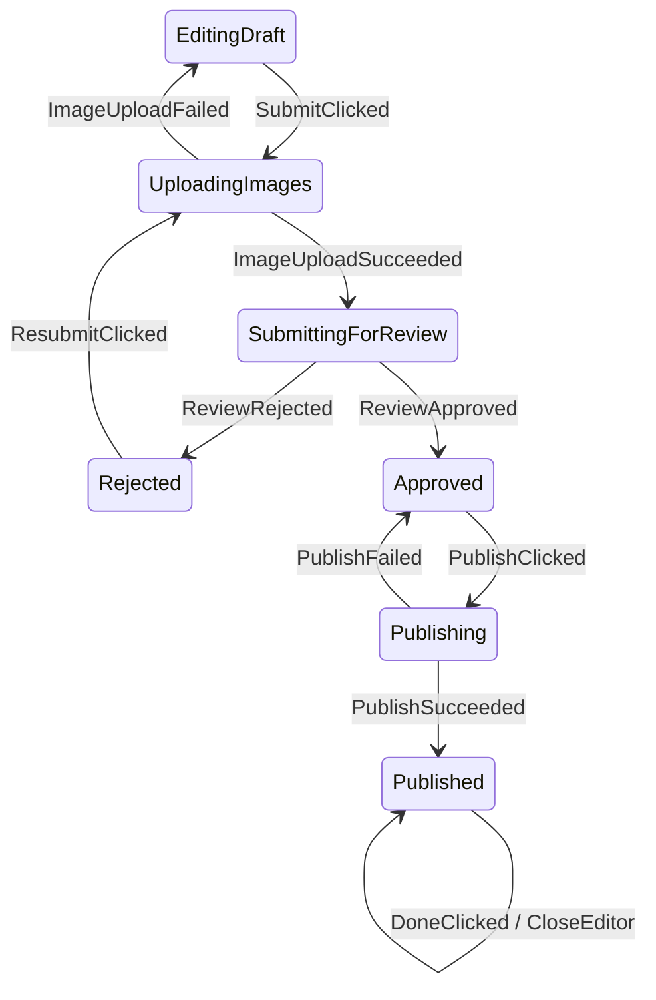
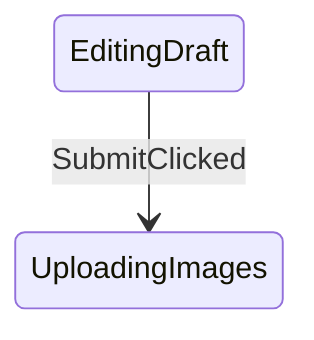

# Afsm v3 Topology-First API

This document compares the current v2 reducer-style API with a possible v3 topology-first API using `ProductEditorStateMachine` as the reference.

## Problem

Afsm exists to make Android screen flows easier to see.

The current v2 API can implement finite state machines, but the graph shape is not part of the API surface.

Current v2 shape:

```kotlin
fun transition(
    state: ProductEditorState,
    event: ProductEditorEvent,
): AfsmTransition<ProductEditorState, ProductEditorCommand, ProductEditorEffect>
```

This is flexible and Kotlin-friendly, but the state diagram must be inferred from function bodies.

For example:

```kotlin
ProductEditorEvent.SubmitClicked -> startUpload(state.draft, state)
```

The transition `EditingDraft -- SubmitClicked --> UploadingImages` is hidden in `startUpload(...)`, not declared at the transition site.

That is why Mermaid graph generation is hard: the code is behavior-first, not topology-first.

## Desired State Diagram

The ProductEditor business flow should be readable as a transition table:

```text
EditingDraft          -- SubmitClicked          --> UploadingImages
UploadingImages       -- ImageUploadSucceeded   --> SubmittingForReview
UploadingImages       -- ImageUploadFailed      --> EditingDraft
SubmittingForReview   -- ReviewRejected         --> Rejected
Rejected              -- ResubmitClicked        --> UploadingImages
SubmittingForReview   -- ReviewApproved         --> Approved
Approved              -- PublishClicked         --> Publishing
Publishing            -- PublishSucceeded       --> Published
Publishing            -- PublishFailed          --> Approved
Published             -- DoneClicked            --> Published + CloseEditor effect
```

Rendered as Mermaid:



## v2 Current Implementation

The v2 implementation is a reducer tree:

```kotlin
override fun transition(
    state: ProductEditorState,
    event: ProductEditorEvent,
): ProductEditorTransition {
    return when (state) {
        is EditingDraft -> reduceEditing(state, event)
        is SavingDraft -> reduceSaving(state, event)
        is DraftSaved -> reduceDraftSaved(state, event)
        is UploadingImages -> reduceUploading(state, event)
        is SubmittingForReview -> reduceSubmittingReview(state, event)
        is Rejected -> reduceRejected(state, event)
        is Approved -> reduceApproved(state, event)
        is Publishing -> reducePublishing(state, event)
        is Published -> reducePublished(state, event)
    }
}
```

Inside each reducer:

```kotlin
private fun reduceApproved(
    state: Approved,
    event: ProductEditorEvent,
): ProductEditorTransition {
    return when (event) {
        PublishClicked -> Afsm.transitionTo(
            state = Publishing(state.draft),
            commands = listOf(PublishProduct(state.draft)),
        )

        ContinueEditingClicked -> Afsm.transitionTo(
            EditingDraft(state.draft),
        )

        else -> Afsm.invalid(...)
    }
}
```

Strengths:

- Plain Kotlin.
- Easy to debug with normal breakpoints.
- No framework-like DSL.
- High flexibility for validation and helper functions.
- Existing `AfsmHost` runtime can execute it directly.

Weaknesses:

- Graph topology is not explicit.
- Helpers can hide edges.
- `Afsm.transitionTo(state = ...)` carries runtime result, not declared edge metadata.
- Graph generation either needs fragile static analysis or representative runtime samples.
- The API reads more like `Reducer<State, Event>` than a topology-first state machine.

## v3 Topology-First Idea

v3 should make the state edge explicit first:

```kotlin
transition<FromState, Event, ToState>("label") {
    goTo(
        state = ToState(...),
        commands = listOf(...),
        effects = listOf(...),
    )
}
```

The generic type parameters are graph metadata:

```text
FromState -- Event --> ToState
```

The lambda is runtime behavior:

```text
create exact next state instance
emit commands
emit effects
apply validation
```

This separates:

- topology: what the graph says,
- execution: what data is carried and what work is requested.

## v3 Pseudo Implementation

Possible ProductEditor shape:

```kotlin
class ProductEditorMachine :
    AfsmMachine<ProductEditorState, ProductEditorEvent, ProductEditorCommand, ProductEditorEffect>() {

    override fun define() = transitions {
        transition<EditingDraft, TitleChanged, EditingDraft>("edit title") { state, event ->
            goTo(
                state = state.copy(
                    draft = state.draft.updateForm { it.copy(title = event.value) },
                    errorMessage = null,
                ),
            )
        }

        transition<EditingDraft, DescriptionChanged, EditingDraft>("edit description") { state, event ->
            goTo(
                state = state.copy(
                    draft = state.draft.updateForm { it.copy(description = event.value) },
                    errorMessage = null,
                ),
            )
        }

        transition<EditingDraft, PriceChanged, EditingDraft>("edit price") { state, event ->
            goTo(
                state = state.copy(
                    draft = state.draft.updateForm { it.copy(priceText = event.value) },
                    errorMessage = null,
                ),
            )
        }

        transition<EditingDraft, SaveDraftClicked, SavingDraft>("save draft") { state, _ ->
            goTo(
                state = SavingDraft(state.draft),
                commands = listOf(SaveDraft(state.draft)),
            )
        }

        transition<EditingDraft, SubmitClicked, UploadingImages>("submit for review") { state, _ ->
            val validationError = state.draft.form.validationError()
            if (validationError != null) {
                stay(
                    state = state.copy(errorMessage = validationError),
                    reason = validationError,
                )
            } else {
                val draft = state.draft.normalized()
                goTo(
                    state = UploadingImages(draft),
                    commands = listOf(UploadImages(draft)),
                )
            }
        }

        transition<SavingDraft, DraftSaved, DraftSaved>("draft saved") { state, _ ->
            goTo(DraftSaved(state.draft))
        }

        transition<DraftSaved, ContinueEditingClicked, EditingDraft>("continue editing") { state, _ ->
            goTo(EditingDraft(state.draft))
        }

        transition<DraftSaved, SubmitClicked, UploadingImages>("submit saved draft") { state, _ ->
            val draft = state.draft.normalized()
            goTo(
                state = UploadingImages(draft),
                commands = listOf(UploadImages(draft)),
            )
        }

        transition<UploadingImages, ImageUploadSucceeded, SubmittingForReview>("image upload succeeded") { state, event ->
            val reviewedDraft = state.draft.copy(
                reviewAttempt = state.draft.reviewAttempt + 1,
            )
            goTo(
                state = SubmittingForReview(
                    draft = reviewedDraft,
                    uploadToken = event.uploadToken,
                ),
                commands = listOf(
                    SubmitForReview(
                        draft = reviewedDraft,
                        uploadToken = event.uploadToken,
                    ),
                ),
            )
        }

        transition<UploadingImages, ImageUploadFailed, EditingDraft>("image upload failed") { state, event ->
            goTo(
                EditingDraft(
                    draft = state.draft,
                    errorMessage = event.message,
                ),
            )
        }

        transition<SubmittingForReview, ReviewRejected, Rejected>("review rejected") { state, event ->
            goTo(
                Rejected(
                    draft = state.draft,
                    reason = event.reason,
                ),
            )
        }

        transition<Rejected, ResubmitClicked, UploadingImages>("resubmit") { state, _ ->
            val validationError = state.draft.form.validationError()
            if (validationError != null) {
                stay(
                    state = state.copy(errorMessage = validationError),
                    reason = validationError,
                )
            } else {
                val draft = state.draft.normalized()
                goTo(
                    state = UploadingImages(draft),
                    commands = listOf(UploadImages(draft)),
                )
            }
        }

        transition<SubmittingForReview, ReviewApproved, Approved>("review approved") { state, _ ->
            goTo(Approved(state.draft))
        }

        transition<Approved, PublishClicked, Publishing>("publish") { state, _ ->
            goTo(
                state = Publishing(state.draft),
                commands = listOf(PublishProduct(state.draft)),
            )
        }

        transition<Publishing, PublishSucceeded, Published>("publish succeeded") { state, event ->
            goTo(
                Published(
                    productId = event.productId,
                    title = state.draft.form.title.trim(),
                ),
            )
        }

        transition<Publishing, PublishFailed, Approved>("publish failed") { state, _ ->
            goTo(Approved(state.draft))
        }

        transition<Published, DoneClicked, Published>("done") { state, _ ->
            stay(
                state = state,
                effects = listOf(CloseEditor),
            )
        }
    }
}
```

## Graph Generation

With v3, graph generation does not need sample state/event values.

Each call registers an edge:

```kotlin
transition<EditingDraft, SubmitClicked, UploadingImages>("submit for review")
```

The graph renderer can output:



KSP is not required for an MVP if graph metadata is registered by executing `define()`.

Possible MVP flow:

```text
ProductEditorMachine.define()
-> transition definitions registered in memory
-> AfsmGraphRenderer.toMermaid(machine.graph)
-> docs/graphs/product-editor-state-machine.mmd
```

KSP can be considered later for automatic discovery of annotated machines, but it should not be needed to prove the concept.

## Invalid and Ignored Events

v2 forces each reducer to list invalid/ignored events to keep `when` exhaustive.

v3 can choose a default policy:

```kotlin
defaultUnhandled = AfsmUnhandledPolicy.Invalid
```

Then the ProductEditor definition can list only meaningful edges.

This reduces noise but changes the mental model:

- v2: Kotlin exhaustiveness makes unhandled events explicit.
- v3: the transition registry handles missing edges through a policy.

The v3 prototype must test this carefully because hidden unhandled behavior could make bugs less visible.

## Commands and Effects

Commands and effects remain valid state machine outputs.

They should be understood as transition actions:

```text
EditingDraft -- SubmitClicked --> UploadingImages
  action: UploadImages command
```

This is state-machine-compatible. UML state machines and Mealy-style machines can produce actions/outputs during transitions.

The problem in v2 is not commands/effects themselves. The problem is that the target state is only a returned value, not declared edge metadata.

## API Comparison

| Concern | v2 reducer API | v3 topology-first API |
|---|---|---|
| Familiar Kotlin | Strong | Medium |
| Graph generation | Weak | Strong |
| Breakpoint debugging | Strong | Medium |
| Boilerplate | Medium/high for invalid branches | Medium |
| Exhaustiveness | Strong through `when` | Needs registry checks |
| DSL learning cost | Low | Medium |
| State diagram readability | Medium | Strong |
| Runtime compatibility | Already implemented | Can compile down to v2 transition behavior |

## Product Judgment

v3 should not immediately replace v2.

Recommended positioning:

```text
v2 = low-level, plain Kotlin reducer-style engine
v3 = optional topology-first authoring layer for graph-friendly flows
```

This avoids forcing a DSL onto all users while still giving Afsm a clearer path to automatic state diagrams.

## Prototype Plan

1. Add a design-only `AfsmMachine` pseudo API page first. This document is the first step.
2. Implement a minimal experimental module, likely `afsm-machine`.
3. Support:
   - `transition<From, Event, To>(label)`
   - `goTo(...)`
   - `stay(...)`
   - default unhandled policy
   - graph metadata registry
   - Mermaid renderer
4. Port only ProductEditor to the experimental API.
5. Verify:
   - unit tests still express the same behavior,
   - Android CLI smoke journey still passes,
   - generated Mermaid graph matches expected topology.
6. Decide whether v3 should become:
   - official recommended API,
   - optional graph-oriented layer,
   - or abandoned if DSL cost is too high.

## Open Questions

- Should v3 require `KClass` arguments instead of reified generics for Java/binary friendliness?
- Should `transition<From, Event, To>` allow multiple `goTo(...)` target classes from one edge when guard branches can produce different states?
- Should validation failures be rendered as self-edges, omitted, or shown in a separate error graph?
- How should v3 preserve Kotlin exhaustiveness that v2 gets from `when`?
- Should graph labels default to type names or require explicit human labels?
