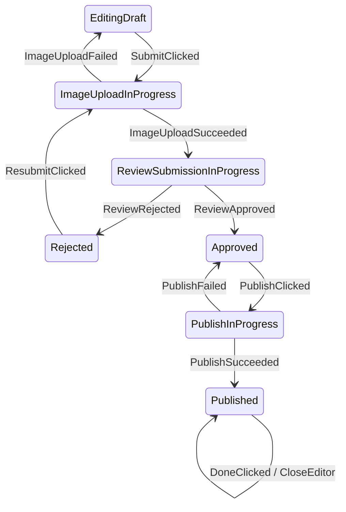
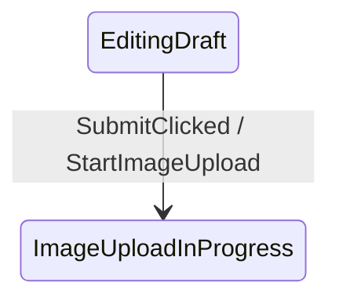

# Afsm v3 Topology-First API

This document compares the current v2 reducer-style API with a possible v3 topology-first API using `ProductEditorStateMachine` as the reference.

## Problem

Afsm exists to make Android screen flows easier to see.

The current v2 API can implement finite state machines, but the graph shape is not part of the API surface.

Current v2 shape:

```kotlin
fun transition(
    state: ProductEditorState,
    event: ProductEditorEvent,
): AfsmTransition<ProductEditorState, ProductEditorCommand, ProductEditorEffect>
```

This is flexible and Kotlin-friendly, but the state diagram must be inferred from function bodies.

For example:

```kotlin
ProductEditorEvent.SubmitClicked -> startUpload(state.draft, state)
```

The transition `EditingDraft -- SubmitClicked --> ImageUploadInProgress` is hidden in `startUpload(...)`, not declared at the transition site.

That is why Mermaid graph generation is hard: the code is behavior-first, not topology-first.

## Desired State Diagram

The ProductEditor business flow should be readable as a transition table:

```text
EditingDraft          -- SubmitClicked          --> ImageUploadInProgress
ImageUploadInProgress       -- ImageUploadSucceeded   --> ReviewSubmissionInProgress
ImageUploadInProgress       -- ImageUploadFailed      --> EditingDraft
ReviewSubmissionInProgress   -- ReviewRejected         --> Rejected
Rejected              -- ResubmitClicked        --> ImageUploadInProgress
ReviewSubmissionInProgress   -- ReviewApproved         --> Approved
Approved              -- PublishClicked         --> PublishInProgress
PublishInProgress            -- PublishSucceeded       --> Published
PublishInProgress            -- PublishFailed          --> Approved
Published             -- DoneClicked            --> Published + CloseEditor effect
```

Rendered as Mermaid:



## v2 Current Implementation

The v2 implementation is a reducer tree:

```kotlin
override fun transition(
    state: ProductEditorState,
    event: ProductEditorEvent,
): ProductEditorTransition {
    return when (state) {
        is EditingDraft -> reduceEditing(state, event)
        is SavingDraft -> reduceSaving(state, event)
        is DraftSaved -> reduceDraftSaved(state, event)
        is ImageUploadInProgress -> reduceImageUploadInProgress(state, event)
        is ReviewSubmissionInProgress -> reduceReviewSubmissionInProgress(state, event)
        is Rejected -> reduceRejected(state, event)
        is Approved -> reduceApproved(state, event)
        is PublishInProgress -> reducePublishInProgress(state, event)
        is Published -> reducePublished(state, event)
    }
}
```

Inside each reducer:

```kotlin
private fun reduceApproved(
    state: Approved,
    event: ProductEditorEvent,
): ProductEditorTransition {
    return when (event) {
        PublishClicked -> Afsm.transitionTo(
            state = PublishInProgress(state.draft),
            commands = listOf(StartProductPublish(state.draft)),
        )

        ContinueEditingClicked -> Afsm.transitionTo(
            EditingDraft(state.draft),
        )

        else -> Afsm.invalid(...)
    }
}
```

Strengths:

- Plain Kotlin.
- Easy to debug with normal breakpoints.
- No framework-like DSL.
- High flexibility for validation and helper functions.
- Existing `AfsmHost` runtime can execute it directly.

Weaknesses:

- Graph topology is not explicit.
- Helpers can hide edges.
- `Afsm.transitionTo(state = ...)` carries runtime result, not declared edge metadata.
- Graph generation either needs fragile static analysis or representative runtime samples.
- The API reads more like `Reducer<State, Event>` than a topology-first state machine.

## v3 Topology-Friendly Kotlin Style

DSL-like APIs are not the preferred direction.

The rejected shapes are:

```kotlin
transition<FromState, Event, ToState>("label") { ... }
```

and:

```kotlin
topology {
    from<FromState> {
        on<Event>().to<ToState>()
    }
}
```

Both make graph metadata explicit, but both add framework-shaped authoring syntax. The better v3 direction is to keep state machine implementation as ordinary Kotlin and make the existing code graph-friendly by convention.

The core rule:

```text
Use concrete State/Event handler signatures.
Let transitionTo expose the next state; do not repeat From/Event there.
```

ProductEditor should still start with normal `when` dispatch:

```kotlin
override fun transition(
    state: ProductEditorState,
    event: ProductEditorEvent,
): ProductEditorTransition {
    return when (state) {
        is EditingDraft -> state.transition(event)
        is SavingDraft -> state.transition(event)
        is DraftSaved -> state.transition(event)
        is ImageUploadInProgress -> state.transition(event)
        is ReviewSubmissionInProgress -> state.transition(event)
        is Rejected -> state.transition(event)
        is Approved -> state.transition(event)
        is PublishInProgress -> state.transition(event)
        is Published -> state.transition(event)
    }
}
```

Then each meaningful branch should delegate to a concrete handler:

```kotlin
private fun EditingDraft.transition(
    event: ProductEditorEvent,
): ProductEditorTransition {
    return when (event) {
        is TitleChanged -> titleChanged(this, event)
        SaveDraftClicked -> saveDraftClicked(this, event)
        SubmitClicked -> submitClicked(this, event)
        else -> invalid("Event is not valid while editing a draft.")
    }
}
```

The handler signature carries the graph source:

```kotlin
private fun submitClicked(
    state: EditingDraft,
    event: SubmitClicked,
): ProductEditorTransition {
    val nextDraft = state.draft.normalized()

    return Afsm.transitionTo(
        state = ImageUploadInProgress(nextDraft),
        commands = listOf(StartImageUpload(nextDraft)),
    )
}
```

The graph extractor can read:

```text
From = state parameter type = EditingDraft
Event = event parameter type = SubmitClicked
To = transitionTo state argument type = ImageUploadInProgress
Action = command expression type = StartImageUpload
```

If static extraction of the `state` argument is too fragile, v3 may allow an optional To generic:

```kotlin
private fun submitClicked(
    state: EditingDraft,
    event: SubmitClicked,
): ProductEditorTransition {
    val nextDraft = state.draft.normalized()

    return Afsm.transitionTo<ImageUploadInProgress>(
        state = ImageUploadInProgress(nextDraft),
        commands = listOf(StartImageUpload(nextDraft)),
    )
}
```

This is acceptable because only `ToState` is explicit.

Do not require this:

```kotlin
Afsm.transitionTo<EditingDraft, SubmitClicked, ImageUploadInProgress>(...)
```

`FromState` and `Event` are already in the handler signature. Repeating them at the transition call site is noisy and not justified.

## Handler Shape

Good graph-friendly handlers use concrete types:

```kotlin
private fun imageUploadSucceeded(
    state: ImageUploadInProgress,
    event: ImageUploadSucceeded,
): ProductEditorTransition {
    val reviewedDraft = state.draft.copy(
        reviewAttempt = state.draft.reviewAttempt + 1,
    )

    return Afsm.transitionTo(
        state = ReviewSubmissionInProgress(
            draft = reviewedDraft,
            uploadToken = event.uploadToken,
        ),
        commands = listOf(
            StartReviewSubmission(
                draft = reviewedDraft,
                uploadToken = event.uploadToken,
            ),
        ),
    )
}
```

Avoid helpers that erase graph source types:

```kotlin
private fun startUpload(
    draft: ProductDraft,
    currentState: ProductEditorState,
): ProductEditorTransition
```

This helper is flexible but graph-hostile:

- `currentState` is the sealed parent type, not a concrete `FromState`.
- The event is absent from the function signature.
- A graph extractor cannot know whether this represents `SubmitClicked`, `ResubmitClicked`, or another edge without deeper call-chain analysis.

If two states share validation logic, keep shared validation as a helper, but keep the transition handler concrete:

```kotlin
private fun submitClicked(
    state: EditingDraft,
    event: SubmitClicked,
): ProductEditorTransition {
    return startImageUploadFromEditing(state)
}

private fun resubmitClicked(
    state: Rejected,
    event: ResubmitClicked,
): ProductEditorTransition {
    return startImageUploadFromRejected(state)
}
```

This keeps edges visible:

```text
EditingDraft -- SubmitClicked --> ImageUploadInProgress
Rejected -- ResubmitClicked --> ImageUploadInProgress
```

## API Direction

```text
FromState = concrete state parameter or typed receiver
Event = concrete event parameter
ToState = transitionTo state argument, optionally transitionTo<ToState>
Transition action = command expression type
Effect = effect expression type
```

The important change is not a new DSL. The important change is a stricter authoring convention that makes plain Kotlin analyzable.

## Graph Generation

With v3, graph generation does not need sample state/event values.

Each concrete handler plus `transitionTo` call exposes an edge:

```kotlin
private fun submitClicked(
    state: EditingDraft,
    event: SubmitClicked,
): ProductEditorTransition {
    return Afsm.transitionTo(
        state = ImageUploadInProgress(state.draft.normalized()),
        commands = listOf(StartImageUpload(state.draft.normalized())),
    )
}
```

The graph extractor can output:



KSP is not required for the first proof if a simple source scanner can parse project-local Kotlin conventions.

Possible MVP flow:

```text
Scan ProductEditorStateMachine.kt
-> find concrete handler functions with state/event parameters
-> find Afsm.transitionTo(...) calls in those handlers
-> infer ToState from the state argument or optional transitionTo<ToState>
-> infer actions/effects from command/effect expressions where practical
-> write docs/graphs/product-editor-state-machine.mmd
```

KSP can be considered later if source scanning is too fragile or if compile-time validation is needed.

## Invalid and Ignored Events

v2 forces each reducer to list invalid/ignored events to keep `when` exhaustive.

The typed-handler convention can keep that behavior. Missing handler branches are still normal Kotlin:

```kotlin
else -> Afsm.invalid(state, reason = "Event is not valid while editing a draft.")
```

This keeps the runtime behavior explicit and testable.

Graph extraction should usually ignore invalid/ignored branches by default. If the team wants invalid edges rendered later, that should be an optional graph mode.

The important point: v3 should not trade Kotlin exhaustiveness for a transition registry policy unless there is a stronger reason.

## Commands and Effects

Commands and effects remain valid state machine outputs.

They should be understood as transition actions:

```text
EditingDraft -- SubmitClicked --> ImageUploadInProgress
  action: StartImageUpload command
```

This is state-machine-compatible. UML state machines and Mealy-style machines can produce actions/outputs during transitions.

The problem in v2 is not commands/effects themselves. The problem is that the target state is only a returned value, not declared edge metadata.

Terminology and naming guidance are tracked in [[afsm-v3-terminology-transition-actions|Afsm v3 Terminology and Transition Actions]].

## API Comparison

| Concern | v2 reducer API | v3 typed-handler API |
|---|---|---|
| Familiar Kotlin | Strong | Strong |
| Graph generation | Weak | Medium/strong with conventions |
| Breakpoint debugging | Strong | Strong |
| Boilerplate | Medium/high for invalid branches | Medium; more concrete handlers |
| Exhaustiveness | Strong through `when` | Strong through `when` |
| DSL learning cost | Low | Low |
| State diagram readability | Medium | Medium/strong |
| Runtime compatibility | Already implemented | Same runtime behavior |

## Product Judgment

v3 should not immediately replace v2.

Recommended positioning:

```text
v2 = low-level, plain Kotlin reducer-style engine
v3 = graph-friendly typed-handler convention over the same plain Kotlin reducer engine
```

This avoids forcing a DSL onto users while still giving Afsm a clearer path to automatic state diagrams.

## Prototype Plan

1. Refine this design-only page first.
2. Rewrite ProductEditor reducer helpers into concrete state/event handlers.
3. Keep `Afsm.transitionTo(state = ...)` as the primary runtime API.
4. Optionally add `Afsm.transitionTo<ToState>(state = ...)` only if source extraction needs a stronger To marker.
5. Build a small graph extraction proof against `ProductEditorStateMachine.kt`.
6. Generate Mermaid from:
   - handler state parameter,
   - handler event parameter,
   - transitionTo next-state argument or optional To generic,
   - command/effect expression types where practical.
7. Verify:
   - unit tests still express the same behavior,
   - Android CLI smoke journey still passes,
   - generated Mermaid graph matches expected topology.
8. Decide whether this convention is stable enough to document as the recommended Afsm authoring style.

## Open Questions

- Should `transitionTo<ToState>(state = ...)` be recommended, optional, or avoided unless extraction fails?
- How much Kotlin source analysis is acceptable before KSP becomes necessary?
- Should handler functions use `(state, event)` parameters or typed state receivers plus concrete event parameters?
- How should one handler represent guard branches that can produce multiple target states?
- Should validation failures be rendered as self-edges, omitted, or shown in a separate error graph?
- Should graph labels default to type names or require explicit human labels?
